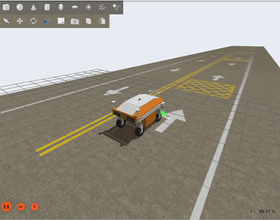
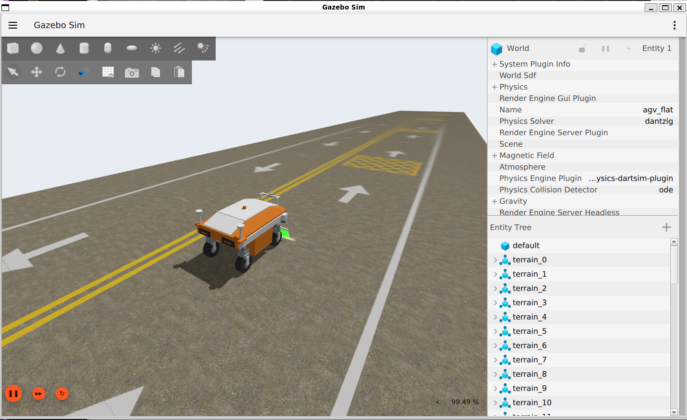
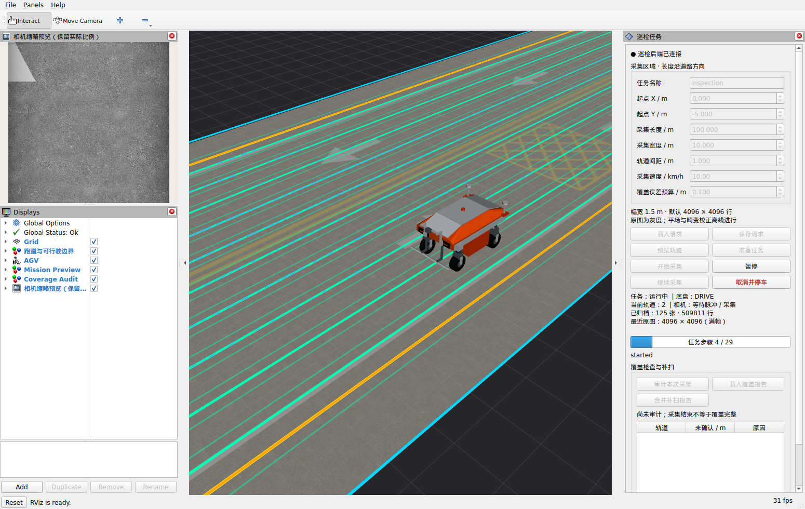

# Four-Wheel Steering AGV Inspection

四轮独立驱动、独立转向（4WIDS）的 ROS 2 / Gazebo **路面巡检仿真**。车辆以弓字形覆盖一块
矩形路面，车上 4096 像素线阵相机由轮编码器等距触发，逐行扫出约 0.366 mm/像素的灰度原图，
供离线校正与条带拼接使用。



*12 秒循环，Gazebo 实时画面。100×10 m 带标识道路，10 km/h 额定采集速度。*

## 一眼看懂

| | |
|---|---|
|  |  |
| **Gazebo**：±2 mm/20 cm 起伏的 100×10 m 混凝土道路，双黄线、边线、箭头与禁停网格，48 个地形分区，物理走原生高度场 | **RViz 巡检面板**：填区域与速度、预览轨迹、启停采集、覆盖审计与补扫。绿色为规划的 10 条轨道，蓝色为可行驶边界，左上为线阵缩略预览 |

上面 RViz 那张是 100×10 m 正式任务进行中：任务步骤 4/29，已归档 125 张、509,811 行。

## 它在做什么

```
区域请求 ──▶ 矩形规划 ──▶ 时间闭环跟踪 ──▶ 四轮运动分配 ──▶ 八电机底盘
  (RViz面板)   10条轨道      梯形/三角形曲线    驱动+转向        4驱4转
                  │                                              │
                  │                          RTK双天线+IMU+轮里程计 ──▶ 三维双EKF
                  │                                              │
                  └──▶ 按轨采集联动 ◀── 轮编码器等距触发 ◀────────┘
                            │
                            ▼
                    线阵相机（OptiX 光线追踪）
                            │
                            ▼
              Mono8 原图 + 稀疏位姿标签 ──▶ 离线校正 ──▶ 条带拼接（进行中）
```

采集与成像是两条独立的几何链路：**物理**走原生高度场，**成像**走 OptiX 读取的光学网格，
**显示**走一套更轻的网格。三者的关系与边界见[场景载入时间](docs/issues/SCENE_LOAD_TIME.md)。

## 关键参数

| | |
|---|---|
| 底盘 | 550 kg，四悬挂，八电机四驱四转；车壳 1.9×1.1 m |
| 速度 | 最高 15 km/h，**额定采集 10 km/h**；加速度 0.8、减速度 1.0 m/s² |
| 转向 | 硬限位 [−280°, +100°]、软限位 [−275°, +95°]，四轮一致；静止起步另留 20° 段余量 |
| 相机 | 20 mm 镜头，4096 像素覆盖 1.5 m，**0.3657 mm/行**；编码器等距触发，10 km/h 约 7.59 kHz |
| 归档 | 默认 4096 行/块，Mono8 线性原图 + 稀疏位姿标签；尾图不足 1000 行丢弃并记缺口 |
| 道路 | 100×10 m 带标识 Concrete047A，±2 mm/20 cm 源网格，1025² 原生高度场；20 m 版用于快速回归 |
| 定位 | 双天线 1.10 m 基线，RTK 10 Hz；三维双 EKF（局部连续 + 全局） |

## 现状

100×10 m 全区稳定采集**已验收通过**：10 条轨道 ESTIMATED_COMPLETE、702 块 285.9 万行、
稳态 RTF 0.997、ROS 与归档逐字节一致。下一步是离线暗场/平场校正与条带拼接。

自主避障、完整拼接与 TIFF 导出**尚未实现**。已知未修问题见
[当前状态与下一步](docs/CURRENT_STATUS.md)。

**接续工作先读[当前状态与下一步](docs/CURRENT_STATUS.md)，按任务查[文档索引](docs/README.md)。**
完整约束见[项目规范](PROJECT_SPEC.md)，踩过的坑见[关键技术问题与解决方案](docs/LESSONS.md)。

## 环境与安装

**Ubuntu 24.04、ROS 2 Jazzy、Gazebo Harmonic、Python 3.12、C++17/CMake**。支持原生 Linux；
已有 WSL2/WSLg 实测，GUI 需要可用硬件图形驱动。版本配对见[官方说明](https://gazebosim.org/docs/harmonic/ros_installation/)。

先按 [ROS 2 Jazzy 安装文档](https://docs.ros.org/en/jazzy/Installation/Ubuntu-Install-Debs.html)
配置软件源，再安装：

```bash
sudo apt update
sudo apt install ros-jazzy-desktop ros-jazzy-ros-gz ros-jazzy-gz-ros2-control \
  ros-jazzy-forward-command-controller ros-jazzy-joint-state-broadcaster \
  ros-jazzy-robot-localization \
  python3-colcon-common-extensions python3-rosdep build-essential cmake git curl \
  python3-pytest python3-numpy python3-scipy python3-pil python3-yaml python3-psutil \
  python3-matplotlib python3-opencv libopencv-contrib-dev libssl-dev qtbase5-dev
sudo rosdep init   # 仅首次；已初始化则跳过
rosdep update
```

ROS 使用系统 Python，避免用 Conda 替换。烘焙需要 OpenCV contrib 的 `cv2.ximgproc.thinning`：

```bash
python3 -c 'import cv2; assert hasattr(cv2.ximgproc, "thinning")'
```

仓库本身就是 colcon 工作区：

```bash
git clone https://github.com/chubbyk-uu/four-wheel-steering-agv-inspection.git
cd four-wheel-steering-agv-inspection
source /opt/ros/jazzy/setup.bash
rosdep install --from-paths src --ignore-src --rosdistro jazzy -y
colcon build --symlink-install --cmake-args -DAGV_ENABLE_CUDA=OFF   # 基础构建不需要 GPU
source install/local_setup.bash
```

默认 `RelWithDebInfo`。基础构建可以控制底盘、跑解析网格或慢速 Ogre2 参考采样，
**不承诺高行频性能**；未优化构建不能用于实时率验收。

> **已配置 OptiX 的机器不要用上面这条命令重建。** `-DAGV_ENABLE_CUDA=OFF` 会让 CMake 跳过 CUDA
> 目标而不报错，构建成功、测试全绿，但已安装插件失去 CUDA/OptiX 后端，下一次采集才会在 gz 插件里
> abort。带 GPU 的机器用[OptiX 安装](docs/OPTIX_SETUP.md)里的完整参数，并在重建后跑
> `python3 tools/check_accelerated_backends.py --expect-gpu` 核对。

## 快速运行

完整巡检界面（先按[道路资产指南](docs/ROAD_ASSETS.md)恢复默认道路并配置 OptiX）：

```bash
ros2 launch agv_bringup inspection.launch.py          # 原生 Linux 加 gpu_backend:=native
```

RViz 右侧面板提供区域编辑、预览、采集控制、覆盖审计和补扫，速度输入 km/h、上限 10；
默认等待操作，不自动开跑。面板用法见[执行说明](docs/RECTANGLE_EXECUTION.md#rviz巡检任务面板)。
正常巡检不注入暂停，验证暂停用显式 `--pause-probe`。

只要底盘不要巡检：

```bash
ros2 launch agv_bringup sim.launch.py rviz:=true      # WSL2 + WSLg + NVIDIA
```

WSL 默认 Mesa D3D12/NVIDIA，其他显卡用 `gpu_adapter:=AMD` 或 `Intel`，无 GUI 用
`headless:=true`。默认从车后沿 +X 观察并跟随看向车辆；`follow_camera:=false` 关闭跟车。
视角操作见[视角说明](docs/GUI_CAMERA.md)，手动驾驶指令见[手动驾驶](docs/MANUAL_DRIVING.md)。

道路默认使用轻量显示网格（GZ 与雷达用，成像不经过它）。需要全量显示几何时：

```bash
ros2 launch agv_bringup inspection.launch.py \
  scene_manifest:=assets/road/<road>/manifest_full_visual.json
```

## 其他入口

| 主题 | 文档 |
|---|---|
| 道路资产恢复、生成、旧样片烘焙 | [ROAD_ASSETS](docs/ROAD_ASSETS.md) |
| 离线暗场/平场与条带处理 | [OFFLINE_PROCESSING](docs/OFFLINE_PROCESSING.md) |
| CUDA / OptiX 安装与后端 | [OPTIX_SETUP](docs/OPTIX_SETUP.md) |
| WSL 项目专用 Mesa 修复版 | [MESA_SETUP](docs/MESA_SETUP.md) |
| 手动驾驶与低速相机试运行 | [MANUAL_DRIVING](docs/MANUAL_DRIVING.md) |
| 场景载入时间与显示资产 | [SCENE_LOAD_TIME](docs/issues/SCENE_LOAD_TIME.md) |
| 观察验收约定 | [VISUAL_ACCEPTANCE](docs/VISUAL_ACCEPTANCE.md) |

WSL 专用 Mesa 与 OptiX 实验运行库**不随仓库分发**，干净检出需先按各自文档构建；
缺失时脚本明确报错，不静默回退旧版。

## 检查与项目结构

```bash
colcon test > /tmp/agv_tests.log 2>&1
colcon test-result --verbose
python3 tools/check_model.py
```

OptiX/GPU 测试需要对应硬件与运行库；纯 CPU 构建不注册这些可选测试。
`results/` 是历史结果，不是新机器的测试保证。

| 路径 | 内容 |
| --- | --- |
| `src/agv_description` | 几何、URDF、机械与相机参数 |
| `src/agv_control` | 四轮运动分配、转向限位与状态机 |
| `src/agv_linescan` | 触发、采样、辐射、标定及可选 GPU 后端 |
| `src/agv_mission` | 矩形规划、跟踪、采集联动与覆盖审计 |
| `src/agv_localization` | 双天线 GNSS、IMU、轮里程计与双 EKF |
| `src/agv_bringup` | 启动、GUI/RViz、控制配置 |
| `tools` | 资产生成、验证和操作工具 |
| `assets/road` | AI 原图、来源摘要及恢复说明 |
| `docs` / `results` | 技术记录、样片和历史验证摘要 |

源码按 Apache-2.0 分发；外部素材与生成资产说明见 [THIRD_PARTY.md](THIRD_PARTY.md)。
公开仓库不含旧本地 Git 历史、原始进程日志、SDK/驱动、构建目录和完整采集数据，
详见[发布范围](docs/REPOSITORY.md)。

本页动图与截图都是**真实运行中的窗口抓取**，不是渲染出来的示意图。WSLg 下 Linux 侧
录屏工具抓到的是黑帧，抓取方式与裁剪参数见
[从 WSLg 抓取窗口](tools/capture_wslg_window.md)。
