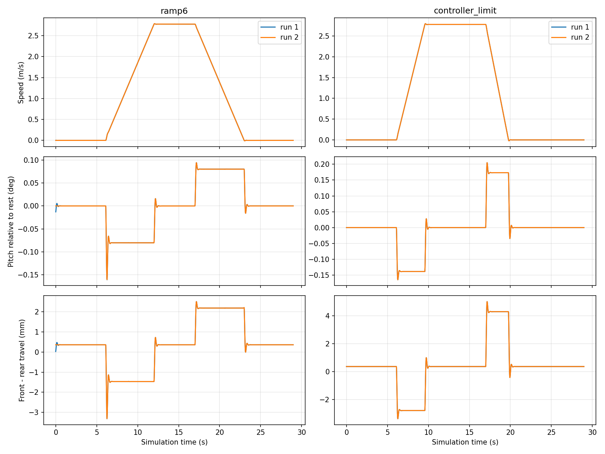

# 平地加减速俯仰响应

本文保留65000 N/m旧刚度对照。后续用户指定持续俯仰1–2°目标，现行参数见[悬挂调参](SUSPENSION_TUNING.md)。

2026-09-15：保持悬挂参数不变，完成两种速度输入、每种两次的实测。**当前姿态变化小且很快衰减，但并非加减速度不足、悬挂没工作或车体被固定。没有真机对照，尚不能认定必须调软。** 路面粗糙度与相机柔性暂不加入。

## 方法与结果

`flat.sdf`、headless、不开采图，实际/标定轮径均0.40 m。每次静止6秒、加速阶段6秒、巡航5秒、制动阶段6秒、停车保持6秒。前两次指令用6秒线性速度斜坡；后两次直接请求10 km/h或零速，由现有控制器限制加减速，实际升降速在6秒阶段内提前结束。仅测试工具读取真值，控制器没有使用真值反馈。

记录真值里程计50 Hz、关节状态100 Hz。俯仰以下均相对该次静止姿态，持续值为实际运动中加减速度显著区间的中位数。

| 工况 | 实际加速度 m/s² | 持续俯仰 | 最大同向瞬态偏移 |
|---|---:|---:|---:|
| 6秒升速 | +0.463 | 抬头约0.080° | 约0.161°，包含起步状态切换 |
| 6秒降速 | −0.463 | 低头约0.080° | 约0.095° |
| 控制器上限加速 | +0.800 | 抬头约0.139° | 约0.165° |
| 控制器上限制动 | −1.000 | 低头约0.173° | 约0.205° |

同一工况两次曲线基本重合。上限加速包含反向回弹的全段峰峰值约0.193°，制动约0.240°，复现之前报告的数值。因此，之前“6秒加速阶段”不能理解为一定使用6秒斜坡，数值更符合当前控制器上限工况。

停止附近从首次前向速度≤0.02 m/s算起，约0.28秒后俯仰持续回到静止值±0.01°内（50 Hz采样精度）。没有持续振荡。上限制动的短时速度下冲约−0.0216 m/s，发生在零指令停车响应中，不是路径规划后退动作；最终速度绝对值<0.001 m/s且控制器HOLD。报告保留此下冲，不能称停车过程严格单调或从无反向速度。

四轮转向始终近零。上限制动时悬挂关节位置全局范围约−0.94～4.07 mm，远离±50 mm行程限位。没有测量轮胎接触力，不能据此宣称动态轮载或轮胎离地已验证。



## 参数解释与调参结论

- 每轮刚度65,000 N/m、阻尼2,800 N·s/m、弹簧参考位置−16 mm。
- 车体固定连接部分质量418 kg（总质量550 kg减四个33 kg轮组），由现行URDF固定连接惯性质量加权，重心在base_link下约69.6 mm，名义离地0.580 m。
- 悬挂关节位置约1.4～1.8 mm不等于弹簧总压缩。相对−16 mm参考位置的形变量约17.4～17.8 mm。仅用418 kg重力估算四轮平均弹簧形变量约15.8 mm；这一简化估算不含轮组内部质量分布、关节约束与接触传力，不作为精确静态受力校验。
- 小角度近似下四弹簧的俯仰刚度贡献为`k × wheelbase² = 109850 N·m/rad`。持续俯仰主要受刚度和传力几何影响；阻尼主要改变瞬态、超调与回稳。不能用加减速段FFT主峰当悬挂固有频率。

当前数据支持“响应幅度小、衰减快”，但不提供真机应有幅度。**本轮不改默认悬挂。** 若继续评估更软版本，先做小幅降低刚度的独立对照，重新计算预载以保持负重车高，并检查电池/条光离地、行程余量和停车响应；不要直接以照片弯曲程度反推参数。完成该项讨论后再处理路面粗糙度。

## 复现与边界

```bash
bash tools/with_optix_runtime.sh bash -c '
  source /opt/ros/jazzy/setup.bash
  source install/setup.bash
  python3 tools/with_mesa_runtime.py python3 tools/measure_accel_pitch.py \
    --output local_data/accel_pitch_response
' > /tmp/accel_pitch.log 2>&1
```

记录：[结果](../results/accel_pitch_response.json)。原始时间序列与完整日志位于忽略目录`local_data/accel_pitch_response/`。可用工具的`--analyze`重绘与复核同一批数据，无需重新运行物理仿真。新采样已在原始记录中保存实际配置，离线分析只用归档值。本文早期样本缺少配置快照，新版工具会拒绝直接重分析，避免误用后来变更的默认值；旧结果与曲线仍保留。

本次是平地直线动力学诊断，不包含GUI人工验收、真实镜头图像、粗糙路面、轮胎弹性、轮载传感或物理步级高频测量。两次重复在同一实例内进行，不等于不同机器或多次冷启动验收。
