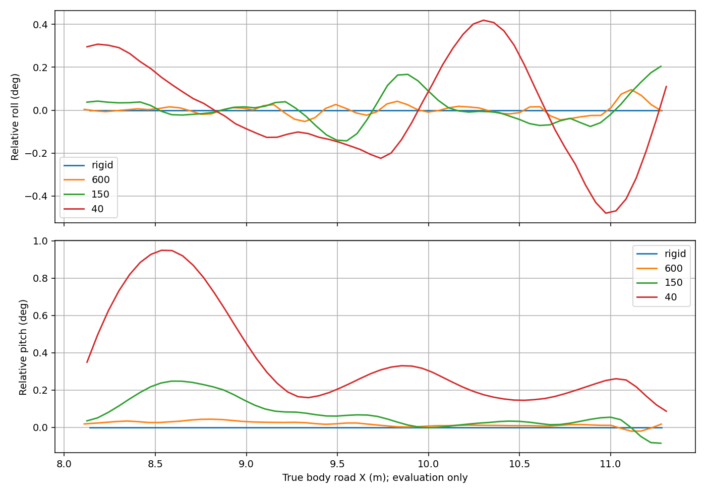
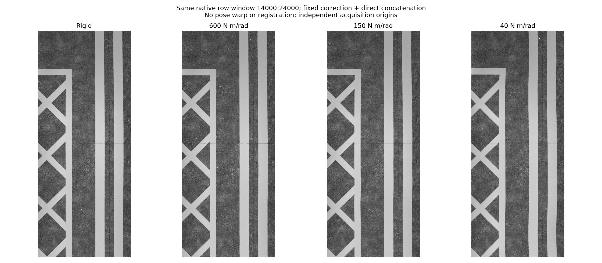

# 相机上支架柔性短道对照

2026-09-15。用户查看刚性逐档调软的短道图像后，选定150 N·m/rad、2.5 N·m·s/rad为当前仿真默认值；仍不是实机测定参数。

## 模型与边界

上支架用俯仰、横滚两个被动转动弹簧表示等效弯曲，Gazebo/DART在原物理步长下求解。下安装块和LED支架保持刚性，上支架、相机外观和碰撞随实际关节运动。成像器读取实际支架位姿，在曝光时刻插值；RViz额外同步两个活动连杆。不是给条带后处理变形，也没有独立随机力或指定振动频率。

这不是有限元梁模型，也未声称参数对应真机支架。当前不含独立扭转、轴向伸缩或松动间隙。运动由路面接触、车体加减速和转向激励；平地匀速无激励时不会自己持续振动。实际刚度和阻尼仍需实机测量。

将原来归入车体的3 kg分给上支架（中间连杆0.1 kg、支架2.9 kg），相机原有1 kg保留，总质量550 kg。刚性与柔性档使用相同质量分布、惯量和零位几何；因此本次重新采刚性基线，不直接与旧质量分配的图像作严格差分。俯仰弹簧预载抵消水平名义位置的重力力矩，避免把静态下垂当成振动。车体实际静止俯仰仍会造成微小平衡偏转。

关节限位±5°只是实验保护；验证器在接近限位（绝对角度0.08 rad）时失败，不能通过撞限位制造变形。配置为`linescan.yaml`中的`mount_flex`：

| 档位 | enabled | 刚度（两轴，N·m/rad） | 阻尼（两轴，N·m·s/rad） |
|---|---|---:|---:|
| 完全刚性 | false | 不参与求解 | 不参与求解 |
| 较硬 | true | 600 | 5.0 |
| 较软 | true | 150 | 2.5 |
| 进一步调软候选 | true | 40 | 1.291 |

阻尼随刚度平方根调整，近似保持阻尼比；两轴惯量不同，因此两轴阻尼比并不相等。当前只开放40–2000 N·m/rad、0.1–30 N·m·s/rad的实验配置范围。默认关闭柔性不等于用极大刚度逼近固定连接。

## 对照方法

使用同一20 m标识起伏试片（10 cm网格、峰值±3 mm）、零PASS横向死区、正常定位噪声和10 km/h请求。正式刚度对照改用短单道X=8..12 m、Y=−0.9..0.1 m，中心−0.4 m，无掉头；四档用zero定位噪声隔离机械效应，150档另恢复normal噪声复测。独立启动的控制与接触响应仍有差异，不声称完全相同激励重放。最初双道失败见下。

逐档记录实际支架角度、车体姿态、逐轮角度、仿真/墙钟、原图与ROS一致性、连续ROI和最终HOLD。离线使用同一固定标定做平场/横向光学校正，再按原行序连接，不用实际支架姿态校正图像。检查原图几何和明暗，不能把补光变化误判为缺线。

数据保存在忽略目录`local_data/mount_flex_probe_v1/`。`--camera-config`传给`tools/validate_rectangle_execution.py`，最终使用配置归档为运行目录的`camera.yaml`和传感器`calibration.yaml`；`mount_evaluation.npy`保存100 Hz左右的两轴实际角度，`clock_evaluation.npy`用于统计墙钟实时率。它们只是诊断数据，不新增每行真机标签要求。

当前实现与实际结果分别记录；尚未完成的档位不能算作通过，不代替100 m全区域重新验收。

实现验证：`colcon test`的线阵包171项、任务包176项均通过。刚性/600/150/40四档在GUI＋RViz下的单道采集均ACQUIRED/HOLD，原图与ROS像素一致；独立50 Hz车体＋100 Hz关节前向运动学与传感器标签位置差小于0.061 mm，角度差小于0.0031°。图像后处理、参数建议和双道失败见下。

## 本轮结果与选择

四档单道GUI＋RViz＋OptiX均ACQUIRED/HOLD，连续ROI和原图/ROS一致性通过。刚性/600/150各6张4096²，40档6张4096²＋1048行尾图；总行数差异包含前导与收尾，不代表ROI缺线。150档恢复normal定位噪声后单道也通过。未做多种子或100 m复验。

| 刚度（N·m/rad） | ROI相对roll峰峰值 | ROI相对pitch峰峰值 | 开采期间pitch绝对峰值（含前导加速） | ROI墙钟实时率 |
|---|---:|---:|---:|---:|
| 刚性 | 0° | 0° | 0° | 0.9954 |
| 600 | 0.148° | 0.064° | 0.128° | 0.9918 |
| 150 | 0.347° | 0.333° | 0.604° | 0.9927 |
| 40 | 0.898° | 0.863° | 2.848° | 0.9859 |

ROI取真实车体X=8.1..11.9 m，每档约57个50 Hz样本、约1.1秒；只能说明短程未明显失去实时性，不能推出完整任务性能或显存余量。相对角度不含车体本身倾斜。40档全过程pitch峰值2.955°，未碰±5°限位，但明显偏软。等效转动惯量约0.22–0.25 kg·m²，对应模态约2–8 Hz，并非额外指定正弦振动。

**用户已选定150 N·m/rad、2.5 N·m·s/rad，默认启用。** 600比较接近刚性，40适合作为偏软压力测试，不能当作实机测定值。较软并不保证所有图像指标单调增大：激励不同，模态也可能局部抵消车体倾斜。

取各条带同一原生行窗14000..24000，不配准，起点不完全相同；预览保持像素比例和共同0..160灰度范围。完整PNG在各档`fixed_strips/track_00.png`。肉眼可见40变化更明显，150较温和。两条黄线中心去掉线性趋势后的峰峰变化：刚性15.2/32.2 px、600档12.8/26.1 px、150档17.7/30.5 px、40档26.8/42.3 px。该指标包含车体运动和原标线形状，不是纯支架贡献；拟合仅诊断，不改变图片。沿行伸缩尚未独立量化。

### 固定标定迁移边界

旧`measured.json`因URDF哈希变化被正常拒绝，生产校正器检查未改。实验工具`transfer_mount_probe_calibration.py`逐三角形比较零位视觉几何/颜色，比较相机光学坐标系和LED零位变换，检查曝光/光学/辐射签名及源、目标URDF哈希。匹配后生成绑定各目标哈希的**实验派生profile**，平场和横向校正系数完全相同，并附来源和新标识。几何/颜色/光学变化及源哈希错误均有拒绝回归。

这不是重新实测标定，也不证明负重静态姿态与旧标定完全一致。目的是观察同一固定校正在动态支架下的残余误差，没有用支架真值逐行修正。确定正式参数后须重采参考板；不要将此迁移作为通用跳过标定的方法。

### 失败记录与显示边界

**后续已定位并修复**：对轮期间车身发生偏转，而旧开采条件只检查DRIVE，未等待航向反馈恢复。旧硬悬挂也能触发，不能归因于支架柔性或悬挂调软；前导段恢复后才开采，保留原保护，见[根因与复测](issues/POST_TURN_HEADING.md)。以下保留本实验当时的失败记录。

最初两道X=8..12 m、Y=−1.9..0.1 m请求，600档normal定位、刚性档zero定位均在第二道前导触发`SCAN_HEADING_EXCEEDS_GATE`并HOLD，末次估计航向误差约0.052/0.074 rad。记录在`run600`、`rigid_zero`。刚性也失败，当时尚不能归因于柔性，掉头/恢复直行根因未查明，未放宽保护。单道成功不替代双道验证。

本轮实际查看输出条带，GUI/RViz参与联合运行；未取得可用的宿主窗口截图，不能宣称已肉眼复核所有活动部件显示。同步链路已扩展两支架连杆，后续多道展示仍需核对。

[完整数值](../results/camera_mount_flex.json)。用`--request local_data/mount_flex_probe_v1/single.yaml --camera-config local_data/mount_flex_probe_v1/150.yaml --profile zero --gui`传给`validate_rectangle_execution.py`，场景为`local_data/rough_markings_3mm_v2/manifest.json`，通过项目Mesa/OptiX包装启动。全部配置、失败记录和校正派生文件保留于忽略目录；`analyze_mount_flex.py`重建报告和图表。

最终检查：增加标定迁移的5个接受/拒绝用例并注册到colcon后，线阵包177项、任务包176项，零失败/错误/跳过。四档条带PNG逐行等于离线校正块的连接；当时默认柔性未开启，全部仿真实例已结束；随后用户选定150档并设为默认。

恢复刚性对照：复制相机YAML，将`mount_flex.enabled`设为`false`，通过`camera_config:=文件路径`启动；刚度和阻尼值无需删除。默认值与本页已通过的150档一致，双道掉头问题已由后续开采准入修复处理，见上述问题记录。

默认切换后的验证：相机配置与此前通过的150档逐项相同，相关171项Python回归通过。包络工具原先将有限转角按整圈旋转包围，现对不足一圈的关节使用弧中点及端点弦长的解析保守球界；连续/超过一圈的关节保持整圈界。新增小角度及非零中心角检查，默认模型包络约1.2653 m，仍小于1.5 m，不扩大规划半径。此修改不代表双道航向保护问题已解决。
