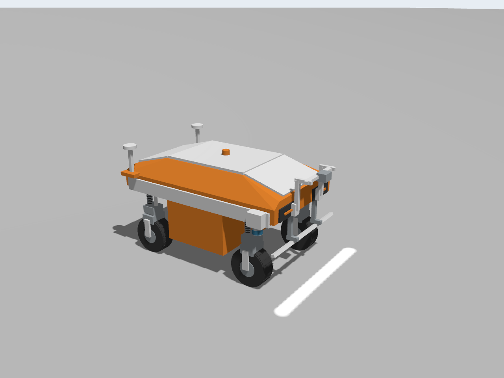

# 550 kg AGV重建与新相机基线

2026-09-08。用户修正了真机尺寸、质量和传感器，本轮重建代替旧65 kg小车。外观依据用户提供的三个视图近似，不能视作机械CAD。

## 当前参数

| 参数 | 当前值 | 来源/说明 |
|---|---|---|
| 总质量 | 550 kg | 用户；包含电池，模型将200 kg作为中央低置电池等效质量 |
| 车体长度 | 1.90 m | 不含前支架 |
| 主车壳宽度 | 1.10 m | 不含两侧雷达 |
| 含两侧雷达宽度 | 1.30 m | 名义固定外廓；转动轮组/天线等总扫掠另算 |
| 顶盖高度 | 离地1.10 m名义值 | 静载悬挂会有毫米级偏移 |
| 轮直径/宽度 | 0.40 / 0.16 m | 直径用户提供，宽度按图估算 |
| 轴距/轮距 | 1.30 / 0.94 m | 按图估算，均为轮组轴线距离 |
| 车体基准高度 | 0.65 m | 模型base_link，非车顶 |
| 电池舱尺寸/底部高度 | 长0.72 × 宽1.10 × 高0.4984 m；正常550 kg静载离地约0.25 m | 前后缩短、横向加宽，顶部与车壳相接；尺寸按图估算 |
| 双GNSS | 尾部小平台x=−0.85 m，左右间距1.10 m | 用户最新修正，替代此前1.20 m |
| 天线顶端高度 | 1.20 m | 外壳顶端，连杆中心不是标定相位中心 |
| 前两侧雷达 | C8型，倒装 | 8线仿真近似，非C16 |
| 相机 | 4096像素，20 mm，1.50 m幅宽 | 像元仍暂取7 µm |
| 光心名义高度 | 1.046317 m | 针孔近似1.5×0.020/(4096×7e-6)，需实机标定 |
| 相机前向偏置 | base_link前1.15 m | 前伸结构；掉头后扫描线位移2.30 m |
| LED | 长1.20 m，名义离地0.30 m，x=1.069615 m | 位于相机后0.080385 m，向前斜射 |
| 横向像素/纵向触发行距 | 0.3662109375 / 0.3657010198 mm | 纵向由单轮编码器固定乘除决定，见[编码器模型](ENCODER_MODEL.md) |
| 10 km/h标称轮速行频 | 7595.76 Hz | 默认轮径0.40 m，实际轮径可独立改变 |
| 默认图块 | 4096×4096 Mono8 | 理想平面约1.5×1.5 m，真实尾图保留 |
| 扫描轨迹间距 | 1.00 m | 侧向重叠0.50 m，约33.3% |
| 独立采样验收目标 | 11 kHz | 对应4.028 m/s（14.502 km/h）。这是**扫描速度的物理天花板**，低于15 km/h车辆最高速度，高于10 km/h额定采集速度 |

前后斜顶及左右向内收斜的肩部采用同一封闭28三角形网格，碰撞共用此低面数网格，白色顶板缩窄至0.74 m，橙黄色侧壁显式指定OBJ材质；保留下方白色腰线；增加下置电池舱、四组叉架/弹簧外观、胎面、尾部天线横梁、前相机/条光支架和倒装雷达。雷达外形为近似圆柱，不能据此判断实机版本。URDF、GZ、RViz和OptiX读取同一几何源，OptiX导出器新增三角OBJ读取，不省略车壳遮挡。

## 动力学与悬挂

四个prismatic被动悬挂，每轮±50 mm机械行程。2026-09-15依据用户提供的暂定响应目标，刚度改为8000 N/m、阻尼750 N·s/m；前后轴分别设置弹簧参考位置以维持550 kg负重车高。持续加速/制动俯仰实测约1.21°/1.51°，具体参数、验证边界及回退见[悬挂调参](SUSPENSION_TUNING.md)。这是等效线性悬挂响应拟合，不声称已匹配真实弹簧、减振器或连杆机构。

`suspension_travel: 0.05`是半行程，总行程100 mm；`springReference`是弹簧力为零所对应的关节参考位置，不是额外行程，也不是直接以牛顿表示的预载。弹簧力应由`k × (q − q_ref)`计算，不能只用关节位置q。以前文档中的4550 N、轮胎分担差额及每轮137.5 kg簧上质量的推论有误，已撤回。当前URDF簧上质量418 kg，每轮约104.5 kg；实际模态还受俯仰惯量、连杆约束与轮胎接触影响，不将单自由度近似当实测固有频率。

当前平地试验保留行程余量，但**悬挂不只是乘坐舒适问题，它直接改扫描几何**：足迹宽度=2×相机高度×0.7168，相机高度变δh则半幅宽变0.7168·δh，覆盖预算0.25 m里吃掉10 mm只需δh=14 mm。旧刚度下的平整路面试验曾测得整趟真值相机高度只变3.4 mm；该数值不能沿用为调软后的动态包络——**行程够不够、以及行程被用起来后覆盖预算怎么变，都要等带高差的路面模型才能回答**，与覆盖审计的高度取值来源是同一个问题的两面。

轮端驱动/保持峰值力矩上限暂设300 N·m（原150已因带载对轮被动滚动对照修订），转向上限180 N·m；最大转向速度0.65 rad/s、转向加速度1.5 rad/s²、最大车身角速度0.35 rad/s、线加速度上限0.8 m/s²、减速度上限1.0 m/s²。550 kg、0.20 m半径，在平地0.8 m/s²仅惯性需求约22 N·m/轮；滚阻、坡度、机械损耗、启动冲击另计。参数为临时轮端规格，不是电机选型结论。

当前gz_ros2_control仍用理想速度/位置接口；URDF effort字段不能替代电流环、力矩饱和和热模型验证。本轮运动通过只证明此伺服假设下可运动，不能证明真机300 N·m的额定/峰值、持续时间或热能力。若要验证电机负载/坡道，应增加受限力矩驱动模型与力矩记录。

以1.0 m/s²制动，10 km/h理论制动距离约3.86 m（约2.78 s），加速至该速度按0.8 m/s²约需4.82 m，尚不含反应/定位余量。小矩形任务先低速执行，规划须计入新车体、雷达/天线/前支架扫掠及更大的掉头相机偏置，不能沿用旧0.9 m车体端部余量。

## C8仿真边界

默认左右各10 Hz、1000水平采样×8垂直采样、0.3–50 m模拟测距、σ=1 cm测距白噪声。每台每帧8000点；原型为等间距−12°..+12°，不宣称是实机校准角表。官方C8页列−12°..+12°以及2°/4°垂直角度信息，仅靠页面不足以恢复精确8线表，待设备校准/手册提供后替换。范围、噪声也为仿真预算值，非厂家保证。倒装通过安装旋转处理，点云在各雷达自身坐标系发布，使用TF变换到车体/地面。

[官方C8页面](https://www.leishen-lidar.com/cx/184)。少线降低采样量但会影响小障碍/近场检测，必须用独立障碍目标验证；当前只接入点云，尚未实现自主避障。当前GZ扫描使用每帧扫描近似，未建模完整机械旋转期间的逐点时序。

## 验证与历史边界

模型500/550/600 kg变体总质量、正定惯量、8主动关节/4被动悬挂、GNSS间距及高度检查通过。无GUI运动、静载平衡与双点云通过；GUI＋RViz运动及点云测试通过；此后电池舱和斜肩形状修订另做模型/渲染检查，新版低速GUI/OptiX采集已通过，独立11 kHz与新版平场仍待复测。图为GZ实际模型渲染，不是AI效果图。

旧版65 kg、16 mm/1.2 m的11 kHz吞吐、标定和平场结果保留为历史基线，不能直接作为新车、新光学、新悬挂的验收。新的calibration_id为`nominal-linescan-4k-20mm-large-v7`，旧参考配置应拒绝兼容。GUI默认保持可旋转/滚轮缩放的跟车方式。

### 外观修订与显示边界

电池舱底面相对base_link为−0.3984 m、顶面+0.10 m，车壳下缘+0.08 m，接合重叠20 mm。根据550 kg静载悬挂平衡高度约0.6484 m设定底部离地约0.250 m；这是负重静止值，不是出生位姿/悬挂无载值，运动时允许变化。前后端x=±0.36 m，轮组轴x=±0.65 m，保守扫掠圆检查前后仍留约58 mm间隙。宽度随body_width为1.10 m。电池组件等效质量仍为200 kg，总车重550 kg，同步更新惯量。

GPS改装在尾部x=−0.85 m的小平台（长0.20、宽1.24、厚0.04 m）上，平台降低至名义顶面离地0.905 m，低于后顶盖边缘；与车壳接合，立柱加长至0.26 m连接天线；左右间距1.10 m，外壳顶端名义高度仍1.20 m。位置和相位中心外参标定不可混淆。

相机光心名义离地1.046317 m，静载/俯仰会略改变实际光心高度和地面幅宽。相机支架改为前端立面安装：固定座位于x=0.97 m、相对base_link高度0.15 m，立柱x=1.005 m、长0.30 m，前伸短臂与横梁承托相机。移除斜盖上的连接点及跨盖长臂，避免将可开启顶盖当成安装基座；未建模铰链及开盖运动，完整开盖扫掠需实机结构确认；检查257根覆盖原始畸变幅宽1.56 m的射线，无车体/支架遮挡（名义平地姿态）。

条光灯体长1.20 m，发光段长1.16 m；GZ光源与OptiX导出的发光点均由灯体尺寸计算。名义灯体中心离地0.30 m、位于扫描线后方0.080385 m，向前偏离竖直15°，仍对准相机扫描线；改变幅宽不要求改变纵向倾角。光带名义宽1.80 m、深0.16 m，覆盖原始畸变幅宽1.56 m。GZ 21聚光灯对257个扫描位置的光锥覆盖检查通过；这只是几何覆盖，不能替代照度均匀性/全悬挂行程/坡面验收。led_peak_relative仍40，不把相对亮度冒充标定lux。整车OptiX使用模型发光点；不带整车模型的历史独立台架仍保留旧0.56 m发光段，不可作为新版补光验收。补光几何变化后标定标识升级v7，需重做平场。

RViz默认显示参考系改为base_link，世界网格仍使用world，使跟车显示不再逐部件叠加不断变化的世界位姿；真实悬挂相对运动保留。此为显示侧处理，不更改控制或定位TF。此前同时间戳消息检查不能单独证明屏幕无抖动。

最新安装修订后复测：550 kg静载base_link高度0.648427 m，计入车体俯仰的电池舱最低角离地0.249932 m；前进、横移、斜行、原地转向、倒退与10 km/h速度检查通过，结束HOLD。该次为无GUI运动复测，结果见[记录](../results/stage3_large_platform_mounts.json)。

最终安装版本的GUI运动与水泥路面联合采集复核见[维护审计](archive/integration/MAINTENANCE_AUDIT.md)。

加减速更新后的任务实施次序见[详细计划](MISSION_IMPLEMENTATION_PLAN.md)。此前0.5/0.5 m/s²运动/采集记录仍保留历史参数。

本次降低条光后，几何检查再次通过257条相机射线零车体遮挡和257个位置光锥覆盖；既有光度/平场结论不得直接继承，后续按新安装重新标定。见[稳定性修订](issues/SCAN_STABILITY.md)。

2026-09-10带载对轮对照：四路零驱动指令下，150 N·m配置仍有两轮约0.148 rad/s被动滚动，产生多余编码器脉冲；300 N·m同场景降至约8×10⁻¹⁰ rad/s。它是当前GZ速度约束/接触模型下的结果，不是实测电机饱和曲线。按550 kg均分、μ=0.8和0.20 m半径估算的单轮静摩擦反扭矩约216 N·m，可作为量级检查，不能替代载荷转移和坡面试验。加减速度与最高速度未改。对轮仍可能改变相机位姿，跨越采集中大角度对轮的图块须按采集质量报告补扫。注意因果方向：150 N·m下的被动滚动是接触模型对真实反拖效应的正常反映，提高到300 N·m是抬高保持能力把该效应压住，不是消除了它。真机若不能在零速下持续保持约216 N·m以上，同样会出现对轮窄纹理带。当前保护数据质量的是跨对轮图块的`motion_quality_excluded`排除与补扫，不是这个力矩值。
