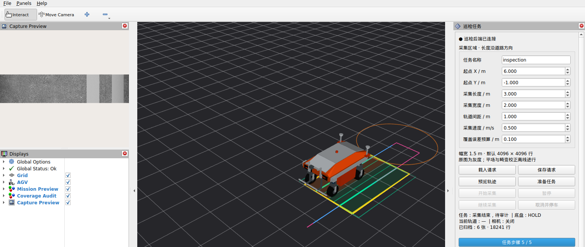
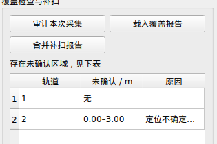
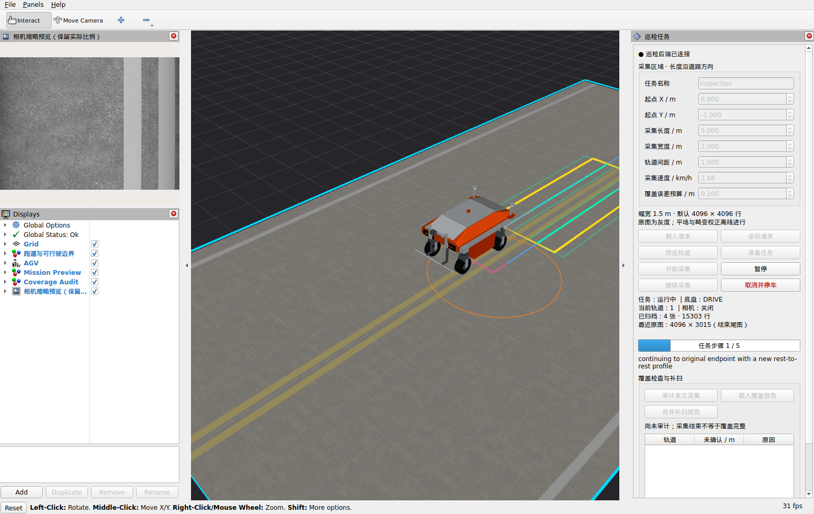

# 矩形任务执行

已接入绝对map目标、当前位置直线接入、停车航向对齐、连续PASS、横移、180°转身与前向驶出补偿。PASS将规划的ACCELERATE/SCAN/RUNOUT_BRAKE合为一条静止到静止时间曲线，扫描边界处不停。行距固定1 m，加速度0.8/减速度1.0 m/s²，当前试验0.5 m/s。

执行前须连续READY＋HOLD 5秒；输入道路frame必须显式map。车辆当前位置和规划路径都检查1.5 m扫掠半径；可行驶矩形的内缩区域是凸集，因此合法端点间的直线接入也不越界。该检查依赖用户声明的无障碍矩形，不是避障。每段终点是绝对规划坐标，不能把上一段误差累计到新目标。

```bash
# 将rectangle_demo.yaml复制到自己的任务文件，明确road.frame_id: map。
ros2 run agv_mission execute_rectangle --ros-args \
  -p use_sim_time:=true -p request:=/path/to/request.yaml \
  -p output_dir:=local_data/rectangle_run_01 -p autostart:=true
```

需先启动localization:=true的仿真；输出目录必须不存在。默认autostart=false，调用`/mission/start`（Trigger）开始，`/mission/cancel`取消并等待HOLD。取消不自动恢复；不同时运行其他cmd_vel发布者。每实例一项任务，归档plan.json、steps.json和execution.jsonl。

当前尚无动态避障和最高速区域闭环验收；RViz任务面板见下节。采集联动独立验证，不能把此运动报告称为完成了矩形图像覆盖。

后续已接可选capture模式，握手和归档语义见[矩形采集](RECTANGLE_CAPTURE.md)；本文件中的运动报告保留为独立基线。

当前换道采用前向驶出，已删除ENTRY后退段；0.5 m/s时中间轨迹的扫描后行程2.55625 m，掉头后直接对接下一道加速起点。调参、耗时与原图几何对照见[扫描稳定性优化](issues/SCAN_STABILITY.md)。

`tools/validate_rectangle_execution.py --gui` 默认启用锁定跟随（FOLLOW_LOOK_AT），始终看向车辆、保留滚轮缩放；需要固定场景视角时显式添加 `--no-follow-camera`。此前测试脚本强制关闭跟车，现已与正常启动的默认行为统一。

跟车启动需连续3秒确认目标为agv，避免仅凭场景加载期间一次短暂确认就退出；成功后不持续重发设置，不覆盖用户后续操作。旧版自由转头复查已保留在历史记录；当前锁定跟车验证见[视角说明](GUI_CAMERA.md)。


## 历史运动基线

以下14步结果早于前向换道修订；当前四道为11步，现行表现见扫描稳定性记录。

零噪声3×2 m两轨和带GUI＋RViz、正常噪声的8×4 m四轨均全部完成并停在HOLD。四轨共14个任务步骤，正常噪声各PASS参考/融合位置误差峰值约6.2–7.9 cm。它不是独立真值定位精度，也不是采集覆盖证明。聚合结果见[运动验收](../results/stage3_rectangle_execution.json)。


## 暂停与恢复

运行中调用`/mission/pause`（Trigger），进入PAUSING并持续发零速度，由底层按既定减速度制动；融合反馈有效、底层HOLD、速度低于阈值且停稳0.5 s后进入PAUSED。初始对轮结束前尚未开始采样；已有采集段暂停时保持相机启用，不关闭未满帧、不清零编码器触发余量。

调用`/mission/resume`显式恢复：当前位置到原计划绝对终点重新生成静止到静止的梯形/三角形时间曲线，不追赶暂停前的旧时间表，不重新跑整道；若已越过本道扫描终点，恢复只走剩余驶出段，不重新开启采集。仅在健康反馈、HOLD、相机握手完成时接受；停止后位置变化超过0.20 m、姿态变化超过0.10 rad、PASS终点已在后方，或保留图块的扫描段需要原地转向时拒绝，保留暂停状态并要求取消/重规划。这些是恢复护栏，不是亚毫米覆盖认证。

暂停期间定位过期或时钟停滞仍锁存FAULT，健康恢复不自动续跑。取消/故障走关闭采集的独立路径；取消等HOLD和相机关闭确认后成为CANCELED，故障保持FAULT。暂停记录位于`pause_events.json`，关闭原因归入`capture_intervals.json`。每实例仍只执行一项任务；不支持重启进程后自动续接内存中的未满帧。

```bash
ros2 service call /mission/pause std_srvs/srv/Trigger '{}'
ros2 service call /mission/resume std_srvs/srv/Trigger '{}'
ros2 service call /mission/cancel std_srvs/srv/Trigger '{}'
```


补扫使用审计输出的`rescan_*.yaml`作为新的`request`，启动新的执行器与输出目录；先确认旧执行器已退出、车辆HOLD、定位与相机恢复健康，保持唯一cmd_vel发布者。FAULT不会因生成补扫请求而自动恢复。实际初始位姿仍经过执行器接近路径检查，候选规划通过不意味着任意停车位置都能直接接入。

回归工具可用`tools/validate_rectangle_execution.py --gui --profile normal --scene ... --request .../rescan_000.yaml --output ...`复现补扫；它启动独立仿真实例，不代表故障进程原地无缝恢复。


## RViz巡检任务面板

完成OptiX配置并恢复当前20×10 m道路后，在仓库根目录启动：

```bash
source /opt/ros/jazzy/setup.bash
source install/local_setup.bash
ros2 launch agv_bringup inspection.launch.py
# 普通Linux附加 gpu_backend:=native；WSL使用现有OptiX运行库包装环境。
```

此入口同时启动Gazebo、RViz、正常噪声定位、导航归档、线阵原图采集与任务后端；启动后车辆保持等待，不自动行驶。每次创建新会话目录；可用`session_dir:=local_data/my_inspection_01`指定尚不存在的目录，`scene_manifest:=...`指定已恢复道路。基础`sim.launch.py rviz:=true`仍可只看机器人，面板会显示后端未连接；完整采集操作使用`inspection.launch.py`。

1. 在右侧“巡检任务”填写区域起点X/Y、长度、宽度、行距和速度，或“载入请求”读取YAML。长度固定沿道路方向，默认3×2 m、1 m行距、0.5 m/s。道路坐标注册及可行驶/成像边界来自请求文件，不让操作者随意旋转矩形。面板速度单位为km/h，默认1.8 km/h（0.5 m/s），上限10 km/h；YAML和后端仍用m/s。提速仍须通过加减速和转场空间校验，不能在短跑道上强行执行。
2. “预览轨迹”校验包络、成像边界和转场空间，显示黄色区域、绿色扫描幅宽、蓝色底盘扫描线及粉色转场线。改参数后须重新预览。“保存请求”写新文件，拒绝覆盖已有文件。
3. “准备任务”建立独立归档并确认相机关闭；定位连续READY、底盘HOLD满5秒后，“开始采集”可用。参数变化或其他速度发布者存在时拒绝开始。
4. 运行中锁定参数、载入与补扫切换；“暂停”制动后保留未满帧，“继续采集”仍去原绝对终点。“取消并停车”等待HOLD与尾图归档；FAULT不可直接恢复，需检查原因后重新准备任务。
5. 面板显示任务/底盘状态、当前道、相机开关、已归档张数与行数及任务步骤进度。左侧为保留实际宽高比的缩略预览，面板另显示最近原图尺寸和满帧/尾图状态；完整原图为4096×4096，缩略图通常为512×512。步骤进度不冒充面积覆盖率。
6. 结束后“审计本次采集”核对原图与融合标签。表格分别报告无采集证据、定位不确定度偏大或足迹偏离；地面绿色覆盖层表示估计已覆盖，橙色表示未确认。面板下方选择候选后“预览选中补扫”，再准备、开始，作为新任务执行。窗口较小时可滚动面板。
7. “载入覆盖报告”选择父任务`coverage.json`，“合并补扫报告”选择补扫报告；检查场景、标定和候选身份后更新覆盖，汇总另存新JSON。仍有未确认范围时保留相关补扫候选，不自动行驶。

每个会话目录内包含`camera.yaml`、`raw/`、`navigation/`和`tasks/`；每项任务独立保存请求、plan、状态日志、采集区间和审计。只有采集控制已关闭且底盘HOLD后才允许替换旧执行器；后端本身不发布速度，所有动作复用现有时间轨迹执行器与四驱四转状态机。关闭RViz窗口不等于取消任务，应使用取消按钮并确认停车。后端退出时停止命令发布，底层看门狗仍生效。

面板默认停靠右侧，用户保存RViz配置后保留自定义布局。机器人仍使用同步`/visualization/tf`、Fixed Frame=base_link；规划/覆盖标记锁定在map，持续按最新显示变换更新，并重试启动阶段的TF缺失。此显示链路不替代控制使用的融合定位。


实机窗口截图（裁去本机标题与路径，不是示意图）：





2026-09-09最终GUI回归：两道3×2 m、0.5 m/s、正常噪声，6块/18,241行，暂停保留完整帧、ROS/归档逐字节一致、最终HOLD；再准备补扫候选并取消，也确认HOLD与相机关闭。一次先前试验在转场时定位滤波输出年龄达到0.129 s触发FAULT，未放宽门限，也不声称重跑成功已消除该偶发中断。详情见[验证报告](../results/rviz_mission_panel.json)。

跑道显示使用场景清单内同源颜色贴图，RViz只加载每块两个三角面及最长边1024像素的缩略贴图，青色框表示声明的可行驶边界；这不是碰撞或成像几何。当前仅支持明确声明的平面world烘焙场景。



时间轨迹当前使用`trajectory_decel: 0.8` m/s²，底层物理`drive_decel: 1.0` m/s²保持不变，留出反馈制动余量；加速度上限仍0.8 m/s²。规划器与执行器读取同一参考减速度，因此10 km/h的规划制动段约4.82 m（另加边界余量），物理极限制动距离仍约3.86 m。修改该参数后重新生成计划，旧计划不直接复用。

## 面板与控制进程隔离

任务面板现在为每次准备启动一个独立执行器进程，通过ROS服务发送开始/暂停/恢复/取消，通过带`execution_id`的状态快照接收结果，拒绝旧任务残留状态。控制、定位新鲜度检查和速度指令在执行器进程中运行；面板不再直接调用同线程中的控制对象。命令竞争检查也由执行器独立执行。

`/mission/status`是周期刷新的BEST_EFFORT遥测，订阅者需使用兼容QoS，防止慢面板通过可靠DDS反压控制；本地`execution.jsonl`仍完整归档，控制服务保持原有可靠传输。面板自己的状态、静态道路/轨迹保留原来的接口。代价是额外一个Python/ROS进程与状态传输开销；不改变轨迹控制周期、定位门限或物理加减速度。

执行器意外退出时，底盘独立指令超时机制停车，面板另行请求关闭相机；只有收到关闭确认并观察HOLD才允许新任务。关闭失败锁存，不反复重试或声称已归档。正常释放先发SIGINT并等待退出，执行器进行有界停车/关闭；重复SIGINT不会打断这段清理。异常强杀的任务不能当作完整采集。

任务目录保留`callback_trace.json`（执行器正常退出时）与`broker_callback_trace.json`。计时记录回调及调度等待的墙钟/线程CPU耗时，内存中有界保留，无热路径文件写入；故障快照也包含最近计时。它可区分耗时所在环节，但不能单凭CPU/墙钟差就确定某一个驱动或系统调用是根因。
