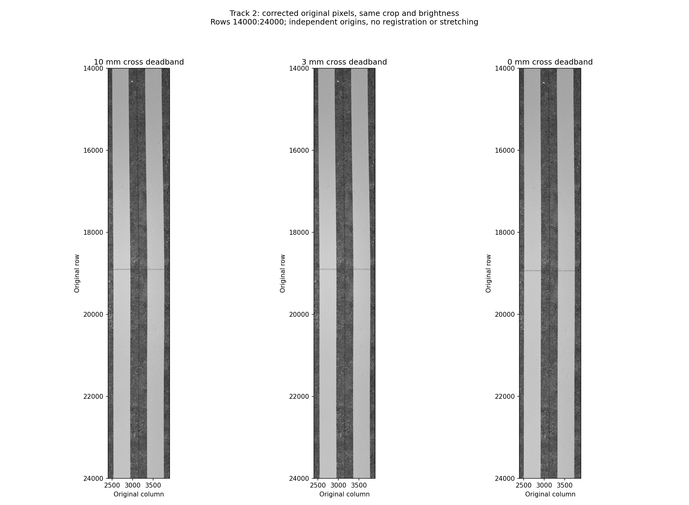
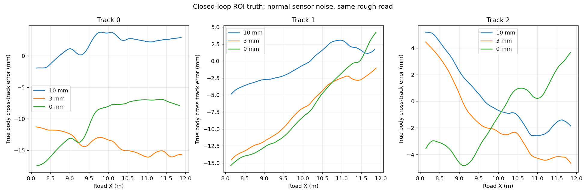
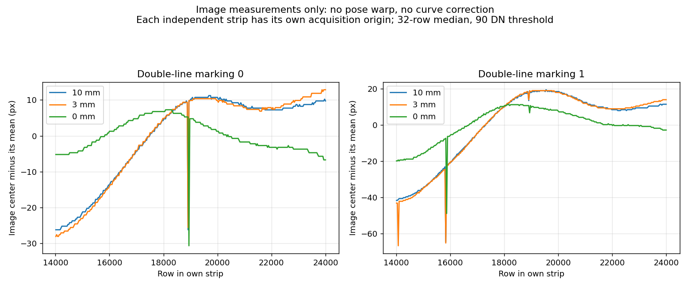

# 起伏路面上的闭环采集与横向死区对照

2026-09-15。用户希望将正式位置轨迹闭环接入20 m水泥标识起伏场景，观察标线是否出现平缓弯曲，再判断横向死区应减小还是取消。此前固定速度试片没有运行融合位置跟踪，不能用于评价该死区。

## 控制范围

在`tracking.yaml`增加`scan_cross_track_deadband_m`，当前默认0 m（完成下述对照后关闭横向死区），仍可配置非负值。仅作用于PASS的前向采集平移，在轨迹切向/横向基底上处理滤波后的误差。纵向位置死区仍为1 cm、航向死区0.004 rad、横向滤波0.6 s；APPROACH、换道和终点调整沿用原设置。不能通过把共用的`position_deadband_m`置零来同时改动制动和起点调整。

执行节点支持ROS参数`tracking_config`加载独立文件，并把实际使用的配置保存为`mission/tracking.yaml`；`tools/validate_rectangle_execution.py --tracking-config 文件`传入并用同一配置核对停车/异常阈值。默认配置不因试验覆盖文件而被改写。外部文件必须提供完整且无未知项的现行参数集合；执行器、独立段跟踪节点和`SegmentTracker`在运动前使用同一校验，缺键、拼错键和错误类型会在启动或构造阶段明确拒绝。

新增回归覆盖1 cm/3 mm/零死区下5 mm横向误差的响应、纵向前馈不变、零死区不影响APPROACH，以及负数/非有限参数拒绝。任务包160项测试通过，1 cm档实际三道采图通过。三档实际采集结果见下，不能由单测推定稳定性。

## 实验条件

同一`rough_markings_3mm_v2`场景（10 cm网格、最大绝对高程3 mm），正常GNSS/IMU/轮速噪声，默认种子，550 kg软悬挂和固定条光，真实轮径0.40 m。使用正式梯形/三角形时间位置轨迹、全局融合位姿反馈和底盘对轮/制动状态机。

请求10 km/h，采集矩形X=8..12 m、Y=−2.9..0.1 m，三道中心Y=−2.4/−1.4/−0.4 m，间距1 m。20 m场景其余空间供加减速及不倒退换道使用；三道不是各扫20 m。原图包含前导采集段，不把加速阶段的光照变化归为死区影响。

比较1 cm、3 mm、零死区三档，其余配置相同。独立仿真启动的随机样本相位及执行时序可能略有差异，单次三道不是严格同噪声轨迹重放，也不足以认定某档普遍更好。评价须同时看真实横向误差、融合误差、纠偏指令、连续采集和实际图像，不以“越弯越真实”作为调参目标。

复用软悬挂后重新实测的固定标定，离线平场和横向光学校正后按行直接连接；不做逐行导航投影、配准或拉伸。反向道仅作180°显示旋转，保留采集顺序的全分辨率PNG。

首次1 cm运行在起步前遇到GZ GUI上下文创建失败，触发系统关闭和任务保护停车；失败记录保留，重试完成。该事件不计入死区稳定性比较。

## 三档实拍结果

每档一次三道任务，GUI＋RViz＋OptiX，均ACQUIRED/HOLD，逐轮实际转角归档，各道存在连续传感器段覆盖请求ROI，原图与ROS像素一致。共9道、58张图、225,451行。零死区没有触发采集故障，但不能由此宣称多种子/长距离稳定性已验证。

| 横向死区 | 图块数 / 总行数 | 三道真实横向RMSE（mm） | 两条黄线中心峰峰变化（px） |
|---|---|---|---|
| 1 cm | 19 / 74,849 | 2.40 / 2.49 / 2.47 | 37.5 / 84.0 |
| 3 mm | 19 / 74,761 | 14.08 / 8.55 / 3.15 | 41.0 / 85.5 |
| 0 | 20 / 75,841 | 10.76 / 9.35 / 2.75 | 38.0 / 60.0 |

真实横向误差相对规划中心线，用同步真值在请求区域两端各去掉0.1 m后的采集窗口评价，每道约65–67个样本。不能把估计位置的误差当成真实横向误差。图块数/行数差异包含前导、覆盖余量和终止尾图处理；不是请求区域缺线，三档连续ROI均通过。

**对照后按用户决定将PASS横向死区默认设为0。** 小的滤波后横向误差也参与纠偏，保留0.6 s滤波和反馈限幅；这一选择不代表实验证明零死区最优。 本次小死区没有表现出更好的真实跟踪，也没有让照片明显更弯；但三次不是相同噪声轨迹重放，不能据此断言小死区必然更差。若以后要选择最优参数，需要多种子重复，并把初始偏差、噪声时序、精度和纠偏平顺性一起比较。



这次闭环条带能看到缓慢的形状变化，但仍属于较温和的变化。预览保持像素比例和共同灰度范围，没有横向夸大。全分辨率PNG可放大查看。黄线指标取Track 2连续条带第14000–24000行，32行中值、90 DN阈值、拒绝截断/过窄连通段；每档313个有效窗口。各条带起点独立，没有配准。

中心峰峰变化也包含整体倾斜；减去最佳直线后的非线性峰峰变化依次为约36.4/67.2、35.7/67.0、37.8/56.7 px。拟合仅用于诊断，**不改变任何输出图像**。这个片段不能把变形完全归因于横向纠偏：车体姿态在加速结束后仍可能恢复，同时有真实路面起伏。未改变支架刚性、未额外注入相机抖动。





### 最新融合误差与实际车速

这轮同时对齐了全局融合位姿与真值。九个ROI窗口的XYZ RMSE范围分别为7.2–11.7、7.5–15.3、8.3–19.3 mm；三个小角度姿态误差分量约0.10–0.56°、0.53–0.74°、0.076–0.198°。角度采用`R_true⁻¹ R_est`的车体坐标旋转向量，近似roll/pitch/yaw误差；不是直接减未展开欧拉角。

**软悬挂采集窗口的俯仰估计误差明显大于旧平地局部报告，不能沿用旧精度。** 本轮未诊断各源因果占比，也未改定位滤波器；这些真值/融合误差只用于评价，不参与平场、光学校正或条带生成。

请求速度为10 km/h；ROI内实际水平车速中位数为10.16–10.38 km/h。现有纵向位置反馈有追赶补偿，因此不能将这轮描述为物理速度严格不超过10 km/h。该行为未随横向死区试验修改；如需严格物理限速，应单独设计补偿限幅并复核时序/制动，不能混入本次A/B比较。未独立统计实时率或内存预算，也不代替新悬挂的100 m重复验收。

## 运行与数据

请求、三份参数文件及完整运行数据在`local_data/rough_closed_loop_v1/`；有效目录为`10mm_retry`、`3mm`、`zero_retry`。各目录的`strips/`保存三道完整PNG、对照预览和Track 2原尺寸`double_line_detail.png`。原图归档和导航记录不入Git。

```bash
bash tools/with_optix_runtime.sh bash -c '
  source /opt/ros/jazzy/setup.bash
  source install/setup.bash
  python3 tools/with_mesa_runtime.py python3 tools/validate_rectangle_execution.py \
    --output local_data/rough_closed_loop_v1/新的运行目录 \
    --gui --profile normal --scene local_data/rough_markings_3mm_v2/manifest.json \
    --request local_data/rough_closed_loop_v1/request.yaml \
    --tracking-config local_data/rough_closed_loop_v1/zero.yaml
' > /tmp/rough_closed_loop.log 2>&1
```

生成请求时以`rectangle_demo.yaml`为基础，设`road.frame_id=map`、`region.start_xy_m=[8,-2.9]`、`length_m=4`、`width_m=3`、`scan_speed_m_s=10/3.6`；其余边界/加减速配置保留。三份跟踪文件仅改变`scan_cross_track_deadband_m`为0.01/0.003/0，不能复制旧车辆参数。

`tools/concatenate_corrected_strips.py`使用本轮软悬挂后的固定标定，参数`--reverse-preview-tracks 1`只旋转反向道预览；完整PNG仍按采集顺序。`tools/analyze_rough_closed_loop.py --case '10 mm=.../10mm_retry' --case '3 mm=.../3mm' --case '0 mm=.../zero_retry' --output results/rough_closed_loop_deadband.json --figures docs/images`重绘本页结果。

1 cm与零死区各有一次GUI启动失败；两次均在实际任务开始前，不计入控制比较。零死区首次失败还暴露验证器只检查任务节点、未检查仿真launch退出，导致继续等待；现每轮检查launch存活，并记录其子进程供退出后清理。用独立父进程退出/子进程存活的小复现验证了清理，随后零死区带GUI重跑完成。失败日志保留，未切换软件渲染或放松控制/采集断言。

[完整数值报告](../results/rough_closed_loop_deadband.json)。
