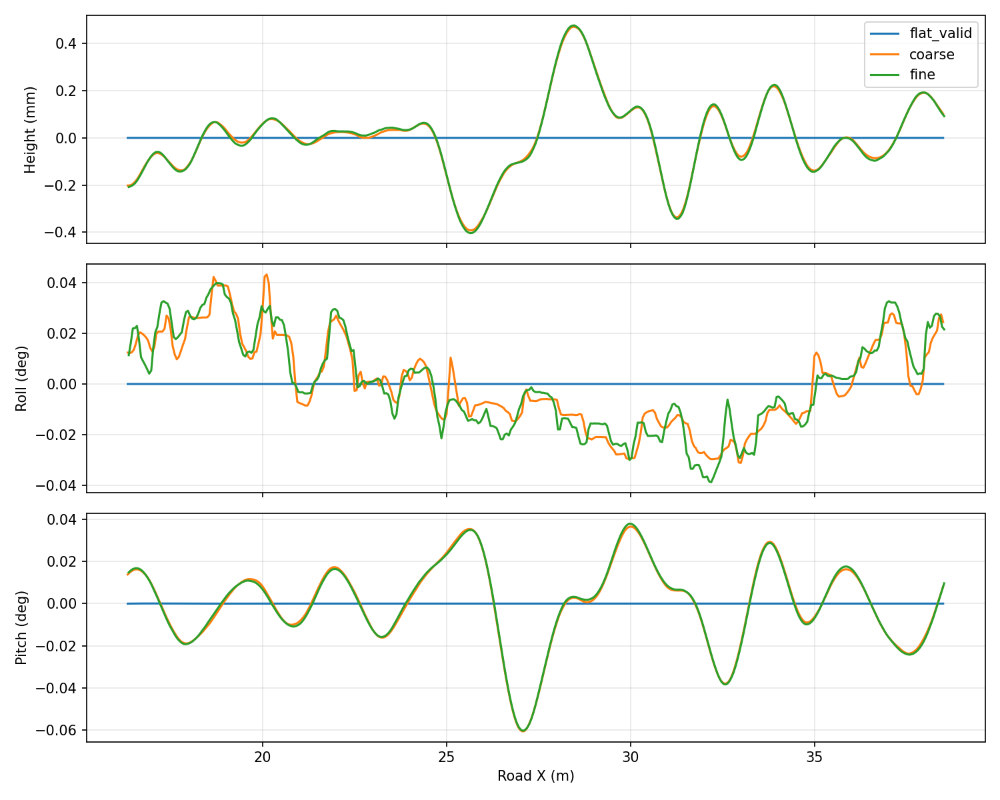

# 毫米级真实路面碰撞试验

2026-09-15。用户授权先试真实起伏几何，以低资源成本让AGV匀速时出现轻微振动。**本轮只生成独立50×4 m试片，不改默认水泥道路、碰撞代理或悬挂。** 不通过直接改车身/相机姿态、给悬挂注入虚拟外力来制造振动。

## 路面与方法

固定种子20260915，48个不同空间方向、波长与随机相位的分量组成二维高程场。波长1–6 m，未限幅前名义RMS 0.3 mm，以平滑`tanh`限制在±1 mm以内；实际网格高度标准差约0.273 mm、最大绝对高程约0.784 mm。起点2–5 m采用平滑渐入，避免初始台阶。没有宣称符合ISO 8608 A/B等级，也没有把旧碰撞代理的3 mm偏差上限当成道路RMS。

同一高程场分别取20 cm与10 cm网格，三角形面片及法线写入OBJ。GZ视觉、GZ碰撞和OptiX读取同一个资产，没有给轮子使用平面替身。对照平面也使用两三角形网格，避免比较时额外混入无限平面与网格碰撞形状的差异。材质为统一反射率，不含水泥纹理、沟槽或道路标识。

现行550 kg、0.40 m轮径、8000 N/m刚度、750 N·s/m阻尼。静止6秒，加速及预热7秒，10 km/h匀速记录8秒，制动保持7秒，结束确认HOLD及速度绝对值<0.001 m/s。真值里程计50 Hz仅用于诊断，未参与控制。

## 动力学与资源结果

| 项目 | 平面 | 20 cm网格 | 10 cm网格 |
|---|---:|---:|---:|
| 三角形数量 | 2 | 10,000 | 40,000 |
| OBJ文件大小 | 很小 | 0.95 MB | 3.96 MB |
| 匀速俯仰标准差 | 约0.000011° | 0.01973° | 0.01976° |
| 匀速横滚标准差 | 约0.00000024° | 0.01764° | 0.01904° |
| 车身高度标准差 | 约0.000003 mm | 0.1613 mm | 0.1634 mm |
| 最大俯仰偏离窗口均值 | 约0.000058° | 0.06056° | 0.06031° |
| 稳态实时率 | 约1.00 | 约1.00 | 约1.00 |

粗细网格俯仰标准差相差约0.17%、高度约1.3%、横滚约7.3%（相对细网格）。高度/俯仰波形十分接近，横滚局部波形仍有差异，不声称严格收敛。对独立随机地面坐标比较三角面插值与连续高程：20 cm网格误差RMS约0.0176 mm，10 cm约0.0045 mm。



波形已明显高于平面对照，幅度仍很小。匀速悬挂绝对关节位置最大约0.95 mm，远离50 mm限位。没有轮载测量，不能把这项行程检查说成严格证明轮胎始终接触；50 Hz信号也不能排除采样带宽以上的现象。8秒窗口仅能提供有限频谱分辨率，表中的波形变化不作为真机高频振动标定。

**资源结论限于本试片：未观察到实时率下降。** 实时率被设置为约1，不能据此推算还剩多少CPU/GPU余量；OBJ大小也不是实际内存或显存增量。没有测量100×10 m完整水泥材质与复杂沟槽叠加后的资源消耗。

## GUI、RViz与OptiX联合采集

两种起伏网格另各跑一轮GUI＋RViz＋OptiX：10 km/h、预热7秒、请求采集10 m并包含后续制动。每轮归档10张图，全部与ROS原图逐字节一致，最终HOLD；实时率分别1.00048（20 cm）和1.00016（10 cm），通过显式0.92实时率下限。图像中零值像素数为0，但这不是完整画质或缺线判据；连续行号/归档由原有验证器检查。

实际查看了原图：均匀反射率试片呈现照明分布与轻微变化，无路面纹理可用于判断特征变形。因此这里只证明共享三维采样链路能工作，不宣称拼接难度或成像真实性已经满足。GUI/RViz本轮为自动窗口/同步TF检查，未重做鼠标交互或屏幕运动部件人工验收。

## 后续取舍

真实碰撞路线已证明能在本机产生轻微匀速振动，不必立刻引入等效悬挂外力模型。20 cm网格成本较低，10 cm几何更准确；两者均保持实时。进入正式水泥场景前，仍需对横滚局部差异、完整场景实时率及采图影响做对照，再定默认网格。

将来接入水泥道路时，应将同一低频高程加到视觉/OptiX精细表面及碰撞代理基底，保留既有裂缝沟槽深度和代理约束。不能只改碰撞面，或把原来的沟槽直接抹掉。轮胎弹性与相机支架柔性仍未加入。

## 复现与证据

```bash
bash tools/with_optix_runtime.sh bash -c '
  source /opt/ros/jazzy/setup.bash
  source install/setup.bash
  python3 tools/with_mesa_runtime.py python3 tools/probe_rough_road.py \
    --output local_data/rough_road_probe/coarse --step .2
' > /tmp/rough_coarse.log 2>&1
```

`--step 0`为平面，`.1`为细网格；`--generate-only`只重建共享场景资产。生成资产、绝对路径world文件及原始时间序列位于忽略目录，不进Git。用`tools/summarize_rough_road.py --output results/rough_road_probe.json`重绘三组已有记录。

[数值报告](../results/rough_road_probe.json)与本页曲线入库。初次试片漏写OBJ法线，DART拒绝子网格并在初始化碰撞时崩溃；生成器已补齐归一化逐面法线及上向检查，后续三组测试均完成。这个初次失败不计入性能数据。
