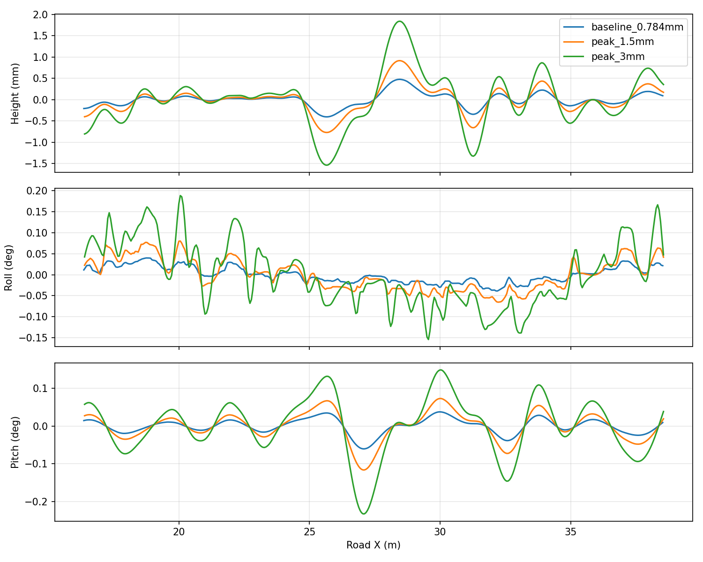

# 毫米级真实路面碰撞试验

2026-09-15。用户授权先试真实起伏几何，以低资源成本让AGV匀速时出现轻微振动。**最初使用独立50×4 m试片；后续另建20 m水泥标识起伏试片，均不改默认道路或悬挂。** 不通过直接改车身/相机姿态、给悬挂注入虚拟外力来制造振动。

## 路面与方法

固定种子20260915，48个不同空间方向、波长与随机相位的分量组成二维高程场。波长1–6 m，未限幅前名义RMS 0.3 mm，以平滑`tanh`限制在±1 mm以内；实际网格高度标准差约0.273 mm、最大绝对高程约0.784 mm。起点2–5 m采用平滑渐入，避免初始台阶。没有宣称符合ISO 8608 A/B等级，也没有把旧碰撞代理的3 mm偏差上限当成道路RMS。

同一高程场分别取20 cm与10 cm网格，三角形面片及法线写入OBJ。GZ视觉、GZ碰撞和OptiX读取同一个资产，没有给轮子使用平面替身。对照平面也使用两三角形网格，避免比较时额外混入无限平面与网格碰撞形状的差异。材质为统一反射率，不含水泥纹理、沟槽或道路标识。

现行550 kg、0.40 m轮径、8000 N/m刚度、750 N·s/m阻尼。静止6秒，加速及预热7秒，10 km/h匀速记录8秒，制动保持7秒，结束确认HOLD及速度绝对值<0.001 m/s。真值里程计50 Hz仅用于诊断，未参与控制。

## 动力学与资源结果

| 项目 | 平面 | 20 cm网格 | 10 cm网格 |
|---|---:|---:|---:|
| 三角形数量 | 2 | 10,000 | 40,000 |
| OBJ文件大小 | 很小 | 0.95 MB | 3.96 MB |
| 匀速俯仰标准差 | 约0.000011° | 0.01973° | 0.01976° |
| 匀速横滚标准差 | 约0.00000024° | 0.01764° | 0.01904° |
| 车身高度标准差 | 约0.000003 mm | 0.1613 mm | 0.1634 mm |
| 最大俯仰偏离窗口均值 | 约0.000058° | 0.06056° | 0.06031° |
| 稳态实时率 | 约1.00 | 约1.00 | 约1.00 |

粗细网格俯仰标准差相差约0.17%、高度约1.3%、横滚约7.3%（相对细网格）。高度/俯仰波形十分接近，横滚局部波形仍有差异，不声称严格收敛。对独立随机地面坐标比较三角面插值与连续高程：20 cm网格误差RMS约0.0176 mm，10 cm约0.0045 mm。


波形已明显高于平面对照，幅度仍很小。匀速悬挂绝对关节位置最大约0.95 mm，远离50 mm限位。没有轮载测量，不能把这项行程检查说成严格证明轮胎始终接触；50 Hz信号也不能排除采样带宽以上的现象。8秒窗口仅能提供有限频谱分辨率，表中的波形变化不作为真机高频振动标定。

**资源结论限于本试片：未观察到实时率下降。** 实时率被设置为约1，不能据此推算还剩多少CPU/GPU余量；OBJ大小也不是实际内存或显存增量。没有测量100×10 m完整水泥材质与复杂沟槽叠加后的资源消耗。

## GUI、RViz与OptiX联合采集

两种起伏网格另各跑一轮GUI＋RViz＋OptiX：10 km/h、预热7秒、请求采集10 m并包含后续制动。每轮归档10张图，全部与ROS原图逐字节一致，最终HOLD；实时率分别1.00048（20 cm）和1.00016（10 cm），通过显式0.92实时率下限。图像中零值像素数为0，但这不是完整画质或缺线判据；连续行号/归档由原有验证器检查。

实际查看了原图：均匀反射率试片呈现照明分布与轻微变化，无路面纹理可用于判断特征变形。因此这里只证明共享三维采样链路能工作，不宣称拼接难度或成像真实性已经满足。GUI/RViz本轮为自动窗口/同步TF检查，未重做鼠标交互或屏幕运动部件人工验收。

## 10 cm网格幅度对照：最大绝对高程1.5 / 3 mm

用户后续要求保持10 cm网格，将同一高程场整体放大。使用`--peak-mm 1.5`或`--peak-mm 3`，按整片网格的最大绝对高度归一化，不重新随机化、不削平峰值。实际高程分别为−1.500/+1.483 mm与−3.000/+2.967 mm，两档高程严格相差两倍（OBJ舍入误差≤1 nm）。空间波长、种子、网格拓扑、车辆配置和运动指令不变。

| 指标（匀速10 km/h） | 原0.784 mm峰值 | 1.5 mm峰值 | 3 mm峰值 |
|---|---:|---:|---:|
| 地面高度标准差 | 0.273 mm | 0.523 mm | 1.047 mm |
| 车身高度标准差 | 0.163 mm | 0.313 mm | 0.627 mm |
| 俯仰标准差 | 0.0198° | 0.0376° | 0.0756° |
| 横滚标准差 | 0.0190° | 0.0371° | 0.0751° |
| 最大俯仰偏离窗口均值 | 0.0603° | 0.1162° | 0.2327° |
| 最大横滚偏离窗口均值 | 0.0398° | 0.0801° | 0.1882° |
| headless稳态实时率 | 约1.00 | 约1.00 | 约1.00 |



1.5 mm与3 mm档在包括加减速的完整运动中，悬挂绝对关节位置最大约18.6/19.9 mm，未触及±50 mm端点。电池仓最低点高于z=0参考面约241.1/240.3 mm；再保守扣除各档最大路面高程，实际离地间隙下界约239.6/237.3 mm。不能把相对z=0的高度直接称为起伏路面上的实际离地间隙。

3 mm档超过此前0.2°的匀速姿态偏移观察目标，因此`small_vibration_target_met=false`，但运动和机械余量检查完成。这个0.2°不是机械安全阈值；工具的`passed`表示测量及停车/行程等硬检查通过，不代表满足轻微振动目标。保留结果，不提高阈值来让报告全绿。

两档另各完成GUI＋RViz＋OptiX采图（10 km/h，预热7秒，请求10 m并包含制动），各收到10张图，ROS与归档逐字节一致，最终HOLD。联合实时率分别1.00045/1.00023，均通过0.92下限。实际查看3 mm档原尺寸PNG，均匀反射率下呈正常照明分布，没有纹理特征可用于评价几何变形；不能以此声称拼接挑战足够。GUI为自动窗口/TF验证，未重做鼠标或屏幕动态部件人工验收。

建议把1.5 mm作为较温和的候选，3 mm作为较强的对照，尚未改正式道路。当前只有单次短程幅度比较，不能据此确定真机道路等级或图像算法难度。三角形数量均为40,000；振幅变化不增加网格数量，但实际CPU/GPU余量仍未测量。

数值见[幅度报告](../results/rough_amplitude_probe.json)。生成与运动命令沿用本页流程，在工具参数中增加`--step .1 --peak-mm 1.5`（或3），输出分别为`local_data/rough_amplitude_probe/peak15`、`peak30`。`tools/summarize_rough_amplitude.py --output results/rough_amplitude_probe.json`从保存的原始数据重绘对照；使用的是每组自身窗口均值，不用相机位姿修正图像。

## 后续取舍

真实碰撞路线已证明能在本机产生轻微匀速振动，不必立刻引入等效悬挂外力模型。20 cm网格成本较低，10 cm几何更准确；两者均保持实时。进入正式水泥场景前，仍需对横滚局部差异、完整场景实时率及采图影响做对照，再定默认网格。

将来接入水泥道路时，应将同一低频高程加到视觉/OptiX精细表面及碰撞代理基底，保留既有裂缝沟槽深度和代理约束。不能只改碰撞面，或把原来的沟槽直接抹掉。轮胎弹性与相机支架柔性仍未加入。

## 复现与证据

```bash
bash tools/with_optix_runtime.sh bash -c '
  source /opt/ros/jazzy/setup.bash
  source install/setup.bash
  python3 tools/with_mesa_runtime.py python3 tools/probe_rough_road.py \
    --output local_data/rough_road_probe/coarse --step .2
' > /tmp/rough_coarse.log 2>&1
```

`--step 0`为平面，`.1`为细网格；`--generate-only`只重建共享场景资产。生成资产、绝对路径world文件及原始时间序列位于忽略目录，不进Git。用`tools/summarize_rough_road.py --output results/rough_road_probe.json`重绘三组已有记录。

[数值报告](../results/rough_road_probe.json)与本页曲线入库。初次试片漏写OBJ法线，DART拒绝子网格并在初始化碰撞时崩溃；生成器已补齐归一化逐面法线及上向检查，后续三组测试均完成。这个初次失败不计入性能数据。

## 水泥标识试片：共享起伏基底

用户选择先观察10 cm网格、最大绝对高程3 mm的实际水泥图像。工具
`tools/create_rough_textured_scene.py`从现有Concrete047A标识试片派生独立场景：

```bash
python3 tools/create_rough_textured_scene.py \
  --source local_data/road_markings_probe_v1 \
  --output local_data/rough_markings_3mm_v1
```

试片保留原UV、颜色/法线纹理、箭头/禁停标识和浅裂缝沟槽，把同一个二维高程加到精细光学表面及碰撞基底。当前8个资产的碰撞面合计56,296个三角形。高程极值−3.000/+2.945 mm、标准差0.901 mm；按本试片全域重新归一化，不能把此前50×4 m试片的车身响应直接当成本片测量值。

新增`layered_heightfield_shallow_v1`代理契约，保留并校验原始浅缺陷参考网格、基底高程及碰撞网格的哈希。原有深度上限和受影响面积≤1%约束不变；粗碰撞网格必须逐顶点/逐三角形符合声明的高程基底。精细成像网格的每个顶点必须等于原顶点加相同高程，防止无意填平裂缝或只改变某一侧世界。光学与碰撞三角划分不同，另在光学三角形三边中点和重心检查基底插值误差≤0.15 mm；这是抽样约束，不是所有面内位置严格相等的证明。

生成器对未改资产使用硬链接节省磁盘，改写文件先断开链接，默认场景保持原样。生成的场景和参考网格留在`local_data/`，不提交Git。自动回归33项通过（新高程/代理10项及既有共享场景23项），包含篡改哈希、重新计算哈希后偷偷填平、过大高程和过大面内插值误差拒绝。

本段只说明资产和校验完成。带GUI/RViz的实际水泥采图、离线校正及条带对照结果需独立记录，不能由资产生成成功推定实时率或图像效果。
