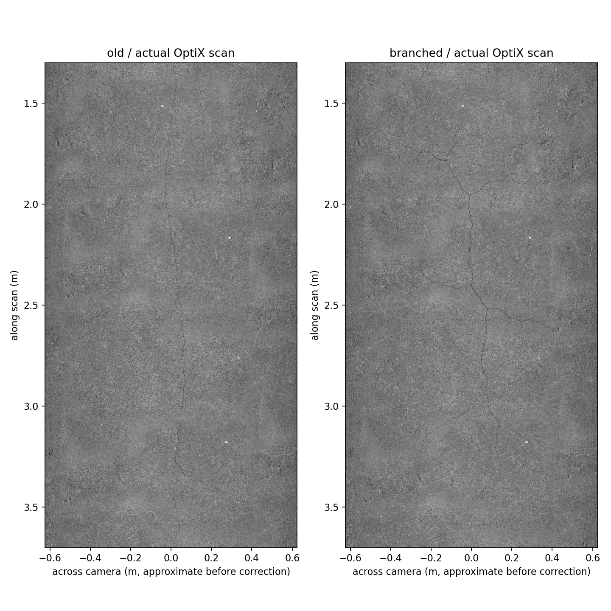
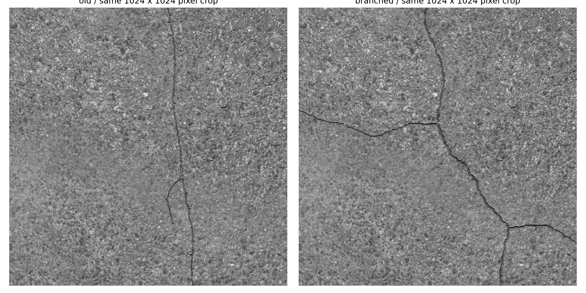
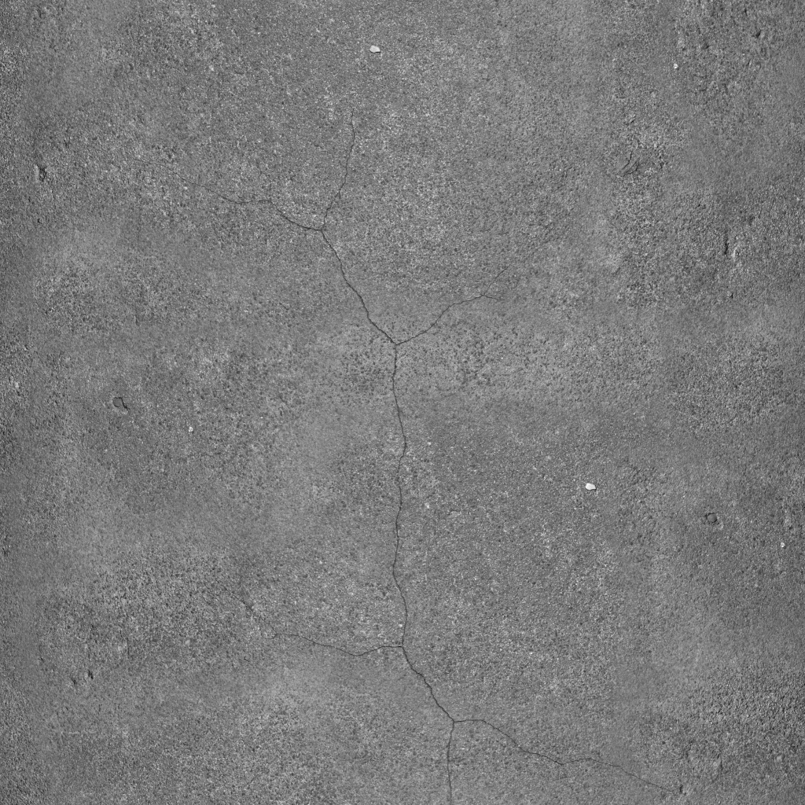

# 分叉裂缝局部试片

> 历史实验记录：本文参数、性能和“当前/默认”描述属于当时版本，不作为新版验收。现行550 kg、20 mm/4K/1.5 m、1 m轨迹间距、11 kHz目标见[当前模型基线](LARGE_AGV_REBUILD.md)。历史命令须按现行配置调整，旧16 mm标定不可用于新版；大体积实验资产可能已清理，复现需重新生成。

2026-09-08。用户反馈现有裂缝像刀刻，要求细长、自然分叉，宽度仍为0.8–2.0 mm。本轮仅制作独立局部试片；正式100 m道路未替换，TIFF显示导出继续后置。

后续更新：用户已认可分叉外观。下面保留精细碰撞试片的原始数据；此前实时率回退已通过显式碰撞代理在局部试片中解决，当前推荐简化碰撞版本，见[碰撞简化记录](STAGE2_COLLISION_PROXY.md)。相机与Gazebo视觉沟槽不变。

## 原图与提取

使用内置image_gen生成单条透明底分叉裂缝，原始PNG保存在[concrete_crack_branch_ai_v2.png](../assets/road/generated/concrete_crack_branch_ai_v2.png)，完整提示词保存在[同名prompt文件](../assets/road/generated/concrete_crack_branch_ai_v2.prompt.txt)。不是现场照片，生成图本身不提供毫米尺度真值。

旧版流程将2.2 m长裂缝的横向范围压到0.14 m，原图的长分叉也被压缩。新版保留原图纵横比例，局部范围约1.8×0.828 m，再校准中心线局部直径为0.8–2.0 mm。支路并集、尖端和抗锯齿像素的可见宽度不能用这个名义直径替代独立测量。

第一轮提取先放大二值图再细化，放大样片出现短倒刺，因此未采用。最终流程先在原图尺度平滑及细化，剪除不足12原图像素的末端提取毛刺，用0.55原图像素容差简化已有轮廓，再按亚像素坐标等比重采样。保留长分叉与连接关系；这些处理是从生图轮廓派生几何，不生成随机裂缝路径。两个独立提取回归测试覆盖长分叉保留、短毛刺清除和确定性。

## 材质与几何

- 裂缝中心深度按图像来源粗细变化在1–2 mm之间变化，横截面为圆滑凹槽，避免整条统一平底刀口。深度为试验合成参数，不是实测值。
- 同一中心线、宽度场和覆盖蒙版派生沟槽、反射率变化和微观法线衰减。真实凹槽坡度来自三角网格，不在法线贴图中重复叠加宏观坡度。
- 原图的彩色边缘与烘焙阴影不直接贴回路面。只对裂缝内部做中性、适度的反射率衰减近似积灰/材质变化，实际补光遮挡由OptiX计算。不声称已建立真实积灰或断裂力学模型。
- 底纹保持Concrete047A颜色＋法线，粗糙度统一0.60，源图按2.1 m项目尺度映射。逐像素检查确认裂缝覆盖之外的高分辨率颜色和法线与对照完全一致。
- 5×5 m水平支撑地面内放置约2×2 m试验区域，高精度光学走廊为2.6×1.6 m：x∈[1.2,3.8]、y∈[−0.8,0.8] m。没有新增起伏、坑洞或板块高差。本试片不带标线/板缝，避免干扰裂缝外观比较。
- 0.25 mm/纹素，10400×6400，颜色R8＋法线RG8各方案的纹理逻辑负载均为190.43 MiB。新版355,562个三角形，对照206,566个；同一个OBJ供GZ视觉、碰撞和OptiX使用，已核对材质哈希、UV/世界坐标及共用网格引用。

## 验证范围

对照采用同一底纹、照明、20 µs曝光、相机安装和生产OptixScene内核。扫描x=1.3–3.7 m，4096列、8192行，每批256行、三次曝光样本。4/8/16/32/64个灯条采样点分别测试，旧/新与新/旧顺序各一次。固定夹具关闭噪声与PRNU以检查重复像素一致性；整车采集使用正式配置。

独立长时间复核重复扫描该小块地面，不代表大场景流式加载、冷缓存、ROS归档或完整11 kHz验收。报告显式设备分配差异，不冒充驱动、Gazebo、GUI和系统总显存峰值。

| 16点灯条采样比较 | 旧版 | 新版 |
| --- | ---: | ---: |
| 两次短测采样率 | 46,214–46,386 行/s | 45,528–45,564 行/s |
| 平均256行批次耗时 | 5.529 ms | 5.621 ms |
| 高分辨率颜色＋法线逻辑负载 | 190.43 MiB | 190.43 MiB |
| 三角形 | 206,566 | 355,562 |

平均批次耗时增加约1.65%，显式GPU分配增加16.51 MiB。新版另测8192批、2,097,152行，累计采样45.662 s，平均45,928行/s，P99批次6.837 ms、最大8.818 ms；这是局部采样11 kHz回归通过，**不是端到端验收**。顺序反转复测和长测导出的实际像素一致。完整数据见[统计记录](../results/stage2_branch_crack.json)。

下图由生产OptixScene实际射线采集；固定夹具脚本提供运动，用于光学比较，不是定位/控制算法。左旧右新，均应用同一sRGB显示转换，原始Mono8未改。





本轮先解决主线过直、分叉压缩及提取倒刺；真实断裂边缘的细碎剥落、积灰分布与实测宽度统计仍需进一步验证，不把生图来源等同于现场裂缝保真验收。

## 整车验证与发现的性能问题

0.5 m/s、2.1 m短距离扫描，使用正式四点条光、噪声、4096行默认图块和编码器触发。新版GUI＋RViz及无GUI运行、旧版GUI＋RViz对照均完成；ROS接收与归档逐字节相同，扫描段连续，结束零速HOLD并关闭实例。新版GUI记录预览传递曲线为`srgb_display_only`。

| 整车测试 | 实时率 | 原图行数 |
| --- | ---: | --- |
| 旧裂缝，GUI＋RViz | 1.0003 | 4096＋3075 |
| 新分叉，GUI＋RViz | 0.8189 | 4096＋3070 |
| 新分叉，无GUI | 0.8412 | 4096＋3071 |

**精细碰撞版本曾出现整车实时率下降；局部修复见[碰撞简化记录](STAGE2_COLLISION_PROXY.md)，尚未推广整路。** 这是4.2 s仿真窗口的短测，不是稳定的整路性能估计。GPU采样只增加约1.65%的耗时，不能解释/掩盖整车开销；无GUI仍变慢，提示共享精细几何的物理/接触处理等开销需进一步隔离，尚不能断言某个碰撞算法就是根因。当时计划比较同拓扑平面和有沟槽网格；后续按用户建议直接对照精细/简化碰撞，保持可见轮廓不变；任何视觉/碰撞简化都要明确误差边界，不能静默换成无裂缝平面。

新版GUI两块共7166行，没有中途分段或缺行；显示TF无异步时间戳错误，待处理超时丢弃为0。采样最大批次6.15 ms；轮心高度最大单步变化约0.0014 mm，未观察到大幅跳动，但这不是全程接触力或任意速度验收。

下图来自新版整车第一张4096×4096原图，以线性面积缩小后做显示转换；不是生图效果图，也没有离线校正。完整查看版保存在本地试片目录的`vehicle_capture_srgb_4096.png`，原始PGM归档保持线性。GUI加载试片清单时发现缺少`length_m/width_m`，已补齐并重测通过，网格/材质哈希不变。



用户已确认分叉外观，局部碰撞简化也已恢复实时。后续进入全宽路段验证，再扩展整路；TIFF最终显示导出仍后置。

## 复现

颜色、法线源图可按[资产说明](../assets/road/README.md)恢复。先构建agv_linescan，再在仓库根目录执行（输出目录必须不存在）：

```bash
python3 tools/branch_crack_fixture.py --output assets/road/baked_branch_crack_v2c
bash tools/with_optix_runtime.sh bash -c '
  source /opt/ros/jazzy/setup.bash
  source install/local_setup.bash
  python3 tools/validate_branch_crack.py \
    --scene-root assets/road/baked_branch_crack_v2c \
    --output /tmp/agv-branch-crack-check
'
```

包装脚本用于本项目实验性WSL OptiX运行库；普通Linux使用已经正确安装的原生运行库时可直接在ROS环境运行Python命令。派生大纹理和OBJ保存在被忽略的`baked_*`目录；原始生图、提示词、生成工具和小型结果随项目保存。外观已获认可，整路推广仍需扩展场景和性能验证。
