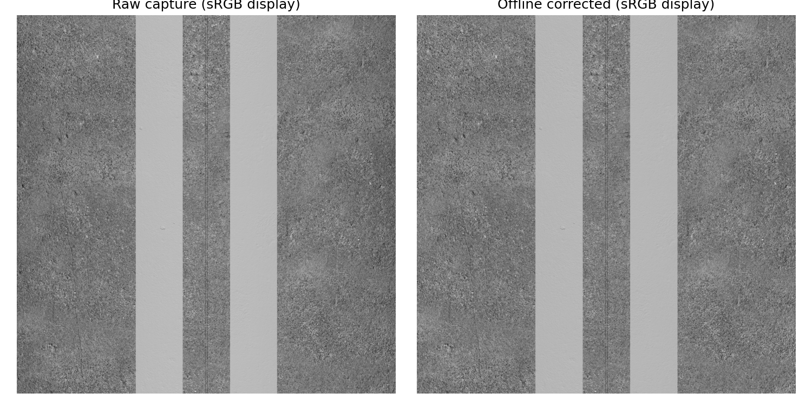
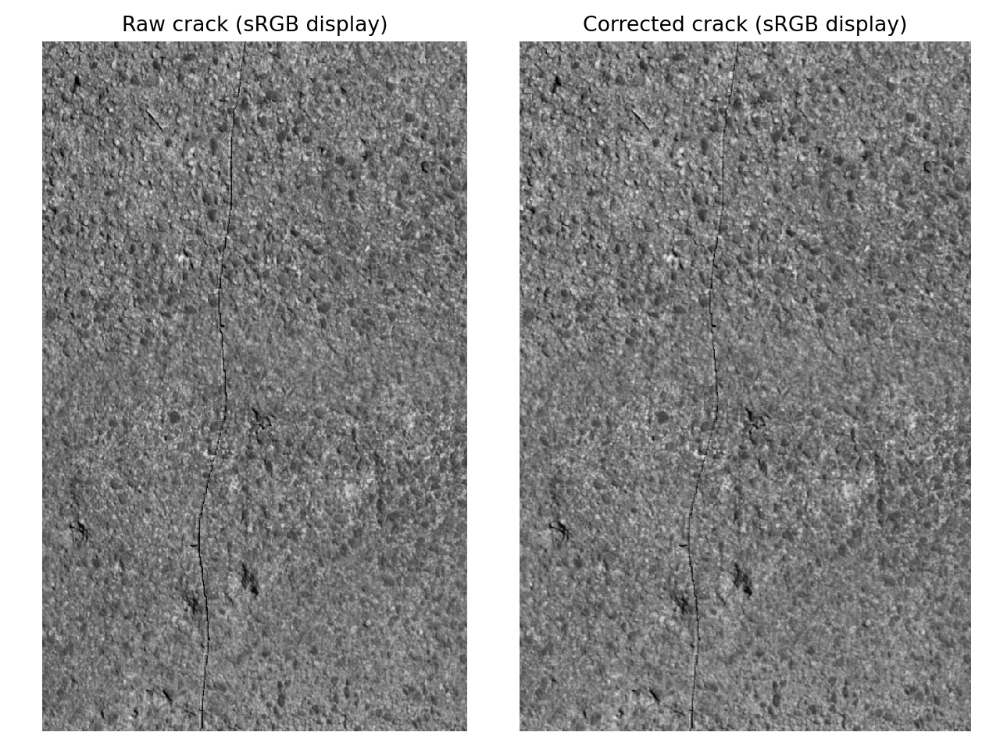

# 水泥路面标定复核与离线校正

> 历史实验记录：本文参数、性能和“当前/默认”描述属于当时版本，不作为新版验收。现行550 kg、20 mm/4K/1.5 m、1 m轨迹间距、11 kHz目标见[当前模型基线](LARGE_AGV_REBUILD.md)。历史命令须按现行配置调整，旧16 mm标定不可用于新版；大体积实验资产可能已清理，复现需重新生成。

2026-09-08。当前正式流程为：**采集原图及少量位置标签 → 归档 → 离线暗场/平场及横向畸变校正 → 后续运动补偿与拼接**。不要求在线校正；已有在线节点和回放测试仅保留为可选诊断证据。11 kHz目标适用于原始采样、传输和归档，离线后处理不要求实时。

## 图块与处理入口

横向4096像素，纵向行数可配置，默认4096行：完整原图为4096×4096，名义地面范围约1.2×1.2 m。相机YAML的`block_rows`决定默认值；OptiX/C++启动参数`scan_block_rows:=2048`可覆盖为4096×2048，不改变每行像素数和编码器行间距。停止采集时保留短尾块实际行数，不补齐、不重用末行。

采集时不设置`correction_profile`，只生成原图。结束采集后，在仓库根目录运行：

```bash
python3 tools/correct_linescan_session.py \
  --input /path/to/capture/session_cpp_TIMESTAMP \
  --profile results/linescan_calibration_concrete_16mm.json \
  --output /path/to/new_corrected_directory
```

只需要Python、NumPy、Pillow、PyYAML，不启动ROS/Gazebo/GPU。输入为完整原图session目录，包含`calibration.yaml`及配对PGM/JSON。逐块处理，不把全程图像拼成巨大内存数组。

输出包括校正后的PGM、保留首末时间/位姿/全局行号/稀疏标签的JSON、标定副本及完成摘要。原图不改动；预先核对标定条件、图块编号、行数和同段连续性。缺块、条件不符或损坏尺寸会报错。输出目录必须新建；每个图像/元数据临时文件完成并fsync后改为正式文件名，全部完成才写`summary.json`；中途失败记录`FAILED.json`，不冒充完成。未声明目录项断电耐久性。

## 灰度与显示亮度

默认原图及离线校正图均为Mono8（8位灰度），原始DN保持线性光强响应。Concrete047A颜色先从sRGB转换为线性反射率；将线性DN直接显示，会比图库照片显得暗。样片及OptiX/带辐射模型的CUDA预览现在使用sRGB显示转换，原图预览先扣除配置黑电平，再进行显示编码；校正图已扣暗场，不重复扣除。RViz先在线性空间做面积缩小，再转换，配置`preview_srgb: false`可恢复原始DN显示。归档和`/linescan/image_raw`不受影响，平场及畸变仍为离线处理。

本次仅调整显示：曝光保持20 µs、LED相对峰值40、增益1。转换不会增加光子数、信噪比或恢复过曝细节。实际裂缝区域原图平均约52/255，暗部显示更清楚；整段原图饱和比例约0.000528%，不能仅凭肉眼偏暗判定曝光不足。后续若改变曝光或补光，应重新验证亮部裁剪和标定适用性。下方PNG已采用显示转换，所有数值评估仍使用原始线性DN。

## 待办：最终拼接与TIFF显示输出

2026-09-08用户确认暂缓，在离线拼接阶段处理；当前只有样片和预览的显示转换，**最终TIFF导出尚未实现**。

- 顺序为线性原图 → 离线暗场/平场及畸变校正 → 运动补偿与拼接 → 统一显示亮度转换 → 供查看的TIFF。保留单独的线性数据供算法和定量分析。
- 查看版采用与样片一致的sRGB传递曲线，明确灰度编码及适当的色彩描述，测试目标看图软件中的实际显示；不能仅改扩展名或只写标签而不转换像素。当前仍为灰度成像，不将显示编码称为彩色采集。
- 整幅使用一致映射，禁止逐图块独立自动拉伸产生亮度接缝；记录黑电平、转换参数和是否已转换，避免重复扣暗场或重复gamma转换。无效像素和过曝区域须保留有效性信息，不能靠提亮伪造细节。
- 采用分块读写及必要时的BigTIFF，避免将100×10 m全图一次载入内存；验证跨块亮度连续性、灰阶/亮部细节、空间尺度及资源峰值。显示编码不会增加实际曝光、光子数或信噪比。

## 标定复核

沿用16 mm、光心离地约0.670 m、近车体LED安装。在实际GZ/OptiX采集链路重新采集暗场、均匀漫反射亮场、50 mm条纹板和偏移25 mm的独立验证板。亮场/条纹第一完整块用于拟合，另一个亮场块和独立验证板用于评价；不读取仿真畸变多项式作为拟合答案。

| 指标 | 校正前 | 校正后 |
| --- | ---: | ---: |
| 独立亮场列均值变异系数 | 7.3200% | 0.05945% |
| 独立条纹板最大横向误差 | 65.167 px | 0.5021 px |

4096列全部有效，拟合最大残差0.2370 px。新测量与此前参考一致，旧标定的光学/安装兼容性检查也通过。当前参考文件为[linescan_calibration_concrete_16mm.json](../results/linescan_calibration_concrete_16mm.json)。文件包含测量数组，原始参考图的临时路径只用于来源记录；重建描述后若几何哈希变化，需要重新确认标定。

均匀板用于估计仪器与固定照明响应，不用水泥照片估计平场。颜色/法线/粗糙度和沟槽产生的真实外观变化仍保留。这里是固定高度平面校正，不是完整内外参分离、颠簸补偿或三维路面展开。

## 水泥归档离线验证

使用100 m共享路面中央高精度走廊上10 km/h、60 m采集的51张原图，共204,894行：50张4096×4096，最后一张4096×94。全段离线处理约7.20 s，约28,469行/s（单次本机记录，文件缓存可能热），最长单块约171 ms；该数值不是离线验收门槛。

- 全部校正像素与参考处理结果一致；分块校正与跨块联合校正相同。
- 首末时间、位姿、行号、每块不超过5个标签保持；同轨迹不添加重叠行。
- 839,245,824个原始像素中4,429个饱和，约0.000528%；校正值另外有4,017个达到上限，约0.000479%。饱和输入不能恢复细节，当前校正器将相关输出置为无效0值并保留原图及计数；不要把它当成新的缺陷真值。
- 独立路面标线边缘检查：忽略实际横向偏移时最大误差1.77 px；该块相机偏离中线约−0.457 mm。仅在评价端纳入归档仿真位姿后最大差约0.263 px。校正算法未使用真值位姿，仍需后续基于测量定位的运动补偿。
- 裂缝裁剪来自实际原图及离线校正结果，可见细裂缝与颗粒保留；不是裂缝宽度或检测准确率的最终验收。





## 保留的在线诊断记录

在用户明确后处理离线化之前完成了以下测试，不作为正式流程要求，也不自动启用：

- 10 km/h、60 m，GUI＋RViz＋在线校正：实时率0.98518，51原图/51校正图均与归档及离线结果逐像素一致；校正队列峰值2，最长接收到发布约283 ms，纹理必需块预取未命中0，最后HOLD。
- 真实水泥原图的生产校正节点回放：150个完整块、614,400行，约54.86 s，11,199.98行/s。含原图读取/耐久副本、ROS、校正、校正文件fsync和独立像素/标签检查；不含同时运行OptiX、GZ或GUI，不能叠加此前渲染吞吐而宣称全链路11 kHz。

完整数值见[stage2_concrete_correction.json](../results/stage2_concrete_correction.json)。绿线辅助显示保持原样。

重新测量标定板并使用水泥路面作为检查样本：

```bash
bash tools/with_optix_runtime.sh bash -c '
  source /opt/ros/jazzy/setup.bash
  source install/local_setup.bash
  python3 tools/validate_optix_calibration.py \
    --output /tmp/agv-new-calibration \
    --grid-scene assets/road/baked_streaming_road_v1/manifest.json
'
```

其中`--grid-scene`是历史参数名，也可传当前水泥场景；平场和条纹标定板由工具单独生成。

可配置行数实测：设置`scan_block_rows:=2048`后收到4张4096×2048及1张4096×346，离线工具同样保留该尺寸和短尾块。13项标定/离线测试通过，覆盖自定义行数、短块、源文件不变、缺图/缺块/同段行号断裂拒绝处理。

三维地形与正式多轨拼接采用[连续条带方案](SURFACE_HEADING_STRIP_DESIGN.md)：跨文件共享时间变化的几何映射，文件重新分块不改变解；当前固定平面校正器仅为前置基线，不构成该方案已实现的证据。
