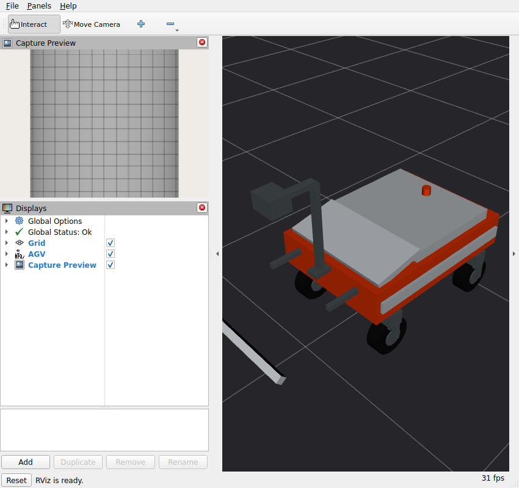
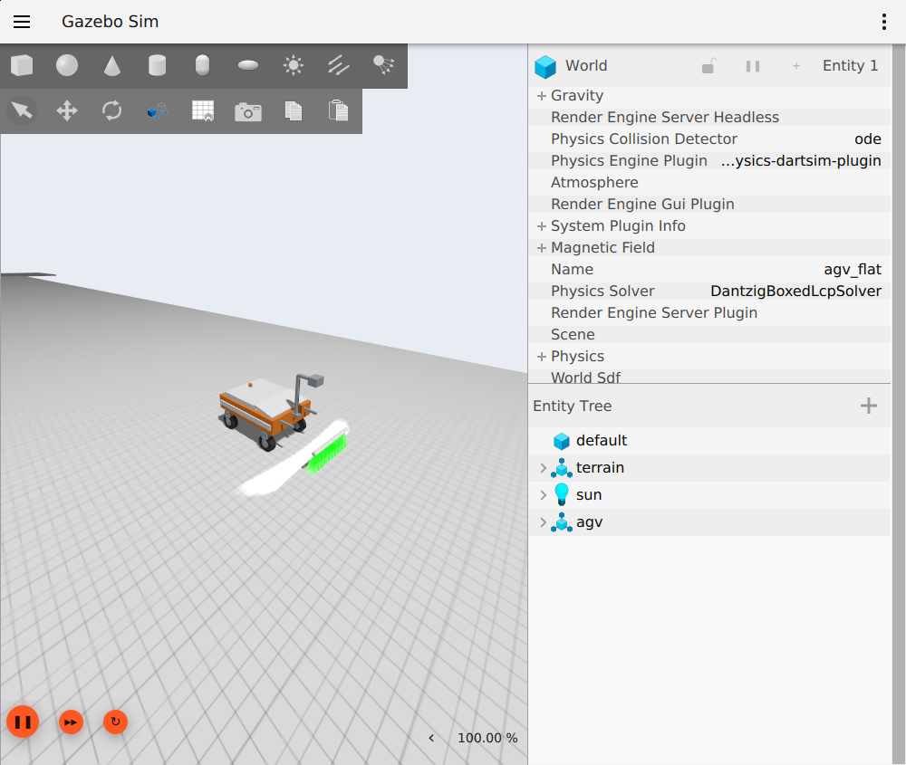

# 10 km/h 平地采集与 GUI / RViz 抖动修复

2026-09-07。当前仿真限速改为 **10 km/h（2.77778 m/s）**，控制器默认值、共享平台配置、URDF 驱动关节速度限制和运动验证工具同步。真车 20 km/h 仅保留为设计参考。4096 像素 / 1.2 m、行距 0.29296875 mm 对应 **9481.48 Hz**；11 kHz 提供能力余量，不把供给只有 9.48 kHz 的整车测试标为 11 kHz 验收。

## 问题与改动

原来世界位姿更新 50 Hz，robot_state_publisher 默认仅发布 20 Hz 轮组 TF。RViz 查询各连杆的最新可用变换时，直接显示的车体与经过轮组分支查询的车轮可能使用不同时间，形成相对前后错位。高速下几十毫秒足以产生厘米级显示误差。

现在关节 TF 发布上限为 100 Hz；`visualization_tf.py` 等待里程计时间戳前后的关节变换，用 TF 插值构成同一时间戳的八个运动连杆和 world → base_link。先发布子节点，再发布世界父节点，避免父节点提前推进最新时间。RViz 专用 `/visualization/tf`；不外推、不修改控制反馈或物理状态。显示仍跟随车体，固定坐标系为 world，地面网格随运动变化。

RViz 全红来自同一 link 内多个 primitive visual 的材质处理：上游 [RobotLink 实现](https://github.com/ros2/rviz/blob/jazzy/rviz_default_plugins/src/rviz_default_plugins/robot/robot_link.cpp) 在未提供材质名时选择首个 visual。现在将其余 visual 拆为固定子连杆，保留原始位姿、材质、质量和碰撞；同一展开 URDF 同时交给 GZ、RViz 和 OptiX。导出测试确认烘焙后的光学几何不变，整车运行确认仍为九个动态几何组。未修改系统 RViz。

大图链路参考 `climbot_sim/docs/INCIDENTS.md` 第 12、13 项的历史经验：给 GZ 发布端配置 128 MiB FastDDS SHM 空间，保留 UDP 传输；已有用户 profile 时不覆盖。实际进程环境和共享内存映射确认生效，段文件大小约 140.5 MB（含实现开销）。这只改善传输缓存，不代替采集队列边界或接收完整性校验。

原生 4K 网格线宽仅数个像素，缩进小窗口时会出现缩小混叠。新增 `/linescan/image_preview`，按 32 × 32 像素面积平均生成完整块 128 × 128 预览，局部像素不足一格时按实际面积归一化。RViz 使用此预览；原始 4096 × 4096 数据、算法输入、ROS 原图和归档保持原分辨率。新 GUI 测试的图像显示负载与此前直接显示 4K 原图不同，不能将性能差异全部归因于 SHM 或 TF 单项。

## 实测

RTX 5080，WSL，Gazebo 与 RViz 均确认使用 Mesa D3D12，OptiX 继续使用进程隔离运行库。100 × 10 m 水平网格，200000 地面三角形，九组运动连杆，三次曝光积分、四个 LED 阴影样本。预热 6 s 后，10 km/h 匀速测量 60 m（21.6 s 仿真时间），随后发零速度、确认 HOLD 并关闭。未并行运行其他 GPU 测试。

| 指标 | Headless | Gazebo GUI + RViz |
| --- | ---: | ---: |
| 实时率 | 1.00007 | 1.00001 |
| 完整图块墙钟交付速率 | 9482 行/s | 9484 行/s |
| 采样阶段容量（不含全部系统成本） | 73344 行/s | 66068 行/s |
| ROS 接收块数 | 51 | 51 |
| 等待队列峰值 / 2048 行 | 47 | 57 |

两组均为一个连续扫描段；原图逐块 SHA-256 与归档一致，编号和相邻块编码器距离连续，零无效像素，最终 HOLD。GUI 组包括 50 个完整 4096 行图块和一个 47 行末块，共 204847 行。用 `check_flat_grid_continuity.py` 检查全部 50 个完整原图中的纵向网格条纹，未检出条纹缺行。末块未参与条纹统计，但参与原图逐字节、编号和有效性检查。该条纹检测不是完整光学几何误差验收。

GLX 实际交换帧探针按进程及 drawable 统计，并仅截取匀速测量时间段：

- Gazebo：43.90 FPS，帧间隔 p99 26.50 ms，最大 30.50 ms。
- RViz 三个 drawable：约 31.25 FPS，最坏帧间隔 36.69 ms。
- 两者均无超过 100 ms 的帧间隔。此指标是 GLX 提交/交换时间，不包含 Windows 桌面合成或显示器扫描时间。
- GUI 组物理步墙钟间隔最大 1.717 ms，p99 上界 1.3 ms。
- 显示同步累计 1699 帧，超时丢弃 0；测试接收的显示消息全部九个变换同时间戳。最大仿真时间等待 15 ms。
- 四轮中心世界高度峰峰值约 0.040–0.041 mm，单物理步高度变化最大约 0.0194 mm；相对车体中心位置变化仅浮点舍入量级。当前平地直线工况没有显示所暗示的大幅机械颠簸。这不是对起伏路面或任意运动工况的接触保证。

截图在测量结束后的停车观察时间采集，避免截屏污染性能区间：





控制与成像包测试通过：23 + 60 项，0 错误、0 失败、0 跳过。包含超速请求限幅及高速改变轮向时制动、visual 拆分几何一致性、窄线面积预览和末块归一化测试。系统 WSL CUDA / OptiX 驱动文件哈希与实验前一致。

详细原始摘要、进程映射、帧统计和条纹检查见 [结果 JSON](../results/stage2_flat_gui_10kmh.json)。旧 20 km/h 测试、起伏夹具和直接显示原图的结果保留为历史，不与本次条件混用。此次解决的是当前平地直线采集的显示抖动、颜色及预览问题；尚未完成新 OptiX 平场标定、校正订阅者、fsync 联合的 11/22 kHz 验收。

## 复现

```bash
python3 tools/generate_shared_scene.py --output /tmp/agv_flat_scene
bash tools/with_optix_runtime.sh bash -c '
  source /opt/ros/jazzy/setup.bash
  source install/setup.bash
  python3 tools/validate_rendered_linescan.py --backend optix \
    --scene /tmp/agv_flat_scene/manifest.json --spawn-x 2 \
    --speed 2.777777777777778 --warmup 6 --distance 60 --gui --rviz
'
```

去掉 `--gui --rviz` 即同参数 headless 对照。程序自动停车和清理。可选帧探针编译：`g++ -shared -fPIC tools/render_swap_probe.cpp -o /tmp/agv_render_swap_probe.so -ldl -pthread`；创建输出目录后给测试进程设置 `LD_PRELOAD=/tmp/agv_render_swap_probe.so` 和 `AGV_RENDER_PROBE_DIR=/tmp/probe_dir`。探针不是默认运行依赖。按摘要的 `steady_wall_start_s` / `steady_wall_end_s` 过滤 CSV，不能将初始化或停车等待计入移动帧率。
