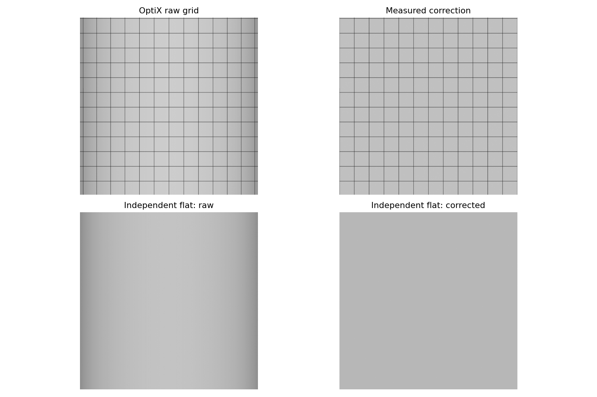

# 16 mm OptiX 标定与在线校正

> 历史实验记录：本文参数、性能和“当前/默认”描述属于当时版本，不作为新版验收。现行550 kg、20 mm/4K/1.5 m、1 m轨迹间距、11 kHz目标见[当前模型基线](LARGE_AGV_REBUILD.md)。历史命令须按现行配置调整，旧16 mm标定不可用于新版；大体积实验资产可能已清理，复现需重新生成。

2026-09-07。使用当前 16 mm、光心高度约 0.670 m、车头近置 LED、4K / 1.2 m 安装。旧 CUDA 平面标定保留为历史，不用于本后端。

## 标定来源与效果

`validate_optix_calibration.py` 依次启动真实 GZ / OptiX 采集暗场、均匀亮场、50 mm 周期条纹板、偏移 25 mm 的独立验证板，以及普通网格。机器人由控制器驱动，编码器触发；不是直接生成理想图像代替传感器采集。参考采集为 0.5 m/s、2.5 m，原图经 ROS 接收与归档逐字节校验。

标定板用相邻、共面的三角网格分区表示亮暗材质，视觉和碰撞共用网格，显式记录线性漫反射率。OptiX 直接使用该值，GZ 使用对应漫反射材质；不宣称两种渲染器的输出 DN 相同。OBJ 包含法线，避免本机 DART / ODE 在缺少法线的网格上发生导入崩溃。普通网格的原有程序反射率逻辑保持兼容。

暗场关闭环境和主动光项，保留黑电平与读出噪声；它模拟无入射光参考。亮场与条纹板使用正常曝光、LED、渐晕、PRNU、噪声和实际机器人遮挡链路。暗场、亮场、标定板的首个完整图块用于拟合；亮场第二块与偏移验证板第二块用于独立验证。

拟合只使用检测到的条纹中心和已知板上坐标，不读仿真多项式作为拟合结果或验证真值。仿真光学配置仅用于生成图像和兼容性摘要。

| 项目 | 校正前 | 校正后 |
| --- | ---: | ---: |
| 独立亮场列均值变异系数 | 7.3200% | 0.05945% |
| 独立验证板最大横向误差 | 65.167 px | 0.5021 px |

25 个条纹对应点，拟合最大残差 0.2371 px，4096 个输出列均有效。相邻两块分别校正与合并后校正逐像素一致；行数、顺序、first / last / pose_tags 和末行曝光参考语义不变。同轨迹仍不增加重叠行。



算法仍为逐列暗场扣除和平场增益，再横向重采样；不逐图自动归一化，不恢复过曝或坏列。当前是固定高度、垂直安装、水平对齐标定板的度量校正，不是独立估计完整焦距、主点、外参或车身振动补偿。当前夸大的镜头畸变只是仿真测试参数，不是真实 16 mm 产品规格。

## 常驻校正节点

新增可选 `linescan_correction`，通过启动参数 `correction_profile` 启用：

- 输入 `/linescan/image_raw` 与 `/linescan/block_metadata`，按末行时间戳配对。
- 输出 `/linescan/image_corrected`、`/linescan/corrected_metadata` 和 `/linescan/correction_status`。
- 校正后 PGM / JSON 存入 `capture_dir/corrected`；每块图像与元数据均调用 fsync。目录必须是新的，防止覆盖旧结果。
- 应用配对队列最多四块、等待期限五秒，超限或缺块明确进入错误状态、停止校正输出。原图采集不由这个错误状态自动关闭；操作方可用采集服务停止。没有默默丢块或继续拼接。
- GZ 使用两个异步归档任务，短尾块可能先于前面的完整块发布。节点在边界内按编号等待和重排，不把合法乱序误报为缺块；超时仍会失败。单元测试覆盖尾块先到和图像 / 元数据两种到达顺序。
- 除光学、曝光和 LED 摘要外，核对成像后端与展开机器人 URDF 哈希；支架、灯条等几何改变需要重新确认标定。几何哈希检查是保守的，不代替真机安装测量。
- 校正图的 ROS 发布端同样配置 128 MiB FastDDS SHM；用户已有 profile 时不覆盖。

现有原图话题与 RViz 面积预览保持原用途。这里的“图块无接缝”证明处理不会因分块产生不同像素，不等于已完成多轨迹世界坐标拼接。

## 10 km/h 联合验证

按用户要求保持 GUI 关闭。100 × 10 m 水平网格、OptiX 真实连杆与灯条阴影、完整原图接收、常驻校正、校正图 ROS 接收、校正图及元数据 fsync 同时运行。预热后 10 km/h 行驶 60 m，再制动并确认 HOLD。

- 实时率 **1.00007**，原图完整块交付约 **9489 行/s**，标称编码器触发 **9481.48 Hz**。
- **51 原图块 / 51 校正图块，204875 行**，包括末尾 75 行短块。
- 原图与归档一致；所有在线校正结果与离线校正逐像素一致；校正图 ROS 字节与校正归档一致；每块位置标签完整保留。
- 校正配对队列峰值 **1 块**；校正、fsync 和发布单块最坏 **239.8 ms**；从接收到发布最坏 **246.9 ms**。
- 65 项成像包测试通过，0 错误、0 失败、0 跳过。

此结果证明当前 10 km/h 的在线校正闭环。原图写入仍沿用原有系统缓存归档，没有把其写入冒充 fsync；校正文件 fsync 也不等于目录项和任务索引均已持久化。9.48 kHz 的供给不构成 11/22 kHz 完整吞吐验收。GUI / RViz 与校正同时运行、11 kHz 独立供给压力测试、全部归档耐久性、真实水泥材质、多轨迹拼接仍需后续专项验证。

结果：[标定与在线联合测试](../results/stage2_optix_calibration.json)。
当前标定文件：[OptiX 16 mm profile](../results/linescan_calibration_optix_16mm.json)。
原始参考图路径和 SHA256 存在 profile，临时采集目录为 `/tmp/agv_optix_calibration_16mm_v2`。

## 使用与复现

在隔离 OptiX 环境内加载 ROS 环境后启动（默认不跟车；此示例关闭 GUI）：

```bash
bash tools/with_optix_runtime.sh bash -c '
  source /opt/ros/jazzy/setup.bash
  source install/setup.bash
  ros2 launch agv_bringup sim.launch.py headless:=true \
    linescan:=true linescan_backend:=optix \
    scene_manifest:=/tmp/agv_flat_scene/manifest.json spawn_x:=2 \
    scan_speed_limit:=2.78 capture_dir:=/tmp/agv_corrected_new \
    correction_profile:="$PWD/results/linescan_calibration_optix_16mm.json"
'
```

启动后先确认 `/linescan/correction_status` 的 `ready`，再开启采集并通过正常控制器行驶。此命令不会自动开车。默认 10 km/h 限速仍然有效。

重新生成标定参考与独立验证：

```bash
python3 tools/validate_optix_calibration.py \
  --output /tmp/agv_optix_calibration_new \
  --grid-scene /tmp/agv_flat_scene/manifest.json
```

实际整车联合测试：

```bash
python3 tools/validate_rendered_linescan.py --backend optix \
  --scene /tmp/agv_flat_scene/manifest.json --spawn-x 2 \
  --speed 2.777777777777778 --warmup 6 --distance 60 \
  --correction-profile results/linescan_calibration_optix_16mm.json
```

上面两条 Python 命令也需要相同 ROS / OptiX 环境；运行完整日志应重定向保存。验证工具会自动发零速度、确认 HOLD 并退出仿真。
