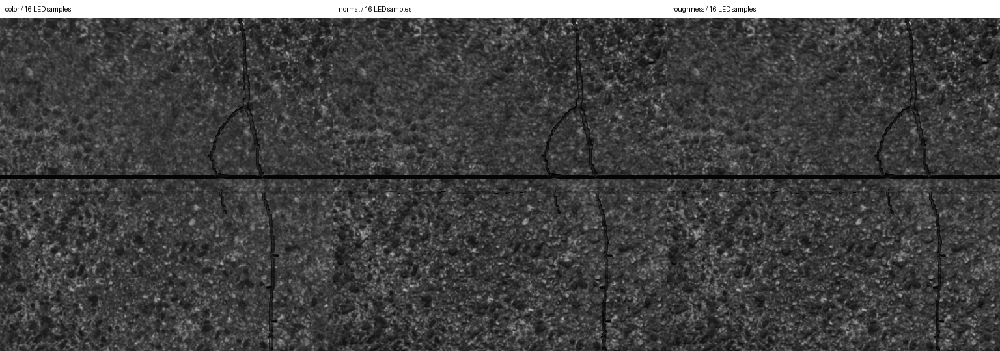

# Concrete047A 颜色、法线与粗糙度成本

> 历史实验记录：本文参数、性能和“当前/默认”描述属于当时版本，不作为新版验收。现行550 kg、20 mm/4K/1.5 m、1 m轨迹间距、11 kHz目标见[当前模型基线](LARGE_AGV_REBUILD.md)。历史命令须按现行配置调整，旧16 mm标定不可用于新版；大体积实验资产可能已清理，复现需重新生成。

2026-09-08。当前目标为 11 kHz，整车限速 10 km/h。本次完成独立 OptiX 小场景的材质接入和逐项比较；默认整车仍为网格，没有把短时采样容量标为整车验收。

## 采用的材质与光照

来自同一 [Concrete047A](https://ambientcg.com/view?id=Concrete047A) 8K-PNG 包的 Color、NormalGL、Roughness；压缩包 SHA-256 与已有颜色来源记录一致。没有使用 AO 或把位移图当成实测高度。原图物理尺度仍采用项目设定的 2.1 m，不是供应商实测尺寸。

三通道复用同一颜色驱动的 quilting 布局、原图坐标和混合权重。颜色按 sRGB LUT 转为线性亮度近似；法线与粗糙度按线性数据处理，法线混合后归一化。NormalGL 的 +V 向上，而当前拼贴图行方向对应世界 +Y，烘焙时翻转法线 Y。法线存储 RG8 的 XY，读取时重建非负 Z 并归一化；源图上半球检查通过。

这是 `agv.ground_material.xy.v1` 世界 XY 投影，适用于本轮单层路面，不是任意网格 UV。三种情况均用同一份 210,422 三角形沟槽网格；裂缝最大深 2 mm，板缝宽 8 mm、深 3 mm。法线只改变着色法线，阴影射线偏移及背面剔除仍使用几何法线，不改变碰撞或产生微观真实遮挡。

材质路径使用非金属 Lambert + 各向同性 GGX、相关 Smith 可见性和 Schlick Fresnel，F0=0.04；感知粗糙度平方后进入 GGX，范围限定 0.1～1。定义依据见 [Filament 的 BRDF 说明](https://google.github.io/filament/Filament.md.html)。这是工程近似，不含多次散射、环境镜面光照、光谱响应或实测 BRDF 标定。

LED 继续采用既有相对光带包络及真实灯条离散阴影射线。材质分支按各发光点的入射方向计算 BRDF，并相对水平参考面的入射权重归一化；环境项为 albedo × ambient 的漫反射近似。旧常反射率/网格分支保持原有公式。因此不能把旧沟槽报告和本报告的速度差异全部归因于“读一张颜色图”：还增加了材质光照计算。

## 数据与测试方法

- RTX 5080，WSL2，Windows 驱动 616.64，隔离 OptiX 610.57.04。
- 5×5 m 几何试片中，只对扫描覆盖的 2.6×1.6 m 区域烘焙材质；0.25 mm/纹素，10400×6400。
- GPU 使用独立 CUDA Array / Texture Object，硬件双线性，无有损压缩、mip 或流式淘汰。颜色 R8、法线 RG8、粗糙度 R8。主射线超出有效材质域会拒绝整批，不静默重复边界像素。
- 4096 像素、256 行/批、三次曝光样本、曝光内位移按 10 km/h；扫描路径 8192 行重复四遍。相同畸变、灯具和相机参数，关闭噪声与 PRNU。
- 三档：颜色 + 统一粗糙度；增加法线；再增加粗糙度图。统一粗糙度取本试片地图均值 **0.599787**，避免任意常数导致不公平的整体亮度差异。
- 各档、各灯条点数先预热 8 批，再测 128 批；顺序正向与反向各一次。最终统计运行时没有并行 GPU 测试。
- Sample 墙钟计时包含同步读回，不含材质构建、图像写盘、ROS、GUI、物理、校正和归档。这是短时 active 容量，不是 11 kHz 持续端到端验收。

## 性能

两次运行范围：

| 配置 | 显式设备分配＋纹理逻辑负载 | 16 点灯条 行/s | 64 点灯条 行/s |
| --- | ---: | ---: | ---: |
| 颜色＋统一粗糙度 | 87.93 MiB | 45,304～45,640 | 12,314～12,316 |
| 增加法线 | 214.88 MiB | 44,991～45,126 | 12,270～12,327 |
| 再增加粗糙度图 | 278.36 MiB | 44,807～44,963 | 12,297～12,320 |

本场景法线增加约 **126.95 MiB**，粗糙度增加约 **63.48 MiB**。上述总数包含几何、GAS、当前保留的构建 scratch 与采样缓冲；不含 CUDA Array 隐式行对齐、驱动/上下文、主存及 GZ 副本，不能直接解释为整机显存峰值。

16 点档新增法线的平均批次开销约 0.70%～1.14%，全部通道相对颜色基线约 1.11%～1.51%。4 点档全部通道相对基线约 1.38%～3.34%。微小正负差异包含运行波动；灯条样本数量的开销远大于本例新增材质读取。

64 点档虽然平均约 12.3 kHz，但完整材质批次 p99 约 **23.51～23.66 ms**，已超过 256/11000≈**23.27 ms** 的名义每批预算；最坏约 23.74 ms。因此不能仅凭平均值宣称这一档能稳态满足 11 kHz。16 点完整材质 p99 约 6.71～6.99 ms、最坏约 8.01 ms，但其阴影采样精度仍需另行验证，不能据此直接更改生产默认点数。

## 图像效果

同一位置、原始 Mono8 DN、无对比度增强；每格 512×512 像素，名义约 150×150 mm。它们是 OptiX 实际相机输出裁剪，不是纹理拼贴预览。



| 增量 | 平均绝对差 DN | p95 DN | 超过 2 DN 的像素比例 |
| --- | ---: | ---: | ---: |
| 法线 vs 颜色 | 8.38 | 23 | 78.66% |
| 粗糙度图 vs 统一粗糙度 | 0.415 | 2 | 2.44% |

法线使颗粒的方向性明暗明显变化；粗糙度地图整体差异较小，但局部高光最大差异达到 **103 DN**，不能说完全无影响。所有三档正反顺序重复生成的 16 点图像逐像素一致。

用户已确认后续默认使用 **颜色＋法线＋统一粗糙度 0.60**；粗糙度图保留可选能力，在反光或在线缺陷任务需要时启用。这不是以自然素材外观替代精度验证；源法线最大倾角约 85.8°，高光、遮挡与纹理过滤还需结合实际工况评估。

## 验证与下一步

- agv_linescan **75 项测试通过**，无失败/跳过；quilting **6 项通过**。
- 新增 GPU 测试覆盖纹理像元中心、双线性插值的环境光解析真值、域外拒绝、哈希/字节数异常、平法线等价、倾斜法线影响和常数粗糙度图等价。
- PBR 通道通过同布局、跨存储切分逐像素一致以及互补模式对齐检查。
- 大场景暂不使用这张常驻纹理。接下来需要把材质、沟槽和 GZ 展示接入同源场景、有限缓存与连续采集，再测试 GUI＋RViz 和 11 kHz 完整接收归档。世界 XY 投影不支持任意多层或垂直网格的无畸变 UV。
- 本轮未改默认整车场景或补光采样数，没有启动 GUI；不存在本轮 GUI 帧率或真实轮胎接触验收结论。

## 复现

先完成 README 的基础构建与 OptiX 安装。下载源图支持显式 `--proxy`，缓存校验成功后无需重新下载压缩包。

```bash
python3 tools/fetch_ambient_concrete.py
python3 tools/fetch_concrete_pbr.py
bash tools/with_optix_runtime.sh bash -c '
  source /opt/ros/jazzy/setup.bash
  source install/local_setup.bash
  python3 tools/validate_pbr_cost.py \
    --textures assets/road/baked_pbr_probe_v1 --output /tmp/agv-pbr-cost
'
```

首次生成材质；后续对已有 raw 进行哈希检查后复用。输出目录必须不存在。原生 Linux 使用正常驱动环境运行同一 Python 工具，无需 WSL 包装。大原图、raw 与完整 PGM 不提交；[测试统计](../results/stage2_pbr_cost.json)、来源校验和小型样片随项目保存。
