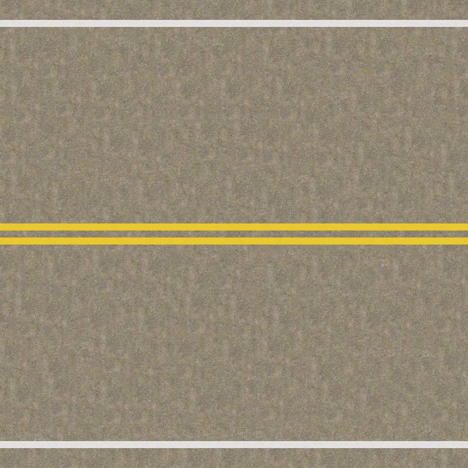
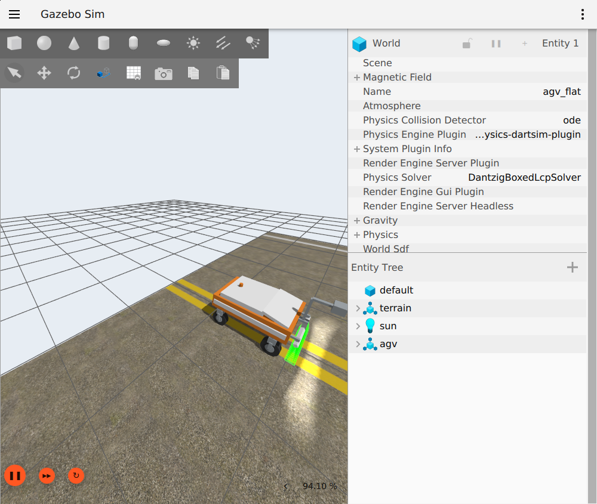
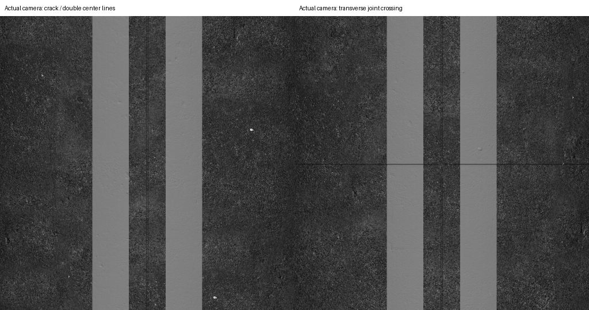
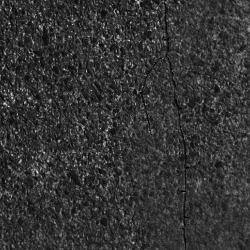

# 双向两车道路面与小范围整车采集

> 历史实验记录：本文参数、性能和“当前/默认”描述属于当时版本，不作为新版验收。现行550 kg、20 mm/4K/1.5 m、1 m轨迹间距、11 kHz目标见[当前模型基线](LARGE_AGV_REBUILD.md)。历史命令须按现行配置调整，旧16 mm标定不可用于新版；大体积实验资产可能已清理，复现需重新生成。

2026-09-08。完成双黄线/白色边线布局，并把 Concrete047A 颜色＋法线、统一粗糙度 0.60 接入同源 GZ/OptiX 小场景。默认启动世界仍为网格；新场景通过 `scene_manifest` 显式选择。

## 道路布局

100×10 m 为后续场景目标，本轮用 10×10 m 路段验证；标线沿 X 连续，在 1、5、99 m 横截面测试一致。

| 元素 | 布置 |
| --- | --- |
| 行驶方向 | 双向两车道，各一条；此处没有额外同向车道分隔线 |
| 水泥板 | 5×5 m |
| 中央双黄实线 | 各宽 0.15 m，中心 y=±0.15 m，净间距 0.15 m，总带宽 0.45 m |
| 中央纵向板缝 | y=0，宽 8 mm；位于双黄线之间，不沿标线重合 |
| 两侧白实线 | 各宽 0.15 m，中心 y=±4.5 m；线中心距路边 0.5 m |
| 横向板缝 | 本试片 x=5 m，正常穿过标线，不人为避让 |

双黄线用于对向交通分隔；尺寸参考公开工程实践，0.45 m 的常用总带宽见[宝鸡市公安局说明](https://gaj.baoji.gov.cn/col13193/col13196/col13203/202408/t20240819_698674.html)。两侧采用白色边缘实线，语义见[北京交管说明](https://jtgl.beijing.gov.cn/jgj/lszt/659722/10860935/dljtbx/zsbx/102358/index.html)。0.5 m 路边留距、颜料反射率和本例净间距为项目参数，不声明某条具体公路的工程设计合规性。

`road_markings.py` 是唯一标线坐标来源，传统离线烘焙器和新共享场景生成器都调用它。旧历史烘焙目录/报告仍保留原有白色虚线，未重写历史证据；重新烘焙将采用新布局。

下图是材质布局预览，尚不包含几何沟槽阴影；真实成像见后文。



## 共享资产与资源边界

- 一份 229,474 三角形 OBJ 同时用于 GZ 视觉、碰撞和 OptiX。平地上仅有 2 mm 深的图像来源裂缝和 3 mm 深的板缝；没有额外起伏或隐藏平面。裂缝放在 y≈−0.45 m，避开中央纵缝，走势仍来自原生图。
- 三维几何为世界坐标烘焙；GZ 使用显式 UV：`u=x/10, v=(y+5)/10`，OptiX 使用同世界坐标的 XY 投影。
- 颜色和法线复用一套 ConcreteQuilt 布局。标线按线性 RGB 颜料近似烘焙；法线 XY 在漆面减为 0.25 倍再归一化，表示部分填充基底颗粒的外观近似。没有加载粗糙度地图。
- 高分辨率光学材质只覆盖 **x∈[0,8]、y∈[−0.8,0.8] m**，32000×6400，0.25 mm/纹素；颜色 R8＋法线 RG8 纹理逻辑负载共 **585.94 MiB**。这是中线附近的光学测试走廊，不是全 10 m 宽度的有效扫描区。
- GZ 使用同布局的 4 mm/纹素、2500² RGB 颜色与法线概览。按 RGBA 展开并计完整 mip，约 31.8 MiB/通道/场景；服务端与 GUI 可能分别加载，不能当作跨进程共享显存。这是估算，未进行新场景整机显存峰值审计。
- GZ 概览为同源坐标采样，未作全高分辨率面积平均；远景颗粒过滤和局部细节仍需完善。它不承担毫米缺陷检测。
- 校验器检查原始纹理字节数和 SHA-256、GZ 显示材质引用、两端粗糙度、每个顶点的 UV/world 对应及面 UV 索引。新增测试确认篡改 UV 即使更新网格哈希也会被拒绝。
- 同源内容与坐标不意味着两套渲染器光度逐像素相同：GZ 含环境照明，OptiX 使用条光相对辐射/传感器模型；相机为 Mono8，黄色标线在相机图中显示为灰度。

## 整车 GUI＋RViz 验证

先跑 3 m，再扩展为 4 m 以实际跨越 x=5 m 横向板缝。以下记录第二次运行：

- 速度 **0.5 m/s（1.8 km/h）**；4096 像素、4096 行完整块；当前生产默认四个灯条阴影样本、三次曝光样本及噪声。
- Gazebo 和 RViz 均开启，沿用项目 D3D12 配置、自由视角和同步显示 TF；最后发送零速度、确认 HOLD 并关闭。
- 测量时长 8 s 仿真 / 8.0194 s 墙钟，实时率 **0.99758**。
- ROS 接收 **4 块 / 13,668 行**：4096、4096、4096、1380；全部逐字节匹配归档，编号与编码器距离连续，未因跨缝分段或缺行。
- 正常供给约 1706.7 行/s；完整块墙钟交付约 1709.4 行/s。采样阶段容量约 62,724 行/s，**不是端到端 11 kHz 验收**。
- 等待队列峰值 9 行，最长等待约 4.68 ms；最大采样批次约 5.26 ms。
- 物理步墙钟最大间隔约 1.85 ms；显示 TF 接收 675 帧，无时间戳混用，显示待处理超时丢弃为 0。
- 前轮世界高度变化范围约 0.097 mm，最大单步约 0.019 mm；没有观察到大幅机械跳动。测试不是任意地形或高速接触保证；未采集新的 GLX/桌面 FPS 指标。

截图来自 Gazebo 客户窗口，不含本机个人路径。画面中的大网格是 GUI 辅助网格，不是相机采集材质。



## 相机样片与坐标检查

下图由实际 4096² 原图作面积缩小显示，保持原始 DN，不拉伸对比度。左为裂缝段，右为跨横缝段。标线的灰度不是 GZ 黄色丢失，而是单色相机响应。



原分辨率裂缝局部：



独立使用 1.2 m 幅宽及归档的横向畸变多项式计算中心两条标线的原始列区间。选取第三块前部 400 行平均轮廓，检测边界为 `[1284,1792)` 与 `[2304,2812)`，与预测一致，整数列误差 **0 px**。这只是一个近似居中的直线片段检查，不代替完整标定或任意姿态下的几何验证。

## 复现与下一步

```bash
# 首次恢复源图；必要时给下载命令添加 --proxy。
python3 tools/fetch_ambient_concrete.py
python3 tools/fetch_concrete_pbr.py
source /opt/ros/jazzy/setup.bash
source install/local_setup.bash
python3 tools/generate_textured_scene.py --output assets/road/baked_shared_road_v1
bash tools/with_optix_runtime.sh bash -c '
  source /opt/ros/jazzy/setup.bash
  source install/local_setup.bash
  python3 tools/validate_rendered_linescan.py --backend optix \
    --scene assets/road/baked_shared_road_v1/manifest.json \
    --spawn-x 1 --speed 0.5 --warmup 1 --distance 4 --gui --rviz
'
# 对上一步输出的 session_cpp_* 目录做标线投影检查：
python3 tools/check_shared_road_capture.py /tmp/实际采集目录/session_cpp_实际编号
```

生成目录必须不存在；已有场景可跳过生成。大 raw/PNG/OBJ 和原始采集留在本地、不上传；保留工具、来源信息、[结果摘要](../results/stage2_shared_road_gui.json)及小型样片。生成世界含本地运行资产路径，因此不能把旧生成目录搬到另一台机器直接用，应重新生成。

本轮 `agv_linescan` 77 项测试通过；标线/quilting/共享场景专项共 21 项通过（其中共享场景测试与包测试重叠，不相加当成独立总数）。下一步是有界的材质分块/预取与更长的有效扫描走廊，随后测试 10 km/h 和 11 kHz 完整链路。不能在当前 8 m 光学域中直接套用 60 m 高速测试命令。
