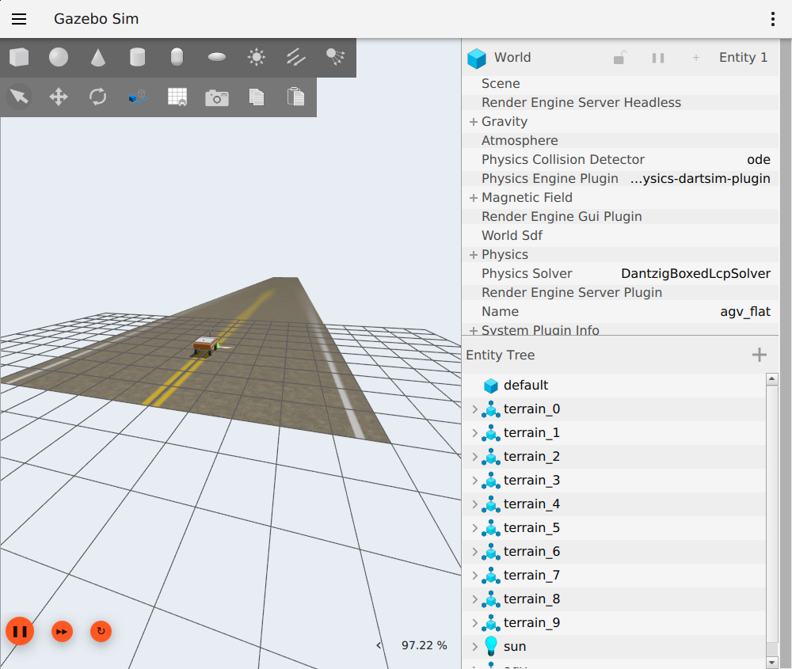

# 100 m 道路颜色＋法线流式采样

> 历史实验记录：本文参数、性能和“当前/默认”描述属于当时版本，不作为新版验收。现行550 kg、20 mm/4K/1.5 m、1 m轨迹间距、11 kHz目标见[当前模型基线](LARGE_AGV_REBUILD.md)。历史命令须按现行配置调整，旧16 mm标定不可用于新版；大体积实验资产可能已清理，复现需重新生成。

2026-09-08。采用 Concrete047A 颜色 R8＋法线 RG8，统一粗糙度 0.60；未启用粗糙度地图或有损压缩。

## 范围与一致性

- 共享视觉/碰撞/OptiX 几何为 100×10 m，约 132 万三角形，仍是平地，仅有局部裂缝和板缝沟槽。没有起伏路面。
- 本次高精度材质为 **100×1.536 m 中央扫描走廊**，不是全 10 m 宽可采集场景。0.25 mm/纹素；588 个 2048² 核心图块，每边带 2 纹素真实邻域。磁盘原始通道约 7.43 GB。
- 两个通道采用同一 ConcreteQuilt 布局、世界 XY 坐标与标线定义。全部相邻图块的共享边缘逐字节一致，最大差值 0。裂缝走势复用保留的图像来源模板，每 20 m 布置一次，不能当作相互独立的自然缺陷样本。
- GZ 概览按 10 m 分区，4 mm/纹素，颜色＋法线；OptiX 几何常驻，只有高精度材质流式换入。跨分区三角形按原平面裁剪，裁剪后的同一资产供两端及碰撞使用，自动检查 UV/world 对应。
- 当前是世界 XY 高度范围内的地面材质投影，不是任意网格 UV 流式材质。相机视野必须留在声明的高精度走廊内；全宽覆盖和地图外背景仍需扩展。

## 缓存行为

32 个预分配 GPU 槽，颜色与法线各用 CUDA array/硬件双线性纹理对象；逻辑纹素和查表负载约 **385.50 MiB**，不随道路长度增长。图块编号直接查 GPU 索引表，避免每像素线性扫描全部槽。

后台线程读取并验证每个文件的字节数和 SHA-256，通过独立 CUDA stream 上传两通道；上传完成后才标为就绪。采样批次按三个曝光位置、两端视线和声明高度上下界计算保守足迹，固定所需槽直到读回完成。前方预取 1.5 m、后方 0.5 m，方向来自批内运动，反向不重置噪声行号。

冷启先等待初始预取完成；连续采集所需块若未就绪，计入未命中和等待，超时明确失败，不使用黑块或旧块替代。槽预算、预取距离和等待上限在场景材质 manifest 中配置。磁盘文件缓存可能热；本实验不声明物理磁盘冷读性能。

回归测试覆盖硬件双线性跨缝数值、淘汰后反向重读、损坏文件拒绝采样、失败后解除固定，以及显示分区裁剪的面积/高度保持。

## 独立 11 kHz 原图链路

4096×4096，256 行/批，3 个曝光样本，每样本 16 个 LED 阴影采样点，噪声开启；96 m 正向后立即反向，合计 160 块。使用车体/灯具光学夹具，未包含九连杆整车动力学。换向不预热、不排除耗时。

- 墙钟 58.514 s，持续 **11,199.97 行/s**；剔除供给节拍等待后的原图链路容量约 **26,849 行/s**。
- 含 GPU 采样/读回/拼块、PGM 写入和 fsync、独立 ROS 接收进程逐字节比较与 ACK；不含校正、拼接或缺陷检测。
- 最慢 256 行批次 **11.189 ms**，p99 **9.644 ms**，均低于供给预算 22.857 ms。
- 1,148 次图块加载、1,130 次淘汰，冷启后所需图块未命中 **0**，批次缓存等待最大 **0.120 ms**；初始冷 GPU 预取约 102 ms。
- 160 块无漏块、重复或像素不一致。采样器显式设备分配约 **534.67 MiB**，其中包含上述缓存；未包含驱动/上下文/数组对齐开销，也不是 GUI 开启时的整机显存峰值。

原始指标：[stage2_streamed_road.json](../results/stage2_streamed_road.json)。独立光学夹具与整车验证分别记录，不能互相替代。

## 复现

先按 README 安装环境并恢复 Concrete047A 颜色与法线源文件。在仓库根目录执行：

```bash
source /opt/ros/jazzy/setup.bash
source install/local_setup.bash
python3 tools/generate_streaming_road.py --output assets/road/baked_streaming_road_v1
bash tools/with_optix_runtime.sh bash -c 'source /opt/ros/jazzy/setup.bash; source install/local_setup.bash; python3 tools/benchmark_optix_stream.py --scene assets/road/baked_streaming_road_v1/manifest.json --output /tmp/agv-stream-benchmark'
```

输出目录必须新建；`--reuse-tiles` 仅供同一配方本地烘焙中断后重新装配使用，仍检查文件尺寸和邻域，不是下载恢复接口。生成的高精度原始文件、绝对路径 SDF 和采集原图不提交 GitHub。

Gazebo 默认自由视角改为道路起点后方看向 +X：`camera_pose = -4 -3 3 0 0.35 0.25`；仍可拖动或通过 `gui_config` 自定义，不修改用户全局配置。

## 高速跨板缝的采集门限

首次 10 km/h、60 m 无 GUI 运行未通过连续采集：30 次轮速一致性拒绝导致分段。记录中的最大轮速差为 0.015424 m/s，偏航估计最大 0.014022 rad/s，转角近零；固定 0.01 m/s 门限相当于该车速的 0.36%。车轮中心高度范围最大 0.262 mm、单步最大 0.075 mm。这些结果支持“窄缝接触瞬态触发过严轮速门限”的判断，不支持纹理缓存抖动解释。

改为配置 `max(0.01 m/s, 1% × |四轮平均速度|)` 的一致性容差；10 km/h 下为约 0.02778 m/s。转角、偏航、最高速度门限不变，编码器等距触发继续使用实际关节位置。该容差是本项目初始工程参数，不是滑移检测或接触可靠性保证；不能据此宣称拼接里程无误差。没有这两个新字段的历史配置保持原有 0.01 m/s 行为。正反行、低速和较大轮速差的回归用例已补充。

新默认视角的 Gazebo 客户窗口截图如下。画面大网格为 GUI 辅助线，不进入相机材质。



## 整车复测结果

两次均为10 km/h、指令匀速段60 m、约21.6 s仿真时间，使用九连杆及生产默认4点LED阴影采样。编码器供给约9.48 kHz；这组实验不取代独立11 kHz测试。

| 项目 | 无 GUI | GUI＋RViz |
| --- | ---: | ---: |
| 实时率 | 0.99637 | 0.98632 |
| 收到且与归档逐字节一致的图块 | 51 | 51 |
| 连续采集段 | 1 | 1 |
| 采样队列峰值（行） | 66 | 76 |
| 队列最长等待 | 5.478 ms | 7.926 ms |
| 冷启后必需图块未命中 | 0 | 0 |
| 加载图块 | 366 | 366 |
| 结束状态 | HOLD | HOLD |

GUI测试共204,847行，含启动/制动边缘实际编码器采样，不能把指令60 m换算的204,800行作为其精确里程真值。检查了逐行编号、相邻块编码器距离、单段连续性、全部ROS原图字节一致性及预览订阅。显示TF收到1,729帧，无混合时间戳、无待处理超时丢弃；物理步墙钟最大间隔2.319 ms，最大采样批次8.376 ms。没有测量桌面FPS或整机显存峰值。

测试结束确认停车并关闭Gazebo/RViz。69项包测试和8项相关工具测试通过。全宽高精度材质、当前材质/照明下重新标定以及校正拼接链路仍是后续工作。
