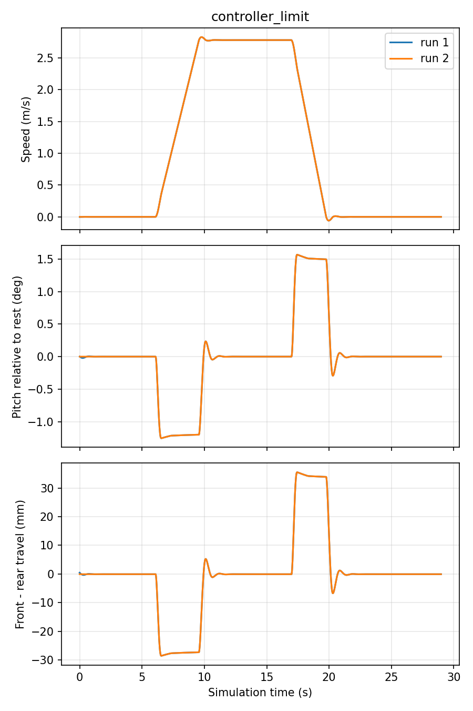
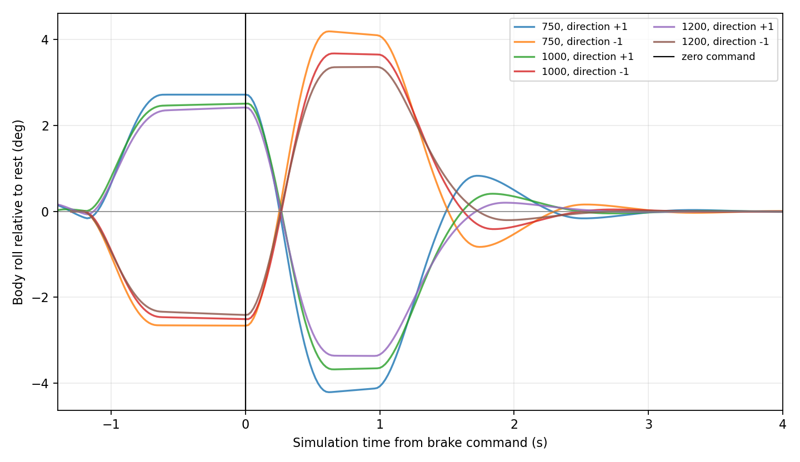

# 悬挂俯仰响应调参

2026-09-15。用户给定的暂定响应目标：在实际加速0.8 m/s²、制动1.0 m/s²期间，车身持续倾斜约1–2°，起步/刹停有更大的瞬态变化与有限回弹。**这是依据使用者描述拟合的等效响应，不是减振器实测标定。** 未增加路面粗糙度、轮胎柔性或相机支架振动。

## 现行参数与结果

默认`platform.yaml`每轮有效刚度8000 N/m、阻尼1200 N·s/m；前轴弹簧参考位置−0.133098864 m，后轴−0.130340845 m，机械行程仍±0.05 m。参数保留完整精度以重现本轮结果，不代表真机测量精度。

参考位置不在机械行程内不表示悬挂越限：弹簧力是`−k(q−q_ref)`，在工作点已预压。等价地可写为工作点附近的常量承载力加线性增量刚度。这里的约130 mm参考偏移不能解释为真机一定具有130 mm直线弹簧压缩量，实际连杆传动比/非线性弹簧尚无资料。

| 项目 | 旧65000 / 2800 | 初始8000 / 750 | 现行8000 / 1200 |
|---|---:|---:|---:|
| 持续加速抬头 | 0.139° | 1.211° | 1.189° |
| 加速最大抬头偏移 | 0.165° | 1.255° | 1.201° |
| 持续制动低头 | 0.173° | 1.508° | 1.437° |
| 制动最大低头偏移 | 0.205° | 1.568° | 1.483° |
| 制动结束后的反向回弹 | 约0.035° | 约0.293° | 峰值已压低，见横移对照 |
| 停车附近回到静态±0.01° | 0.28 s | 1.76 s | 最慢2.30 s |

俯仰相对各次静止值，两次重复基本重合。“持续值”取实际加减速区间中位数。1–2°目标仅针对上述加减速度，较缓慢加减速不应仍强行维持同样倾角。没有用姿态覆盖或相机扰动伪造效果。



## 过程与包络检查

1. 保留[旧刚度基线](ACCEL_PITCH_RESPONSE.md)。
2. 16000 N/m、1400 N·s/m中间档测得持续俯仰0.56°/0.71°。
3. 8000 N/m、1000 N·s/m达到约1.21°/1.49°，但静止车高上移约9.5 mm且瞬态超调很小。
4. 按测得的前后静态行程分别修正参考位置，阻尼降至750 N·s/m。两次重复确认后采用为默认值。

550 kg、实际轮径0.40 m平地检查：

- 静止base_link离地0.64970 m，与旧值约差1.3 mm；静止电池仓最低角点离地0.25128 m。
- 加减速过程电池仓最低角点约0.24184 m；条光保守包围盒最低点约0.24006 m。
- 最大悬挂绝对关节位置约17.9 mm，离±50 mm机械端点至少32 mm。
- 真值姿态与插值关节位置计算的轮胎最低点离地上界约1微米，没有测得毫米级轮胎离地；这是50 Hz采样几何检查，**不是接触力测量，也不排除采样间的短暂现象**。
- 前进、横移、斜行、原地旋转、倒车、10 km/h直行与最终HOLD回归通过。
- 刹停速度有短时约−0.0592 m/s下冲，比旧值−0.0216 m/s更大；这是现有理想伺服与更软车身的停车瞬态，不是任务规划后退指令。不能宣称零反向速度，后续精确终点控制须检查实际位置影响。

仍有短暂反向回弹；当前不继续降低阻尼去追求更夸张的峰值。保留较快衰减和机械余量，比任意制造大幅晃动更符合本轮目标。

## 静态扫描线与条光中心复核

2026-09-15用户要求在继续起伏水泥路面采图前检查静态对中。读取新悬挂`flat_valid`试验停车后的最后100个真值样本（约2秒），确认静止与姿态稳定，再将当前URDF相机和GZ条光变换到实际水平地面。不重新启动仿真，也不使用名义0.65 m车高代替实测车高。

实测base_link离地0.6497038 m、pitch约−0.003764°，光心离地1.0460963 m。扫描线中心与GZ中央条光轴地面交点相差约**0.0591 mm**；全部4096个原始像素的扫描射线均在GZ光锥集合内。按OptiX实际`LedIrradiance`计算，扫描线相对纵向包络中心最大偏差同为0.0591 mm，对应半宽参数79.94 mm，纵向包络因子近似1。静态仍基本居中，本项不需要调整灯位置或倾角。

这项检查仅证明平地静态几何对中及包络覆盖，不是绝对照度、均匀性、遮挡渲染或加减速/起伏工况的完整验收。光斑是连续衰减分布，半宽参数不是硬截止边界。工具为`tools/check_static_light_alignment.py`，报告见[静态对中](../results/static_light_alignment.json)。

## 联合采图回归

采用初始8000/750参数，在标识试片上以10 km/h、预热4.5秒、请求扫描距离4 m并包含后续制动，开启GZ GUI与RViz：收到5张4096×4096完整图和1张4096×1113尾图，ROS与归档原图逐字节核对通过，最终HOLD。同时间戳显示TF共599帧，待处理帧丢弃为0，最大仿真时延15 ms。短段RTF约1.0006，不能替代11 kHz或100 m持续吞吐验收。

已实际查看六张原图缩略对照，路面标识、裂缝和尾图比例正常；此前缩略图曾引起刹车段明暗条带的怀疑，用户查看原尺寸PNG后认为可接受；目前未证实光斑覆盖缺陷，不据此调整条光。GUI/RViz本轮为自动窗口与TF检查，未重做鼠标操作或运动部件的屏幕人工验收。未启用在线校正。原图预览保留在`local_data/suspension_tuning/raw_preview.png`。

模型质量/惯量/行程结构检查、前后预载映射检查、光学无遮挡及条光覆盖检查通过；控制包30项测试通过。

## 复现、归档与回退

```bash
bash tools/with_optix_runtime.sh bash -c '
  source /opt/ros/jazzy/setup.bash
  source install/setup.bash
  python3 tools/with_mesa_runtime.py python3 tools/measure_accel_pitch.py \
    --output local_data/suspension_check --modes controller_limit --repeats 2
' > /tmp/suspension_check.log 2>&1
```

工具支持`--platform PATH`使用独立完整底盘配置；原始记录保存实际配置，`--analyze`按归档配置重绘与复核，不误读后来变更的默认参数。结果见[调参报告](../results/suspension_tuning.json)，大体积时间序列与日志在`local_data/suspension_tuning/`，不进Git。图表与报告保留于仓库。

回退旧响应：复制现行完整platform配置，将刚度恢复65000、阻尼2800、通用参考值−0.016，**同时删除前后轴专用参考值**，通过`platform:=该文件`启动。不能仅改刚度而保留新预载。

## 验收边界

本轮550 kg平地响应已验证，不能把500/600 kg几何质量检查称为这些载荷的动态悬挂验收。静止姿态仅近似保持；机器人源契约已经改变，旧相机实测标定若拒绝新机器人哈希，应重新标定，不应绕过校验。

原100×10 m全区域任务通过于旧悬挂，不能自动沿用为新参数的完整动态验收。新的回弹可能进入起步采集或停车阶段，后续正式任务应验证采集门控、终点位置与覆盖包络。当前先完成加减速目标，之后再讨论路面激励；仅调软悬挂仍不会使理想平面上的匀速段随机晃动。

## 横移阻尼对照

2026-09-15针对GUI中横移后多次左右摆动，对每轮阻尼750、1000、1200 N·s/m做同条件对照；刚度8000 N/m、前后预载、质量、控制限幅均不变。每档先运行一次零定位噪声的3×2 m矩形任务，再用控制器以±1 m/s执行两次相反方向的0.55 m横移并在零指令后观察6秒。后一试验使用相同制动触发，适合单独比较阻尼。

| 每轮阻尼 | 横移期间横滚峰峰值 | 停车后最大横滚 | 明显回摆极值数 | 回到±0.05° | 最大悬挂行程 |
|---:|---:|---:|---:|---:|---:|
| 750 N·s/m | 2.769° | 4.112° | 3 | 1.96 s | 35.94 mm |
| 1000 N·s/m | 2.508° | 3.651° | 2 | 1.42 s | 30.60 mm |
| 1200 N·s/m | 2.449° | 3.363° | 1 | 1.50 s | 29.20 mm |

1200相对750将停车后最大横滚降低18.2%、横移横滚峰峰值降低11.6%、最大悬挂行程降低18.8%，并把可见的多次回摆压到一次。1000进入±0.05°带略快0.08秒，但仍有两个明显极值；针对本次“来回次数多”的屏幕症状，1200是更合适的候选。

1200档另做两次0.8 m/s²加速、1.0 m/s²制动复核：持续俯仰平均1.189°/1.437°，最大约1.201°/1.483°，仍在用户给定的1–2°目标内；回到静态±0.01°最慢2.30秒，比750档1.76秒更慢，原因是高阻尼压住峰值同时延长很小残差的尾部，不能把单一“首次进入阈值”当作全部视觉品质。

GUI＋RViz＋OptiX已经实际显示1200档横移和掉头。正常定位与零噪声两次短双道都在第二道进入采集区时因航向误差约2.96°/2.82°触发`CAPTURE_NOT_ACTIVE_AT_REGION`并最终HOLD；这是独立的掉头后进区门控回归，故这两次只作为屏幕运动证据，不算双道采集通过。用户接受对照后，默认阻尼已改为1200；该门控问题仍须独立关闭。完整数字见[横移阻尼对照](../results/lateral_damping_comparison.json)。


