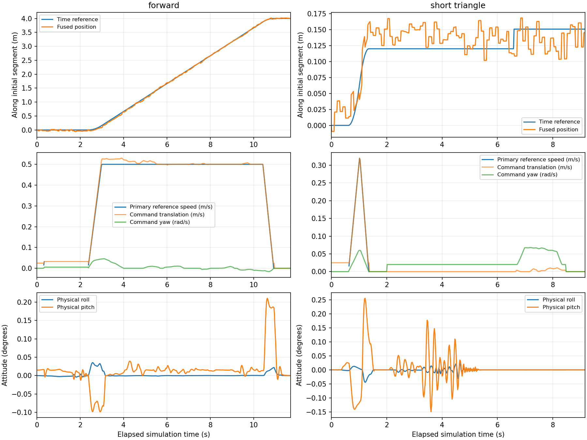

# 单段梯形/三角形时间闭环

本轮交付独立单段跟踪器，使用融合定位执行前进、横移、后退和原地旋转。矩形规划已有；完整矩形任务、连续扫描段、相机门控、融合图像标签及暂停恢复尚未接入。本轮整车平移限速0.5 m/s，不代表10 km/h闭环验收，也没有开启线阵采图。

## 时间点位置控制

对静止到静止、距离D的运动，峰值速度为：

`vp = min(vmax, sqrt(2*D/(1/a + 1/d)))`

加速时间`ta=vp/a`，减速时间`td=vp/d`。足够长时有匀速段，构成梯形；短段无匀速段，自动降低峰值，构成三角形。解析积分得到各时刻`s(t)`，同一曲线提供`v(t)`前馈。参考使用仿真时间；墙钟只负责消息/时钟看门狗。不是按持续时间发送恒定速度，也不因时间结束而直接确认完成。

平移参考`p(t)=p0+R0*[ux,uy,0]*s(t)`，旋转参考`R(t)=R0*Rz(sign*s(t))`。参考保留三维位置和四元数；位置误差投影至初始局部切平面，输出车体系vx/vy/wz，无独立升降指令。当前仅在水平路面验收，不能由此宣称坡面轨迹接口已完成。

控制量为速度前馈＋滤波后的位置/航向比例反馈，再经耦合限幅和现有四驱四转控制器。仅订阅融合`/odometry/global`作为位姿；仿真真值仅由验证工具独立评价。零噪声也保留EKF和传感器路径，不直接跟踪真值。

## 参数与状态

| 项目 | 当前值 |
|---|---:|
| 平移参考加速度/减速度 | 0.8 / 1.0 m/s² |
| 旋转参考加速度/减速度 | 0.15 / 0.20 rad/s² |
| 单段旋转限速 | 0.25 rad/s |
| 位置/航向比例增益 | 0.7 / 0.8 s⁻¹ |
| 反馈滤波时间常数 | 0.25 s |
| 位置/航向反馈死区 | 0.01 m / 0.004 rad |
| 最大平移/角速度反馈 | 0.12 m/s / 0.06 rad/s |
| 终点位置/航向容差 | 0.05 m / 0.025 rad |
| 停稳速度/角速度 | <0.025 m/s / <0.015 rad/s |
| 终点停稳时间 | 0.5 s |
| 微调平移/旋转限速 | 0.08 m/s / 0.06 rad/s |
| 最大终点微调次数 | 3 |
| 启动连续READY＋HOLD | 5 s墙钟 |

底层仍负责四轮正反驱动分支、转角限位、BRAKE/ALIGN和驱动加减速。上述梯形/三角形是参考曲线；实际指令受反馈、对轮探测小速度和底层限幅影响，不会严格等于理想折线。

- `ALIGNING`发送稳定的小速度方向探测指令，由底层完成对轮；航向估计噪声不持续改变这条指令。
- `RUNNING`只在底层DRIVE时推进参考。途中重新BRAKE/ALIGN则冻结参考，恢复后从当前投影进度重新生成剩余段时间曲线，不追赶冻结期间的时间表。
- `STOPPING`先输出零指令，经底层制动，检查位置、航向、实测速度、HOLD和持续停稳。终点误差先滤波，同时保留原始误差不得超过2倍容差的约束。
- 未收敛时按位置/航向误差各自占容差的比例选择微调，重新对轮并运行一条低速时间曲线；达到次数上限仍未收敛报错，不放宽容差。
- `COMPLETED`和`FAULT`均锁存。取消、定位过期、超大误差或时间异常后输出零指令，定位恢复不自动续跑。实例只执行一段，重新运行必须启动新实例。

日志包含参考/融合位姿、曲线时间、原始及滤波误差、微调次数、底层状态和输出指令。定位故障额外记录各测量、滤波器及订阅到达年龄，便于区分真正定位丢失和调度间断。

## 调试中发现与修复

1. 短段末端的微小混合纠偏低于底层死区，曾持续HOLD直至超时。改为明确停车及独立微调曲线。
2. 带噪声时，直接按某一帧位置误差决定微调会反复横移，未能优先修正更大的航向误差。改为滤波后、按容差归一化选择方向；同时固定对轮期间的探测指令。
3. GUI试验曾在启动对轮期间触发定位保护停机；其中一次明确为轮测量年龄略超100 ms，IMU/GNSS/EKF仍新鲜。增加连续READY＋HOLD启动驻留至5秒，并保留诊断。没有放宽测量新鲜度门限；源时间戳间断的底层原因尚未完整定位，后续高负载仍需监测，不能以单次通过宣称彻底排除。
4. 底层原先在ROS时钟不前进时直接返回，若时钟桥中断而物理继续运行，旧驱动目标可能保留。新增单调墙钟保护，超时发送四轮零驱动目标并进入FEEDBACK_HOLD。

## 验证与复现

聚合结果：[stage3_tracking.json](../results/stage3_tracking.json)。



图左为4 m梯形曲线，图右为0.12 m三角形短段并带0.10 rad初始航向偏差。右侧后半段是停车、对轮和独立航向微调，不属于原平移曲线。融合位置带有厘米级GNSS修正，图中估计抖动不等于车体实际振动；最下行是独立物理姿态。

正常噪声＋GUI/RViz最终五项（前进、横移、180°旋转、后退、短段）全部完成，真实终点位置误差约1.8–8.3 cm、航向误差绝对值最大约0.76°，真实横滚/俯仰峰值最大约0.41°。短段完成一次航向微调；前进发生一次轮组重配并正确重定时。这些数值不是保证范围，5 cm终点判定作用于融合估计，不能等价为真实定位精度或图像配准精度。

零噪声无GUI对照五项也全部完成，真实终点位置误差最大1.75 cm，航向误差绝对值最大1.00°。单元测试共83项（含colcon包装：mission 39、control 25、localization 19）通过。

取消及GNSS失效后到物理停车/HOLD约0.50和0.52 s仿真时间；FIX恢复仍保持FAULT。独立控制器时钟停滞到四轮零目标约0.400 s墙钟。

启动/取消方法见[包说明](../src/agv_mission/README.md)。验证前构建并source环境；OptiX运行环境按根README准备，各次输出使用新目录：

```bash
python3 tools/validate_tracking.py --profile normal --gui \
  --output local_data/tracking_normal_gui
python3 tools/validate_tracking.py --profile zero \
  --output local_data/tracking_zero
python3 tools/validate_tracking_faults.py --output local_data/tracking_faults
python3 tools/validate_clock_watchdog.py --output local_data/tracking_clock.json
colcon test --packages-select agv_mission agv_control agv_localization
```

GUI试验同时开Gazebo和RViz，使用D3D12。真值误差不用于调节运行时判定。轮组总转角包含正常的横移/旋转对轮，不能直接称为抖动指标。取消和GNSS失效试验通过真实物理速度及HOLD确认停车；时钟试验为真实控制器＋模拟反馈的通信保护验证，仅验证零目标延迟，不等同于物理制动距离。

## 下一步

将单段原语接入矩形执行器。加速、扫描和驶出属于需要连续通过的区间，不能逐个调用静止到静止原语导致扫描中断。接入相机位置边界、换道停采、轨迹ID、尾块、融合标签，再验证整条弓字路线和暂停恢复；之后逐档提速。生产任务运行中不能另启键盘或其他`/cmd_vel`发布者，命令仲裁与任务所有权需随执行器接入。
