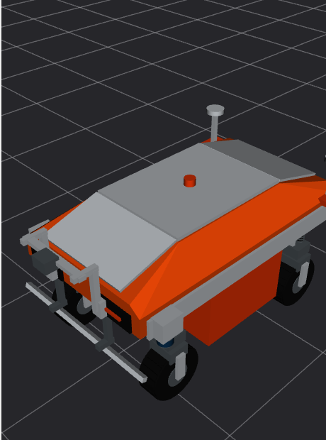

> 已归档：保留原始设计、问题和实验数据；文中的“当前/下一步”属于当时阶段，现行入口见 [当前状态](../../CURRENT_STATUS.md)。历史命令仍从仓库根目录运行。

# 文档、RViz与数据维护审计

2026-09-08，针对最终550 kg/20 mm/v7、尾部低平台、前端立面相机支架版本。

## 文档

逐项核对README、项目规范、当前设计/安装/环境说明和资产说明；历史阶段文档显式标注适用旧模型，保留当时实验参数。修正现行入口残留的1.2 m幅宽、0.29296875 mm行距、80 cm轨迹间距、旧相机高度/补光倾角/v6标识、已删除道路入口，以及把旧16 mm平场当作当前配置的示例。纹理预算按实际0.25 mm/纹素说明，不能混同相机0.3662 mm/像素。

修复资产说明的相对链接。公开文档检查本机个人路径，当前未发现个人目录或本机局域网地址。AGENTS.md为本机忽略文件，单独同步显示/机械约定，不上传。

当前参数入口为[重建记录](../../LARGE_AGV_REBUILD.md)。新版低速原图采集已通过；新版平场、标定、独立11 kHz和10 km/h长时成像尚待复测，矩形规划/融合定位/任务控制/拼接仍未完成。

## RViz与联合负载

默认RViz Fixed Frame为base_link，世界网格仍用world；显示用同时间戳的12个轮组变换＋世界车体位姿。控制TF不变。检查实际RViz窗口连续截图，未见此前明显车体/附件脱节；正常转向、轮转和悬挂相对运动保留。截图不是所有帧的统计证明。

基础GUI＋RViz复测包含前进、横移、斜行、原地旋转、倒退、升至10 km/h再停车：

- 3900组显示快照，时间戳错误0，倒序0，最大间隔20 ms。
- 悬挂→转向→轮心连接距离最大误差约1.7e-16 m。
- 含出生落地/悬挂收敛阶段，轮组相对中心最大单帧变化2.70 mm；该项不等同于持续行驶抖动。
- 正常负重静止最低电池角离地0.249932 m，最终HOLD。

见[GUI运动结果](../../../results/stage3_gui_display_audit.json)。首轮Gazebo在控制器启动期提前退出，反馈等待超时；日志没有足够证据确定退出原因。重新启动相同D3D12配置通过，不将第一次失败隐去，也不据此宣称解决了所有环境启动问题。

另在20 m全宽水泥道路同时开启GZ GUI、RViz、双C8和OptiX原图采集，以0.5 m/s采集4.6 m：4096、4096、4096、282行，ROS与归档逐块字节一致，显示时间戳错误0、RTF约1.00009、采样队列峰值12行。采集段轮心竖向单步变化最大约6.4e-11 m，未发现持续颠簸；此数值属于理想平地物理工况，不代表真机稳定性。

见[联合采集结果](../../../results/stage3_textured_gui_capture.json)。这是低速功能/显示复测，不是11 kHz吞吐验收；两次测试均确认HOLD并关闭自建进程。

## 清理

删除约1.214 GB（1.131 GiB）：旧16 mm可重算校正图、两份旧道路边缘压力测试原图、四张无引用旧预览、Python/pytest缓存及非最新构建日志。不删除仍被文档引用的历史报告/样片，不删除SDK、驱动或源代码。

保留Concrete047A源通道、三张AI原图、20 m全宽道路、旧/新分叉及碰撞代理对照夹具，以及代表性旧连续原始档案/双轨档案。新增v7联合测试原图保存在被Git忽略的local_data/current_large_v7_gui/session，作为当前回归数据。它不是新版平场标定。

清理明细保存在本地local_data/cleanup_model_revision_20260908.json；公开文档不嵌入本机绝对路径。WSL废纸篓为空，未操作Windows用户回收站。后续生成的最新验证缓存可能重新出现，不为消灭所有缓存重复删除正在使用的数据。

## 10 km/h稳速20 m补充演示

在现有20 m水泥道路前后增加临时平地加速/制动区，原高清纹理硬链接复用，仅平移共享几何和纹理坐标；工具为`tools/prepare_speed_demo_scene.py`。临时缓冲网格最初缺法线引发DART崩溃，补齐法线及场景校验后成功，不计入有效运动结果。

GUI＋RViz＋双C8＋OptiX开启：稳速窗口7.2 s，实测20.00076 m、平均10.00038 km/h，RTF约0.99049；13张4096×4096与1张4096×1357尾图，连续性及ROS/归档逐块字节一致检查通过，显示时间戳错误0，采样队列峰值76行。采完关闭采集后制动，最终HOLD，窗口额外保留60 s后关闭。原图保留在local_data/10kmh_20m_large_v7/session。该测试约7.59 kHz供给，不是独立11 kHz或长时全场验收。见[20 m演示结果](../../../results/stage3_10kmh_20m_gui.json)。
