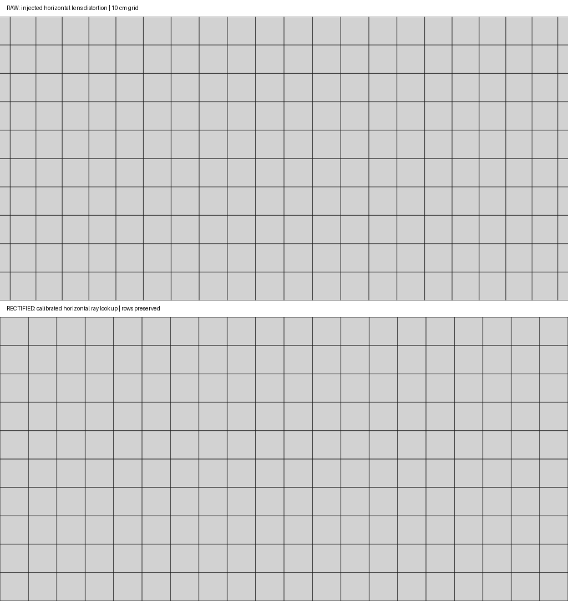

> 已归档：保留原始设计、问题和实验数据；文中的“当前/下一步”属于当时阶段，现行入口见 [当前状态](../../CURRENT_STATUS.md)。历史命令仍从仓库根目录运行。

# 第二阶段：线阵网格采集原型

> 历史实验记录：本文参数、性能和“当前/默认”描述属于当时版本，不作为新版验收。现行550 kg、20 mm/4K/1.5 m、1 m轨迹间距、11 kHz目标见[当前模型基线](../../LARGE_AGV_REBUILD.md)。历史命令须按现行配置调整，旧16 mm标定不可用于新版；大体积实验资产可能已清理，复现需重新生成。

> 当前运行参数已迁移为 **4K / 1.2 m、行间距 0.29296875 mm**。高行频实现与验收记录见 [CUDA 批量采样说明](STAGE2_CUDA.md)；11 kHz / 22 kHz 的完整成像链路验收仍未完成。


本页记录 **ROS 2 侧解析网格平面传感器**，已接入 Gazebo 的真实仿真轮关节反馈和相机位姿。不是标准面阵相机裁一行，也还不是 C++ Gazebo 渲染插件。它用于验证采集、光学映射和标签接口；不能将其性能、遮挡或亮度视为真实相机和完整 GZ 渲染的验证结果。



图为此前 8K 独立测试台的历史缩小预览，上图包含注入的横向畸变，下图仅做横向校正。每格 10 cm；完整图块为 8192×4096。

正式场景采样已加入 [C++ Ogre2 后端](STAGE2_RENDER.md)，`linescan:=true` 现在默认使用该后端。本页命令显式选择解析后端，保留为独立几何参考。

## 运行

构建并加载工作区后：

```bash
ros2 launch agv_bringup sim.launch.py linescan:=true linescan_backend:=analytic capture_dir:=/tmp/agv_linescan
```

继续使用项目默认 D3D12 / NVIDIA 和跟随视角。GZ 世界由同一配置生成 10 cm 网格、2 mm 线宽、20 m 范围的视觉标尺。解析成像使用相同网格几何，但不读取 GZ 渲染 Buffer；GZ 视觉亮度与输出灰度不要求一致。

采集默认关闭。另一终端加载工作区后，先开启采集，再低速直行：

```bash
ros2 service call /linescan/set_enabled std_srvs/srv/SetBool '{data: true}'
python3 tools/command_velocity.py --vx 0.05 --seconds 26
ros2 service call /linescan/set_enabled std_srvs/srv/SetBool '{data: false}'
```

`/linescan/image_raw` 为 Mono8 图块；`/linescan/block_metadata` 为带 schema 的 JSON 字符串（原型接口）；`/linescan/status` 报告采集分段及异常。每次启动新建独立归档目录，原始 PNG、逐块 JSON、参数快照同时保存。正常关闭仿真前先关闭采集并等待写盘完成；强制终止不保证最后一个尾块落盘。

## 光学与时序

- 4096 像素、7 μm 暂定像元、20 mm 暂定焦距、名义 1.2 m 宽，对应光学中心离地约 0.83705 m。这些是自洽的仿真参数，尚未选择真实镜头。URDF 相机位置与传感器采用同一配置。
- 外参仍为三维刚体变换 `T_base_camera`。光学坐标 `+X` 沿横向感光线、`+Z` 沿向下观察方向。改变支架高度不改变外参的数学类型。
- 内参不是整块图像的面阵 `K`。令 `q=(u-c)/(N/2)`，采用 `ray_x=S/(2f) × P(q)`，每像素观察射线为 `[ray_x, 0, 1]`。`P` 是严格单调的一维多项式，可含非对称项。首版 `P(q)=q+0.04q³`，特意注入可见横向畸变；因此原始边缘覆盖比名义 1.2 m 略宽，校正输出回到名义视野。
- 不发布具有虚构纵向焦距的整块 `CameraInfo`。纵向来自运动和触发，不是第二个光学像素轴。完整模型以后可扩展为每像素三维射线查找表，以描述线阵偏心、倾斜及沿程光学偏移。
- 行触发依据四轮平均有符号编码器距离，间距 0.29296875 mm；仅允许四轮接近 0°、轮速一致的前进/后退扫描。轮距换算为理想连续编码器反馈，尚未模拟实际编码器整数计数、减速比与量化。转向、制动、速度超限、反馈中断和反向切换会分段，不能把任意全向运动都当作有效扫描。
- 每个编码器样本区间内枚举行触发时刻；读取 GZ 真值轨迹仅供传感器生成。曝光开始于触发时刻，20 μs 内用三个中点积分样本近似运动模糊；位置线性插值、姿态 SLERP，禁止向轨迹范围外推。三点积分不是任意长曝光或高频振动的精确模拟。
- 图块 4096 行；首末行及少量中间行保存相机三维位置、旋转矩阵、时间和编码器距离。图像时间戳对应**末行曝光中点**。连续图块不复制边界行，尾块保留真实行数。待处理但缺少位姿的行被中断时，记录丢弃数量。

## 镜头校正方案

当前已实现：由已知标定的像素到射线映射建立反向采样查找表，沿每一行重采样，**不改行号、触发时刻或纵向间距**。超出原始视野的列不外推，输出零值并报告有效列范围。此过程不读取场景或真值位姿。

```bash
python3 tools/rectify_linescan.py \
  --calibration /tmp/agv_linescan/session_<id>/calibration.yaml \
  --input /tmp/agv_linescan/session_<id>/block_000000.png \
  --output /tmp/agv_linescan_corrected/block_000000.png
```

待实现的真实标定步骤：在已知安装几何下，从覆盖全幅的标尺/条纹靶提取亚像素位置，拟合单调像素到射线映射；用独立标尺检查未参与拟合位置的误差。再单独标定编码器沿程尺度、扫描方向与外参。自动提取标靶及参数估计尚未实现，不能把“用仿真注入参数去畸变”称为真实标定验收。单幅未知姿态网格不能独立辨识全部焦距、高度、外参与编码器尺度。

这一划分参考 [Common Vision Blox 线阵标定文档](https://help.commonvisionblox.com/NextGen/15.0/md_documentation__sections__camera_calibration__linescan_calibration.html)：分别处理感光线方向的镜头畸变，以及运动方向的尺度。运动、地形引起的变形后续通过逐行空间投影另行校正，不能用固定横向查找表消除。

## 测试与性能边界

```bash
colcon test --packages-select agv_linescan agv_control > /tmp/agv_linescan_tests.log 2>&1
colcon test-result
python3 tools/validate_linescan.py --output /tmp/agv_linescan_bench_new > /tmp/agv_linescan_bench.log 2>&1
python3 tools/validate_linescan_gz.py > /tmp/agv_linescan_gz_test.log 2>&1
```

迁移后的独立测试台输出两个完整 4096×4096 图块和一个 4096×204 尾块，共 8396 行。测试覆盖反向触发、停车后继续、最高速度理论触发数量、三维姿态插值、曝光积分、畸变反采样、无效边缘及图块行序。GZ 联调使用独立 ROS 域 79，测试结束确认 HOLD 并关闭该仿真实例。

Python 逐行实现性能有限，先使用 0.05 m/s；不以丢行或降低 4K 分辨率维持高速。归档使用独立工作线程与有界队列，队列满显式报错。实际归档和渲染吞吐需分别测量。

正式场景后端采用自定义 C++ GZ 系统插件（当前实现见上述链接），通过 GZ 渲染接口访问场景，在插件内部累计图块，再发布 ROS 图像与标签。先验证插件接口能力，不预设必须修改 GZ 源码。1 ms 物理步在最高速度下包含约 18～19 个行触发；不能每步仅取一行，也不能把一个姿态的 Buffer 重复作多行。应研究多时刻批量采样、GPU 内累计和批量读回，实际性能由实验决定。

尚未实现：真实水泥材质、任意网格场景射线相交与遮挡、太阳光和 LED 辐射响应、完整有限宽光带、镜头选型、实测标定、融合定位、运动校正和跨轨迹拼接。当前解析灰度网格仅用于几何测试，不能作为“补光压制阳光阴影”的证据。

### 2026-09-06：图像标定与校正

完成暗场/均匀亮场逐列估计、条纹板横向映射拟合及独立验证，见 [STAGE2_CALIBRATION.md](STAGE2_CALIBRATION.md)。独立板最大误差 0.3547 px；独立亮场列间不均匀度降至 0.06025%。CUDA 采集、ROS 原图接收、校正及原图/校正图落盘测试达到 22.99 kHz；仍需正常 GZ 控制与校正节点联合验收，不能把该子测试记为完整场景完成。
