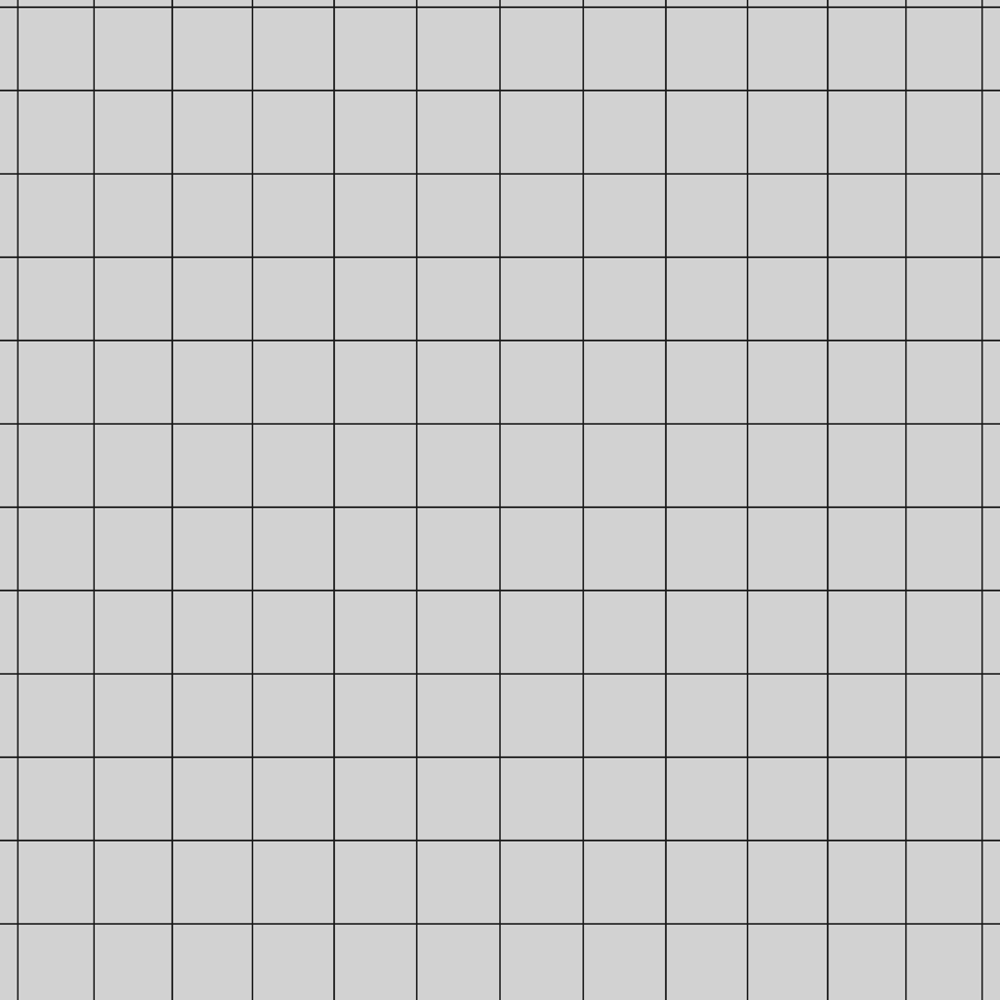

> 已归档：保留原始设计、问题和实验数据；文中的“当前/下一步”属于当时阶段，现行入口见 [当前状态](../../CURRENT_STATUS.md)。历史命令仍从仓库根目录运行。

# 第二阶段：CUDA 批量线阵网格原型

> 历史实验记录：本文参数、性能和“当前/默认”描述属于当时版本，不作为新版验收。现行550 kg、20 mm/4K/1.5 m、1 m轨迹间距、11 kHz目标见[当前模型基线](../../LARGE_AGV_REBUILD.md)。历史命令须按现行配置调整，旧16 mm标定不可用于新版；大体积实验资产可能已清理，复现需重新生成。

运行基线：4096 像素、名义幅宽 1.2 m、纵横间距 0.29296875 mm、4096 行/块（沿程 1.2 m）、20 μs 曝光。暂定 7 μm 像元、20 mm 焦距推导光心高度 0.837054 m，安装模型自动同步。底盘尺寸不变；真实镜头和工作距离仍待选型。

最新选型方向：优先 **20 mm 焦距、像场覆盖约 28.7 mm 感光线并留余量**，对应 1.2 m 幅宽的名义光心高度约 **0.837 m**。运行配置与安装结构已迁移；下文历史性能数据仍为 25 mm 时期的记录，20 mm 与分块纹理新结果见[分块原型](STAGE2_TILES.md)。

最终场景为 **100 m × 10 m 代表性跑道，并支持更宽跑道**；当前小网格仅用于调试。纹理/地形分块、GPU 预取与有界缓存、大图分块拼接及跨块性能要求见[项目规范](../../../PROJECT_SPEC.md#81-跑道规模与分块加载)，当前已实现网格纹理的读取、预取、有界缓存和跨块采样，见上述分块原型；地形、真实材质、大图拼接尚未实现。

## 实现范围

新增 `linescan_backend:=cuda_grid`，使用独立 CUDA 计算，不共享 Ogre2 的 OpenGL Buffer。本机现有 CUDA 12.8 / RTX 5080，无新增系统安装。CUDA 是可选构建项；没有 toolkit 时仍可构建 Ogre2 和 Python 后端，选择 CUDA 会明确报错。

- GZ 插件从四个驱动关节生成有符号等距离触发，沿用 DRIVE 准入、停止/换向分段和完整曝光区间检查。
- 从物理步轨迹插值得到每行三个曝光采样位姿。临时累计最多 512 行，再一次上传 GPU；每个像素按既有一维畸变射线与 `z=0` 平面求交，积分三次曝光结果，输出 Mono8。
- 每批统一读回，主机累计完整图块。支持尾批、尾块、反向和无效像素计数；无界队列和丢行降载均未使用。
- 归档只记录首末行和少量中间位姿，通常每块五个标签；不逐行生成或保存完整 JSON 位姿。末行参考时间仍为曝光中点。
- 平面使用相同配置的 10 cm 网格与 2 mm 线宽；采样依据实时相机姿态和每次触发时刻，不重复一行 Buffer 代替移动成像。

当前 **只支持无遮挡网格平面**。它不是通用 GZ 场景渲染器，不读取 GZ 的任意物体、材质、灯光或阴影；灰度仍为固定网格值，曝光只参与几何积分。`scan_probe:=true` 与 CUDA 后端组合会拒绝启动。Ogre2 后端保留为真实材质与遮挡参考，不能拿本原型的行频宣称完整光照链路已经达标。

GPU 使用 float 几何计算；大世界坐标会降低精度，后续接 RTK 全局坐标应先转为局部坐标。当前测试不验证大坐标亚像素精度。CUDA 采用批量上传和读回，不依赖 WSL 下尚不支持的 CUDA–OpenGL 互操作，参考 [NVIDIA WSL 支持边界](https://docs.nvidia.com/cuda/wsl-user-guide/) 和 [CUDA 内存接口](https://docs.nvidia.com/cuda/cuda-runtime-api/group__CUDART__MEMORY.html)。

## 构建和运行

```bash
source /opt/ros/jazzy/setup.bash
colcon build --symlink-install --cmake-args -DCMAKE_BUILD_TYPE=Release > /tmp/agv_build.log 2>&1
source install/setup.bash
ros2 launch agv_bringup sim.launch.py linescan:=true linescan_backend:=cuda_grid
```

默认仍使用 D3D12、NVIDIA 和 GUI 跟随。CUDA 只负责扫描像素计算。不开线阵时，基础控制保持原样。需要完全关闭 CUDA 构建时传入 `-DAGV_ENABLE_CUDA=OFF`；默认编译包含 compute 75 PTX，较新 GPU 可由驱动 JIT，可通过 `CMAKE_CUDA_ARCHITECTURES` 指定其他架构。

采集使用 `/linescan/set_enabled`；运动通过带仿真时间戳的 `/cmd_vel`。默认扫描准入上限仍为 0.25 m/s，可显式传入 `scan_speed_limit`。它不会自动调整车速。降低仿真实时率仍不等于达到目标墙钟行频。

```bash
python3 tools/validate_rendered_linescan.py --backend cuda_grid --speed 0.5 --distance 1.3 > /tmp/agv_cuda_forward.log 2>&1
python3 tools/validate_rendered_linescan.py --backend cuda_grid --speed -0.5 --distance 1.3 > /tmp/agv_cuda_reverse.log 2>&1
```

工具独立启动 GZ，验证图块连续性、稀疏标签、末行时间戳、ROS 接收和网格投影，结束确认 HOLD 并清理实例。反向采集保留有符号编码器距离。

## 独立持续吞吐验证

```bash
python3 tools/benchmark_cuda_linescan.py --output /tmp/agv_cuda_benchmark_new --blocks 180 --rate 23000 > /tmp/agv_cuda_benchmark.log 2>&1
```

输出目录必须不存在。工具自动检查持续时间至少 30 秒、墙钟吞吐至少 22 kHz（可用 `--minimum-rate` 指定最低门槛），不满足则报错。测试先预热，再以 23 kHz 供给约 32 秒的独立直线轨迹，留出判定 22 kHz 的余量。测试网格按轨迹长度扩展；不会修改整车场景的 20 m 网格。车速换算仅服务独立测试台，不提高底盘速度上限。

计时包含位姿输入生成、三时刻 GPU 采样、读回、图块组装、五个位置标签、PGM 写入和逐图像 `fsync`、独立 ROS 进程接收、逐字节与归档图像比较及确认。每块等接收确认后再发送下一块，因此没有持续增长的发送队列。单独报告主动处理时间与含节拍等待的墙钟吞吐，验收取后者。`fsync` 不代表已经独立验证宿主机存储的断电持久性。

这仍是 **静态网格子项测试**，不包含 GZ 物理与场景同步、材质、任意遮挡、主动 LED 辐射模型。满链路最低 11 kHz、完整目标 22 kHz 的要求继续有效，当前不标记为完成。

## 本次验证结果（2026-09-06）

证据：[结构化结果](../../../results/stage2_linescan_cuda.json)。本机 RTX 5080、CUDA 12.8，完整 4096×4096 图块。

| 项目 | 结果 |
| --- | --- |
| 独立网格持续吞吐 | 32.056 秒、737,280 行，约 **22,999.94 行/墙钟秒** |
| 归档与 ROS 接收 | 180 个完整图块，每图像调用 fsync；独立进程逐字节比对全部通过 |
| 标签 | 每块五个标签，末行时间戳与 ROS 消息一致 |
| CPU 独立像素核对 | 524,288 个像素，零不一致；本次无像素落入边界保护带 |
| 整车正/反向 | ±0.5 m/s；完整块和尾块连续；网格中心最大误差约 0.230 像素；结束 HOLD |
| 整车较高速短段 | 3.45 m/s（12.42 km/h），采集窗口约 0.354 秒，实时率约 0.995；结束 HOLD |
| Ogre2 4K 回归 | 完整块与尾块、ROS 输出、网格投影通过；结束 HOLD |
| 单元与模型检查 | 44 项测试通过；50/65/80 kg 模型检查通过 |

3.45 m/s 对应标称约 11.776 kHz 的仿真触发行频。这只是短段整车功能验证，不能替代持续整车吞吐验收。单独列出的采样函数速度不包含整车物理、ROS 和写盘时间，不能作为端到端结果。



可复核独立 CPU 像素比较：

```bash
python3 tools/validate_cuda_grid_pixels.py /tmp/agv_cuda_benchmark_new
```

以上持续吞吐证明批量路线在当前网格子项中有余量；完整成像链路尚未验收。

## 后续工作

接下来按以下顺序推进：

1. 已迁移运行配置到优先的 20 mm 焦距，按 4K / 7 μm / 1.2 m 推导约 0.837 m 光心高度，同步支架、安装外参和标定版本；复核视野、遮挡及光带覆盖几何。
2. 已用 100 m × 10 m 跑道网格建立分块加载骨架，结果与边界见[分块原型](STAGE2_TILES.md)。使用实际纹理块读入/上传和已知网格图案测试后台预取、缓存切换、局部坐标与跨块连续性；只计算无限解析网格不能算加载验证。按正常扫描跨块不卡顿、不中断、不跳变验收，并记录延迟尾部值。
3. 接入一种条形 LED 的有限宽度光带、线性曝光与传感器响应，验证补光主导、均匀性与姿态变化，再复测持续行频和跨块时延。
4. 加入真实水泥贴图、凹坑/板缝几何及遮挡，扩大到更宽跑道，复测完整成像链路。定位融合、区域覆盖和校正拼接按项目后续阶段推进。

真实地面贴图仍放在网格验证之后。加载失败时的受控等待/减速/停采是异常处理，不算连续采集验收通过；不能用放慢仿真、重复旧行或降低扫描细节掩盖卡顿。具体约束见[大场景验收](../../../PROJECT_SPEC.md#82-大场景验收)。
