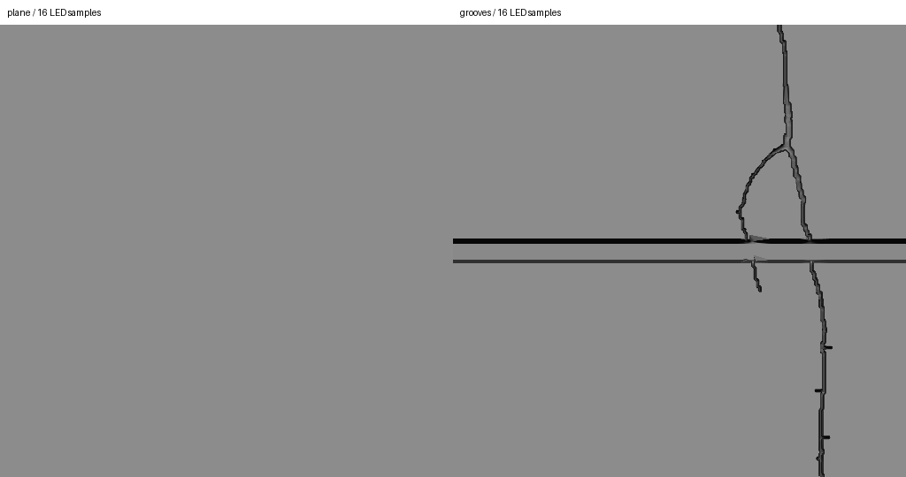

> 已归档：保留原始设计、问题和实验数据；文中的“当前/下一步”属于当时阶段，现行入口见 [当前状态](../../CURRENT_STATUS.md)。历史命令仍从仓库根目录运行。

# 局部裂缝、板缝沟槽成本实验

> 历史实验记录：本文参数、性能和“当前/默认”描述属于当时版本，不作为新版验收。现行550 kg、20 mm/4K/1.5 m、1 m轨迹间距、11 kHz目标见[当前模型基线](../../LARGE_AGV_REBUILD.md)。历史命令须按现行配置调整，旧16 mm标定不可用于新版；大体积实验资产可能已清理，复现需重新生成。

2026-09-08：总体墙钟吞吐验收目标改为 **11 kHz**，不再要求 22 kHz。整车速度仍为 10 km/h，等距离触发约 9.48 kHz。

本次结论：一块 5×5 m 平板上增加一条 2.2 m 的图像来源裂缝及一条 5 m 板缝，局部几何的增量较小，值得继续接入材质。不能把本实验解释为混凝土材质或 GUI 全链路已通过验收。

## 方法与边界

- 使用当前生产 OptixScene 内核、4096 像素、256 行/批、每行 3 个曝光样本、实际灯具安装参数；曝光内位移按 10 km/h。
- 扫描 x=1.3～3.7 m，每行间距 1.2/4096 m，8192 行路径重复四遍。关闭噪声和 PRNU，保持相同反射率 0.65，隔离几何效应。
- 裂缝轮廓取自现有 AI 原图及 prepare_crack 的 0.8～2 mm 标称宽度标定；未生成随机裂缝路径。实验合成最大深度 2 mm，不是实测深度。
- 板缝宽 8 mm、深 3 mm、两侧各 1 mm 斜面。与裂缝相交处取较深表面。
- 在裂缝附近使用 0.25 mm 局部顶点支持，其余使用稀疏平面，Delaunay 生成单层连续表面。不是在完整地面下面叠沟槽。检查三角形方向、非退化、投影面积 25 m² 与深度范围；GZ visual/collision 引用同一个 OBJ，但本轮没有启动 GZ。
- 普通平面仅 2 个三角形；同拓扑平面与沟槽各 210,422 个三角形。同拓扑平面用于排除细分本身造成的光照变化。
- 每组预热 8 批，测 128 批。顺序为平面→细分平面→沟槽，再反序复测。计时包含 Sample 的同步 GPU 读回；不含场景构建、图像写盘、GUI、ROS、物理、纹理采样和校正归档。属于短时 active 性能实验，不能证明长时间尾延迟。
- 硬件：RTX 5080，WSL2，Windows 驱动 616.64，隔离 OptiX 运行库 610.57.04。

## 结果

两次运行的范围；耗时增幅按各轮平面与沟槽的平均批处理时间计算，负值表示小于运行波动。

| 灯条采样点数 | 普通平面 行/s | 沟槽 行/s | 平均批处理耗时增幅 |
| --- | --- | --- | --- |
| 4 | 148,833～148,943 | 146,330～147,106 | +1.17%～+1.79% |
| 8 | 91,943～92,504 | 91,843～92,448 | +0.06%～+0.11% |
| 16 | 53,214～54,226 | 52,877～53,513 | −0.56%～+2.55% |
| 32 | 28,594～29,079 | 28,528～28,747 | +0.23%～+1.16% |
| 64 | 14,815～15,108 | 14,859～14,962 | −0.30%～+0.98% |

采样器显式 cudaMalloc 总量由 **1.13 MiB 增至 24.45 MiB，增加约 23.32 MiB**。包含几何、加速结构、当前仍保留的构建 scratch 与采样缓冲；不包含驱动隐式分配、CUDA 上下文或 GZ 副本，因此不是整机显存总占用。

本轮最慢沟槽批次约 20.26 ms，低于 256/11000≈23.27 ms 的名义批次预算；64 点档余量已经不大，不能据此承诺加入其他工作负载仍然实时。灯条点数的影响显著大于本例局部沟槽几何。未据此修改生产默认灯条点数，也未宣称完成裂缝阴影采样收敛验证。

各点数下，普通平面与同拓扑平面均逐像素 **0 DN 差异**。沟槽图像约 12.96 万像素改变超过 2 DN，最大差异 133 DN，说明新增几何确实进入射线成像。以下为相同位置的原始强度裁剪，无对比度增强；横向约 150 mm，沿扫描方向约 150 mm，横向受现有畸变影响。



## 下一步与限制

1. 接入 Concrete047A 颜色材质，再增加法线；粗糙度先用统一参数。纹理通道的显存、采样与光照计算成本尚未实测，不能归入上面的 0～3%。
2. 当前只有一条裂缝，不代表密集裂缝或全跑道；沟槽网格未来也应分块管理。
3. 深度外形为实验合成的 2.5D 表面，无倒扣、真实断面测量或物理接触验证；细长三角形、接缝处形状以及 0.1 mm 阴影射线偏移还需成像精度验证。
4. 完整材质后，单独验证阴影质量与所需灯条点数，并做 GUI＋RViz 联合负载及 11 kHz 完整接收归档测试。当前常反射率测试不能代替“纯颜色纹理 vs 全 PBR 材质”的性能比较。

## 复现

先按 [OptiX 环境文档](../../OPTIX_SETUP.md) 构建。本机 WSL 使用以下包装；原生 Linux 直接在正常驱动环境下运行 Python 命令即可。

```bash
bash tools/with_optix_runtime.sh bash -c '
  source /opt/ros/jazzy/setup.bash
  source install/local_setup.bash
  python3 tools/validate_groove_cost.py --output /tmp/agv-groove-cost
'
```

输出目录必须不存在。大 OBJ 和完整 PGM 保留在本地实验输出，不提交；[统计记录](../../../results/stage2_groove_cost.json)与对照图随项目保存。测试结束不启动或留下仿真实例。

构建通过；agv_linescan 的 73 项测试通过，无失败或跳过。
