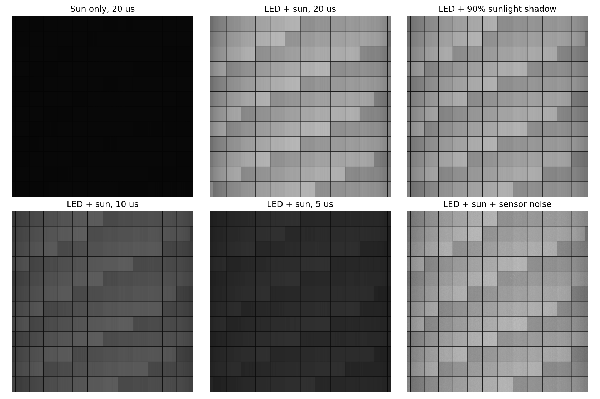
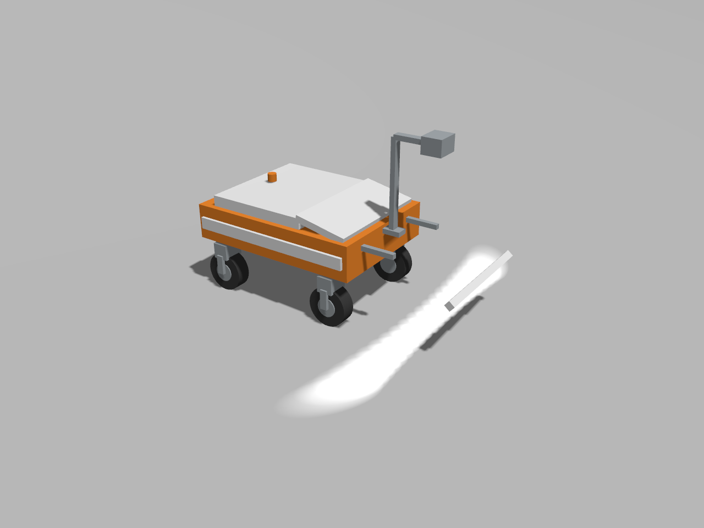

> 已归档：保留原始设计、问题和实验数据；文中的“当前/下一步”属于当时阶段，现行入口见 [当前状态](../../CURRENT_STATUS.md)。历史命令仍从仓库根目录运行。

# 第二阶段：条形 LED 与线阵响应

> 历史实验记录：本文参数、性能和“当前/默认”描述属于当时版本，不作为新版验收。现行550 kg、20 mm/4K/1.5 m、1 m轨迹间距、11 kHz目标见[当前模型基线](../../LARGE_AGV_REBUILD.md)。历史命令须按现行配置调整，旧16 mm标定不可用于新版；大体积实验资产可能已清理，复现需重新生成。

本轮将相对照明与传感器响应接入 `cuda_tiles` 分块纹理链路，保留 4K / 1.2 m、20 mm 镜头、20 μs 默认曝光、三次曝光采样和有限采集队列。默认几何畸变继续使用 `q + 0.04q³`，为用户确认保留的放大测试畸变，不作为真实镜头指标。

## 光带与响应

配置位于 `src/agv_description/config/linescan.yaml` 的 `radiometry`。只对 `cuda_tiles` 生效；Ogre2、解析网格及 `cuda_grid` 的成像方式没有因此获得同一套辐射模型。

- 日照参考强度为 1，LED 光带中心为 40。数值是相机有效波段内的**相对照明单位**，不是已校准 lux，也不是电功率。名义平地全扫描线最小 LED / 日照比约 33.8，要求至少 20。
- LED 前置 0.25 m、名义离地 0.30 m，光带朝相机视线方向后斜射。采用工程化投影光带模型：横向八次超高斯、沿程四次超高斯，参数半宽 0.85 m、沿程半宽 0.08 m。这里半宽是强度降到峰值 `exp(-2)` 的位置，不是均匀亮区边界。
- 光带与相机共同跟随车辆。用每次曝光的相机位姿把地面采样点转换到灯具安装坐标，随高度改变投影中心、带宽和相对强度；另计平面入射余弦。名义中心沿程 ±4 cm 仍有较强照明，±16 cm 已接近零。不是无限细线或给整块地面添加常量亮度。
- 灰度纹理作为线性漫反射率 `DN/255` 输入，先叠加环境与 LED、乘表面反射率及像素响应，再在三次曝光样本间积分，最后加噪声、限幅和量化。未来彩色照片贴图需要先处理颜色空间和反射率解释，不能直接把 sRGB 值当作线性反射率。
- 暗角默认边缘损失 15%，固定像素响应非均匀性默认 ±1%；参考白面在强度 41、20 μs 下产生 10,000 电子，满阱 12,000 电子，读出噪声 3 电子，黑电平 4 DN，线性增益 1。这些是可复现实验参数，并非已选相机的测量数据。
- 噪声使用电子域散粒噪声的高计数高斯近似及读出噪声，低光子数下不等同于精确泊松模型。固定响应按列生成，随机噪声按采样行与列索引生成，改变 CUDA 批次划分不会重复同一条噪声。预热采样也推进内部噪声序列；不是基于归档行号复算的实机噪声模型。
- 曝光时间同时影响亮度和运动积分。将 20 μs 改为 10 / 5 μs 后，未饱和、减黑电平的信号分别约为 1/2、1/4；不自动增加增益或归一化图片亮度。

## 阳光阴影与验证范围

默认世界 X=40～50 m 设置解析的环境阴影带，保留 10% 日照。此带只改变环境分量，代表外部物体挡住阳光而未挡住近距离 LED 的测试工况；不是由 GZ 场景几何自动计算的阴影。全阴影情况下 LED 与日照比为 20 时，减黑电平信号变化上界为 1/21≈4.76%；本轮 90% 遮阳场景以 4% 的亮区 P99 变化为验收门限。

未实现任意车体/地形对 LED 的遮挡、反射高光、非平面路面、精确灯具配光、绝对光谱响应、脉冲补光。本轮是**平面相对 LED / 传感器模型子项**，不替代这些最终场景验收。当前仅支持连续点亮的条形 LED。

## 复现

先构建并 source 项目，再使用已生成的分块跑道：

```bash
python3 tools/validate_radiometry.py --terrain /tmp/agv_runway_tiles_100x10/manifest.json --output /tmp/agv_led_cases_new > /tmp/agv_led_cases_new.log 2>&1
python3 tools/benchmark_cuda_linescan.py --output /tmp/agv_led_bench_new --blocks 240 --rate 23000 --terrain /tmp/agv_runway_tiles_100x10/manifest.json > /tmp/agv_led_bench_new.log 2>&1
python3 tools/validate_rendered_linescan.py --backend cuda_tiles --terrain /tmp/agv_runway_tiles_100x10/manifest.json --speed 5.555555555555555 --warmup 7.2 --distance 50 > /tmp/agv_led_gz_new.log 2>&1
```

比较工具实际运行 CUDA 采集，不在生成的图片上事后补光；输出各工况图块、配置、固定显示范围的对比图和 `validation.json`。仅日照图中接近黑电平的列不适合用 Mono8 反推照度比，因此信号比统计只纳入均值高于黑电平至少 2 DN 的列；全幅照度比由独立全列光带测试检查。噪声场景默认不允许饱和；额外高亮场景检查满阱和 ADC 削顶确实生效。

基准测试包含 LED、噪声、GPU 读回、ROS 独立进程逐字节接收比对和逐图像 fsync；三条独立扫描段共 240 块。仍使用分块阶段已公布的延迟预算及启动预热边界。`validate_tiled_pixels.py` 只适用于关闭 `radiometry.enabled` 的几何测试配置，不可直接比较加入噪声的原图。基准工具新增 `--config` 可指定这种独立测试配置。

## 本次结果（2026-09-06）

结构化证据：[测试记录](../../../results/stage2_linescan_radiometry.json)。本机 WSL、RTX 5080、CUDA 12.8。

| 检查 | 结果 |
| --- | --- |
| 全列名义 LED / 日照比 | 最小 33.80，中心 40；高于 20 的目标 |
| 实际输出信号比 | 纳入 4010 列，LED / 日照最小约 33.93 |
| 90% 日照遮挡 | 亮区信号平均变化 2.24%，P99 2.91%，最大 4 DN |
| 10 / 5 μs 曝光 | 稳定纹理区相对 1/2、1/4 的缩放误差 P99.9 均为 0.5 DN |
| 噪声与饱和 | 默认饱和比例 0；噪声差值标准差约 1.79 DN；专用过曝场景饱和比例 100% |
| 持续 4K / 4096 行图块 | 42.741 秒、983040 行，约 22999.95 行/墙钟秒 |
| 连续性 | 496 次纹理块加载；必需块未就绪次数 0；最长采样批次 17.71 ms，小于 22.26 ms 预算 |
| ROS / 归档 | 240 块逐字节比对、每图像 fsync；最大同段接收间隔 201.78 ms，小于 267.13 ms 预算 |
| GZ 20 km/h / 50 m | 9 秒仿真、约 8.999 秒墙钟；41 个完整图块加 2749 行尾块，共 42 块；最后 HOLD |
| GZ 时序与队列 | 物理步最大间隔 1.65 ms；采样批次最大 15.50 ms；队列峰值 **15/16**，没有溢出，但瞬时余量较小 |
| 回归 | 50 项测试、0 失败；包括曝光比例、阴影抑制、暗场、饱和、噪声统计和批次划分不变性 |

以上吞吐是本轮平面模型子项通过 22 kHz，不构成复杂场景最终验收。队列峰值接近上限，后续增加计算应重新检查暂态余量；本轮测试没有扩大队列来隐藏延迟。GZ 已关闭，原始归档保留于测试记录所列路径。



[整车 20 km/h 采集的一张完整原图](../../images/linescan_led_sample_4k.png)。图像含原有放大的横向畸变、光带不均匀、暗角、像素响应不均和随机噪声，尚未做平场校正。

## Gazebo 中可见的条光

AGV 模型现在默认附带 **21 个重叠聚光灯**，共同近似一根条形 LED 的配光。灯源位于原有 0.60 m 灯条的出光面下方，向后及横向展开；光轴在名义平地指向相机扫描线。灯具直接挂在 `base_link` 下，因此跟随车体平移、转向和姿态变化，不是固定在世界坐标中的亮条。每个聚光灯启用投射阴影，太阳光和环境亮度保持原设置。

Gazebo 与 CUDA 共用安装位置、名义投光范围及 LED 相对强度配置。GUI 额外使用 `gz_led.enabled` 和 `gz_led.intensity_at_reference`（默认 0.7）控制是否显示及显示强度。两条链路的亮度单位、配光曲线并不相同：Ogre2 的离散圆锥叠加用于可见投光和遮挡参考，不声称逐像素复现 CUDA 的超高斯分布，也不将屏幕上饱和的白色解释为物理照度标定。

标准启动即包含这些灯光，无需额外开启线阵采集：

```bash
ros2 launch agv_bringup sim.launch.py
```

已通过 WSL Mesa D3D12 / NVIDIA 的 Gazebo Ogre2 实际场景渲染检查。下面是离屏观察相机直接导出的场景图，没有后期绘制光带：



复现：

```bash
GALLIUM_DRIVER=d3d12 MESA_D3D12_DEFAULT_ADAPTER_NAME=NVIDIA python3 tools/render_model.py --output /tmp/agv_led_visible.png > /tmp/agv_led_visible.log 2>&1
```

`--led-off` 可导出同视角、同日照的无 LED 对照图。模型质量和八个驱动/转向关节保持不变。配光使用 [SDF spot light 的方向、锥角和投射阴影配置](https://sdformat.org/spec/1.7/light/)。

本次可见灯光回归：[结构化记录](../../../results/stage2_gazebo_led.json)。50/65/80 kg 模型检查通过；开启灯光后的 Ogre2 线阵网格投影、两个连续图块及停车 HOLD 检查通过。观察相机最终效果图使用显示强度 0.7；初始较高显示强度导致网格辨识回归失败，已调整并重测。该低速 Ogre2 回归不替代 CUDA 高行频性能测试；新增聚光灯会增加图形渲染开销。
