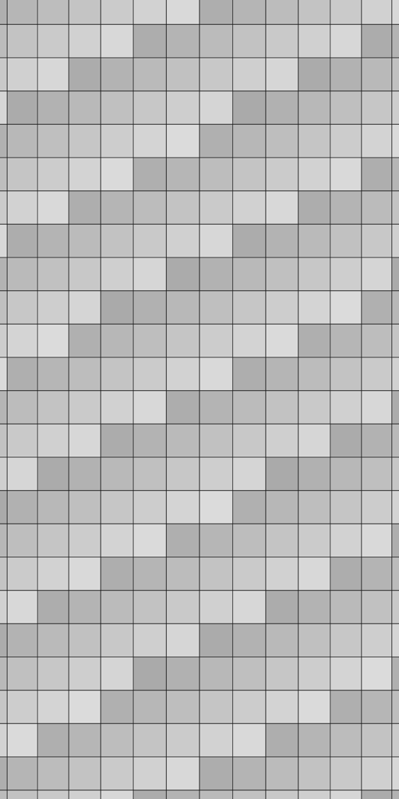

> 已归档：保留原始设计、问题和实验数据；文中的“当前/下一步”属于当时阶段，现行入口见 [当前状态](../../CURRENT_STATUS.md)。历史命令仍从仓库根目录运行。

# 20 mm 镜头与跑道分块纹理原型

> 历史实验记录：本文参数、性能和“当前/默认”描述属于当时版本，不作为新版验收。现行550 kg、20 mm/4K/1.5 m、1 m轨迹间距、11 kHz目标见[当前模型基线](../../LARGE_AGV_REBUILD.md)。历史命令须按现行配置调整，旧16 mm标定不可用于新版；大体积实验资产可能已清理，复现需重新生成。

当前相机：4096 像素、7 μm 暂定像元、20 mm 暂定焦距、名义幅宽 1.2 m、行间距 0.29296875 mm、20 μs 曝光。光心名义高度 0.837054 m，由同一配置生成 URDF 支架和采样外参；标定版本 `nominal-linescan-4k-20mm-v3`。这仍不是已采购镜头规格。

## 地面数据与缓存

`tools/generate_runway_tiles.py` 实际生成 100 m × 10 m 平面纹理文件，不使用 GPU 解析网格代替文件加载。纹理是 10 cm 网格、2 mm 线宽，并用随全局网格位置变化的灰度检查错块和旧块问题。它不是水泥照片或具有凹坑的地形。

- 每块核心 4096×4096 纹素，对应 1.2×1.2 m，周围各留一纹素边界。PGM 文件为 4098×4098 Mono8；横向 X 对应文件列，Y 对应行。
- 100×10 m 场景共 84×9＝756 块，原始纹理约 12.70 GB，包含外缘补齐和边界纹素。长宽可配置；更宽跑道尚未做完整任务验收。
- GPU 缓存固定 24 槽，纹理占约 403 MB；主机上传暂存约 16.8 MB，另有小型位姿/图块缓冲。采样和后台上传使用不同 CUDA stream。
- 后台工作线程读取 PGM、检查尺寸/完整性并上传。当前扫描足迹及前方 4 m 的块优先预取；该距离与缓存是当前直线原型配置，不代表适用于任意姿态、速度或存储设备。足迹超出缓存能力时明确失败。
- 上传完成后才标记为可用。正在被 GPU 采样引用的槽位加锁定计数，采样完成前不得覆盖。图像采用双线性插值，边界纹素保证跨块插值连续。
- 主机用 double 保留世界坐标，在转成 GPU float 之前减去当前块的局部原点；块切换不改变图像行号、编码器触发相位、时间或归档的世界位姿。

首次启动扫描或换到新的独立扫描段时先完成预取；正常跨块期间不会等待文件加载。必需块未就绪、文件缺失/损坏或缓存不足会明确报错，不能用空白、旧纹理或降分辨率替代。启动准备可能耗时，因此应在车辆开始扫描前调用采集准备流程；不能把首次准备耗时算成正常跨块延迟。

## Gazebo 接入

新后端 `linescan_backend:=cuda_tiles` 仍从 GZ 的实际四轮关节反馈触发，并按物理步轨迹插值每行三个曝光位姿。它只采样 manifest 描述的无遮挡 `z=0` 纹理平面，不读取 GZ 任意物体的材质、遮挡或灯光。

物理线程通过最多 **16 个物理步任务**的队列提交数据；采样线程临时累计最多 512 行，批量计算和读回。物理步不再等待每批 CUDA 计算完成。停止采集或分段通过顺序屏障处理完此前任务并归档尾块，不重排行号。采样图块归档仍使用有界后台任务。

队列超限或采样失败时停采并记录 `/linescan/status` 与归档事件，不暂停物理步来掩盖过载；修复数据后需重启该实例。文件缺失的启动故障测试检查采集被拒绝、仿真时钟继续推进、控制器能够正常停车。异常处理不是连续性能验收通过。

GUI 使用单独的低分辨率地面概览，线阵采样从不读取概览图。默认仍为 WSL D3D12 / NVIDIA、跟随 AGV；Ogre2 参考后端保持可用。

```bash
source /opt/ros/jazzy/setup.bash
colcon build --symlink-install --cmake-args -DCMAKE_BUILD_TYPE=Release > /tmp/agv_build.log 2>&1
source install/setup.bash
python3 tools/generate_runway_tiles.py --output /tmp/agv_runway_new > /tmp/agv_tiles_generate.log 2>&1
ros2 launch agv_bringup sim.launch.py linescan:=true linescan_backend:=cuda_tiles terrain_manifest:=/tmp/agv_runway_new/manifest.json
```

数据生成目录必须不存在，默认约需 12.7 GB。文件写入后对各自文件执行 fsync 和缓存释放建议，不清理系统全局缓存；操作系统和宿主机是否真正冷缓存不作保证。启动参数 `spawn_x` 可指定车体初始 X，默认仍为 0。

## 吞吐与连续性测试

```bash
python3 tools/benchmark_cuda_linescan.py --output /tmp/agv_tiles_bench_new --blocks 240 --rate 23000 --terrain /tmp/agv_runway_new/manifest.json > /tmp/agv_tiles_bench.log 2>&1
python3 tools/validate_tiled_pixels.py /tmp/agv_tiles_bench_new > /tmp/agv_tiles_pixels.log 2>&1
python3 tools/validate_rendered_linescan.py --backend cuda_tiles --terrain /tmp/agv_runway_new/manifest.json --spawn-x 10 --speed 0.5 --distance 2.5 > /tmp/agv_tiles_gz.log 2>&1
```

独立测试台在三条扫描线位置上进行每段 96 m 的正/反向扫描。换段明确先准备新区域；不是模拟真实底盘瞬间换道。23 kHz 的输入用于证明至少 22 kHz 的采样能力，不改变整车 20 km/h 上限。

持续计时包含每块位置标签、GPU 数据传输与采样、PGM 写入及每图像 fsync、独立 ROS 进程接收与逐字节核对。显式换段准备包含在总墙钟时间内，但不当成同一扫描段的跨块延迟。独立台采用每图块供给节拍，整车测试则由实际编码器连续触发。

本次原型在测量前采用的预算：持续测量至少 30 秒，墙钟有效行频至少 22 kHz；512 行采样批次最长不超过其供给周期（23 kHz 时 22.26 ms）；同一段的图块接收间隔最长不超过标称周期的 1.5 倍（267.13 ms）。整车原型另外检查 1 ms 物理步的墙钟间隔最大不超过 10 ms、P99 不超过 2 ms。这些是本轮工程测试预算，不是对任何硬件或未来复杂场景的保证，也不意味着操作系统调度抖动为零。

独立 CPU 校验在全局坐标中重建纹素值并进行双线性和曝光积分，检查每个图块边缘、纹理块边界及其邻域；允许最多 1 个灰度级的浮点量化差异。不会仅凭“发出的数据等于收到的数据”判断几何正确。

## 本次结果（2026-09-06）

证据：[结构化结果](../../../results/stage2_linescan_tiles.json)。本机 WSL、RTX 5080、CUDA 12.8；完整 4K Mono8。

| 检查 | 结果 |
| --- | --- |
| 独立持续分块采样 | 42.741 秒，983,040 行，约 **22,999.95 行/墙钟秒** |
| 实际加载与上传 | 496 次纹理块读取/上传，约 8.33 GB；必需块未就绪次数 0 |
| 缓存 | GPU 纹理 403 MB，主机上传暂存 16.8 MB |
| 采样批次延迟 | P99 6.29 ms，最大 8.93 ms，均小于本次 22.26 ms 预算 |
| ROS 和归档 | 240 个完整图块逐字节一致，图像逐文件 fsync；同段接收间隔最大 203.60 ms，小于 267.13 ms 预算 |
| 独立几何/像素比较 | 24,576,000 像素，最大差异 1 灰度级，覆盖每块边缘及纹理块边界附近 |
| GZ 最高车速扫描 | **20 km/h、50 m**，9 秒仿真时间，实时率 **0.99944**；41 个完整块与 2881 行尾块，全部接收；结束 HOLD |
| GZ 物理步时序 | 上述最高车速扫描中，墙钟间隔最大 **2.76 ms**、P99 上界 **1.1 ms** |
| GZ 异步采样队列 | 峰值 **5/16** 个任务，无溢出；采样批次最大 5.12 ms |
| GZ 反向 | −3.45 m/s、6 m，实时率约 1.0005；连续图块、末行标签、网格投影通过，结束 HOLD |
| GZ 网格投影 | 最高车速检查中，网格中心最大误差约 0.56 像素 |
| 缺文件故障 | 拒绝采集，状态明确报错，仿真时钟和控制器继续工作，正常停车 |
| 其他回归 | 20 mm Ogre2 视野/图块测试、模型检查通过；47 项单元测试全部通过 |

以上说明本轮测试没有出现缺块、采集中断或超出既定预算的跨块延迟，不宣称系统调度完全无抖动。GZ 50 m 测试证明整车短时高负载运行；最终整区域覆盖和完整成像链路仍需后续验收。

下面是最高车速扫描中两个连续原始图块按行直接连接的等比例缩小预览，无边界行复制：



## 尚未覆盖

真实水泥材质、非平面地形、任意遮挡、LED 辐射模型、噪声与饱和、RTK 融合、区域覆盖和大图拼接尚未完成。当前测试不是 100×10 m 区域的完整覆盖巡检，也不是全功能最终验收。下一步加入条形 LED 的有限宽度光带、线性曝光与传感器响应，并在同一吞吐/延迟测试链路上复测。

## 后续补光更新

本页上述数值保留为固定纹理灰度的历史结果。当前默认 `cuda_tiles` 已启用相对 LED、曝光与噪声，实测及使用说明见 [补光原型](STAGE2_RADIOMETRY.md)。复现本页纯几何像素校验时，需复制相机配置并设 `radiometry.enabled: false`，通过基准工具 `--config` 传入；旧像素校验器不会把辐射变化误报为采样几何误差。
