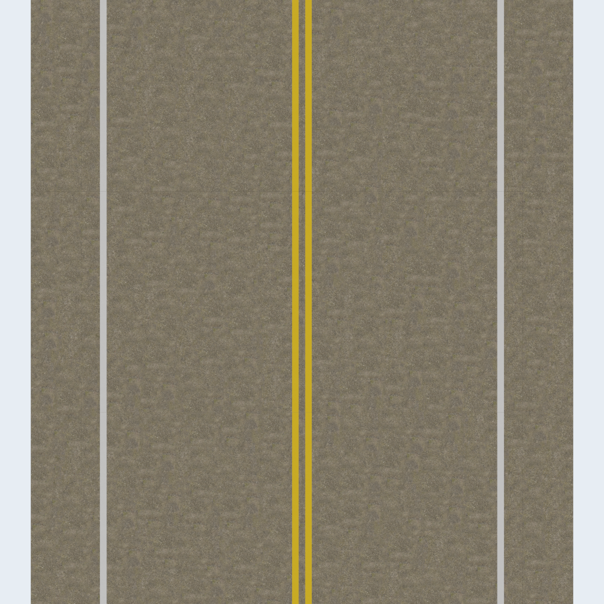

# Gazebo路面与线阵原图的坐标对齐修订

用户发现线阵原图有双实线，而GUI中央没有。实际SDF/Ogre2俯视渲染证实问题：旧显示把中心黄线映到y约±6.00 m，白线也偏向道路中部。它不是4 mm低清显示丢掉15 cm标线，也不是相机外参或车辆定位误差。

烘焙PNG的第0行来自分区最小世界Y，行号随Y增大；旧OBJ却使用`v=(y-y0)/(y1-y0)`。Ogre加载/采样后的图片纵向与该约定相反，因此每个半幅分区被镜像。旧校验只证明OBJ满足同一套错误公式，无法代替实际渲染交叉校验。

修订为`v=1-(y-y0)/(y1-y0)`，U保持不变。分区清单增加`v_direction: decreasing_world_y`，共享场景检查按照显式方向校验所有顶点UV；不改顶点、三角形、碰撞代理、PNG颜色/法线、高清RAW纹素或OptiX采样坐标。OptiX的OBJ读取器忽略vt，高清采样仍以真实交点的世界XY查询瓦片。

新生成器直接输出正确方向；已有本地资产可无需重新烘焙13 GB纹素地迁移：

```bash
python3 tools/fix_road_display_uv.py assets/road/baked_fullwidth_20m_v1/manifest.json
```

迁移仅重写vt及其网格校验和、清单方向字段，可重复执行；迁移后需重启Gazebo以重新加载网格。现有20×10 m全宽资产的8个分区已迁移。与之前采集会话中的清单比对，ground_material及display_materials完全一致，已有原图不因此改变。旧归档保持原有清单，不对历史采集进行追溯改写。

独立GZ Sensors/Ogre2实际渲染（D3D12，俯视x=7.5 m，高10 m，1400×1400）：黄线中心为y=−0.14660、+0.15149 m，目标−0.15、+0.15 m；最大误差约3.4 mm，小于该渲染的9.77 mm/像素。已核对中央双黄线、两侧白线及道路中缝，见[数值记录](../../results/road_uv_alignment.json)。



复现渲染：

```bash
python3 tools/render_road_alignment.py \
  --manifest assets/road/baked_fullwidth_20m_v1/manifest.json \
  --output local_data/road_alignment_new
```

工具输出实际渲染PNG及report.json，验收应检查passed=true；输出目录必须不存在。共享场景回归增加显式方向错误检测并通过。该结果守住标线的空间一致性，不要求GZ彩色环境照明与线阵Mono8短曝光强补光的亮度逐像素相等，也不代表两个渲染器的法线着色已做光度标定。
