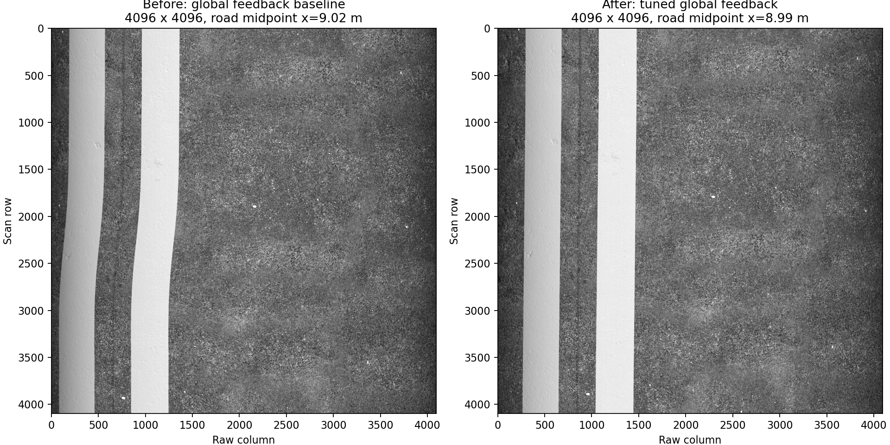

# 全局闭环稳定性、前向换道和条光修订

本轮针对GUI四轨试验中用户指出的后退、起点等待、标线弯曲和灯条过高进行修订。原有“运动完成、档案连续”测试不足以证明扫描姿态平稳，因此增加独立真值、原图几何与耗时对照。

## 问题证据

旧策略每次掉头后ENTRY后退约2.33125 m，用于补偿前置相机和下一道加速距离；它是规划主动生成，不是避障或定位丢失。部分PASS累计对轮约9–16秒，还有终点微调。

旧预览采用32×32面积平均，4096×4096缩到128×128后在RViz放大，纹理模糊是显示链路造成的。但标线弯曲也存在于原图：旧第15块相机横向跨度约44 mm、航向跨度约0.90°。用真实成像位姿和同一光学模型预测一条固定地面标线，五个采样位置与原图提取边缘相差不到约1像素，支持实际运动是该块弯曲的主要来源。固定横向镜头畸变不能独自解释随行号变化的弯曲。

## 保留准确的全局位置约束

仍然使用`/odometry/global`作闭环反馈，没有切换到局部里程计或固定一道的全局偏差。RTK每轴水平σ=2.5 cm、垂直σ=4 cm、10 Hz和原有延迟/外参噪声均保持。

全局EKF的水平过程噪声原为0.02，yaw为0.001；调整为X/Y各0.00005、yaw 0.00001。轮速和IMU继续传播真实运动，RTK仍约束全局位置，但不把每个观测跳变都快速传成姿态/位置变化。本轮未更改局部EKF、RTK测量协方差或测量新鲜度门限。

控制反馈滤波时间常数0.25→0.60 s，航向比例增益0.8→0.5 s⁻¹，位置增益仍0.7 s⁻¹。参考仍是梯形/三角形时间点位置＋速度前馈，位姿终点容差保持原值。大误差和定位异常保护继续生效。

## 前向驶出与起点等待

中间轨迹的扫描后行程为`max(制动预留, 2*相机前置距离+下一道加速预留)`。当前0.5 m/s时取2.55625 m，比旧0.225 m多2.33125 m；这些距离从扫描中心越过ROI终点起算。停车后横移1 m、车身转180°，恰好接到下一道加速起点。取消ENTRY段，四轨由14步减为11步，最后一轨只做正常制动。

相机在融合位置推导的扫描中心越过ROI终点0.10 m后关闭，车辆继续向前驶出。关采集异步握手不再向仍在RUNNING的控制器插入零速度；换道前仍须确认关闭与尾块写入。PASS禁止负向追赶；若终点越过太多，报告FORWARD_ONLY_TERMINAL_OVERSHOOT，不能用后退悄悄纠正。

对轮期间发现ALIGN↔BRAKE切换：驱动目标为零时，转向接触引起的轮速反馈也可能超过0.025 m/s。对小于0.05 m/s的脉冲增加60 ms确认；期间驱动目标仍为零，进入DRIVE仍要求轮速低于0.025 m/s及原有轮角/速率稳定条件。达到0.05 m/s立即制动，较小但持续的运动在确认后制动。确认时长配置为`alignment_motion_confirm_s`，限制不超过0.1 s。

修订后PASS累计对轮约2.1–4.0 s。剩余时间包含0.65 rad/s转角上限、转向加减速以及实际轮速保护，并未把必要对轮跳过；还不能声称所有接触引起的重配都消失。

## GUI、条光与原图

预览默认`preview_bin: 8`，完整图块预览为512×512；原始4096×4096 Mono8及尾块不变，预览sRGB显示转换不作用于原图。提高预览清晰度不修正原图畸变。

LED中心名义离地0.30 m，主方向向前偏离竖直15°；距扫描平面后方0.080385 m，中心x=1.069615 m。灯条长度1.20 m、名义光带1.80×0.16 m，实际支架和碰撞几何随安装位置更新。GZ光源与OptiX发光位置使用同一安装参数。

光心仍为1.046317 m，原始畸变幅宽1.56 m。257条相机射线无车体遮挡，257个扫描位置均被GZ光锥覆盖；500/550/600 kg模型质量、惯量和关节检查通过。该结果限于名义平地几何，不等于全悬挂行程或光度均匀性验证。照明安装变化后需要重新做平场，不能套旧标定。

## 实测对照

同一20×10 m水泥道路，8×4 m区域、4道、1 m行距、0.5 m/s，GUI＋RViz＋OptiX原图归档同时运行。对照保留相同测量噪声设置，但物理时序不同，随机样本不是逐个相同，因此是实测对照而非确定性因果分解。

| 指标 | 旧四轨 | 修订后四轨 |
|---|---:|---:|
| 任务运动时长（仿真秒） | 226.38 | 184.73 |
| 累计ALIGNING时间（秒） | 61.42 | 34.07 |
| 融合水平位置对真值RMSE | 2.38 cm | 0.83 cm |
| 融合水平位置对真值最大误差 | 6.66 cm | 2.93 cm |
| 融合航向对真值RMSE | 0.739° | 0.232° |
| 完整图块内相机横向跨度中位数 | 26.41 mm | 6.45 mm |
| 横向运动去线性趋势后跨度中位数 | 14.64 mm | 2.28 mm |
| 完整图块内航向跨度中位数 | 0.554° | 0.030° |
| 掉头后ENTRY后退段 | 3 | 0 |

定位指标仅统计READY后任务执行区间，排除EKF尚在原点初始化的阶段。图块几何指标来自原始稀疏成像标签，不能宣称涵盖未记录的高频运动，也不把整体线性倾斜当成弯曲。修订后PASS平移负向命令采样数为0；旧版本未归档该命令指标，其后退由规划ENTRY和运动记录确认。

两图均为4096×4096未校正原图，在相近道路位置取样，用相同0–140 DN显示窗口绘制，未进行配准、畸变校正或改动原始像素。灯条安装也发生变化，因此不能用这组图比较绝对照度。

修订后四轨共91,131行、26块（含区外启动短块及真实尾块）。每轨均有同一个连续传感器段跨过ROI，ROS接收与落盘像素逐块SHA256一致。稀疏地面光学覆盖检查通过，最小采样重叠约0.385 m；不是逐像素完整覆盖认证。GNSS失锁/恢复回归也通过，最终HOLD，水平RMSE约0.895 cm。

证据：[稳定性对照](../../results/stage3_scan_stability.json)、[采集/覆盖/失锁/安装结果](../../results/stage3_rectangle_capture.json)。生成方法为`tools/compare_rectangle_runs.py`、`tools/render_scan_comparison.py`和`tools/audit_mission_footprints.py`。原始大档案保存在本地，不纳入Git。

本轮不宣称10 km/h矩形闭环、坡面、高频支架振动、暂停补扫或离线拼接已经完成。后续应继续验证误差扰动恢复和不同速度的稳定性，再接暂停恢复与覆盖补扫。

## 2026-09-09：当前基线回归补齐

线阵单测从旧16 mm/1.2 m/20 km/h更新为20 mm/1.5 m/10 km/h，保留独立基线断言，网格中心/线宽与信号测试按配置推导。默认Config同步550 kg底盘几何与转向动力学，并通过YAML一致性测试锁定；横移速度上限现统一放在platform.yaml，跟踪与轮组分配共同读取，不再放在motion.yaml重复覆盖。

终点滤波误差只触发重新评估；实际修正方向和长度使用当前位姿，已到达目标时不创建修正，不消耗修正次数。增加零长度保护、滤波滞后和航向残差测试，保持前向PASS不后退策略。没有改变全局融合反馈来源或扫描增益。

对应colcon结果198项零失败。正常噪声、GUI/RViz/OptiX两轨3×2 m实跑通过，逐轨9122/9045行，连续ROI、原图与ROS哈希一致，最终HOLD；时间参考位置误差最大2.12/3.28 cm。查看4个完整原图块缩览未见明显缺线横带，不代表亚像素几何合格。独立正反旋转恢复试验均约54.13°，允许180°驱动反转，未出现126°绕回。详见[回归结果](../../results/review_baseline.json)。

## 已修复：采集时GUI联合实时率下降

2026-09-09缓存修改后与39b1d95隔离构建对照，使用同一20 m贴图与前后加减速平台、550 kg整车、D3D12、GUI/RViz、10 km/h、20 m采集；完整性均通过，但实时率分别0.512和0.519，低于旧记录0.990。当前版本最大批次13.87 ms、缓存最大等待0.050 ms、队列峰值68行，零必需纹理缺失，未出现采样中断；这不能解释或豁免实时率不足。两组测试前后清理了各自的仿真进程。未修改速度、物理步长、画质或全局定位策略来规避该异常。

该阶段没有观察到缓存优化导致明显整体回退，但当时尚未确定性能差异的根因，因此继续剖析整车/渲染负载。结果记录[前后对照](../../results/review_material_cache.json)区分capture_integrity_passed和realtime_target_met。

随后按用户观察，将进入贴图区域与启停采集解耦：同一路径、GUI/RViz均开启，关闭采集时各区段实时率约1.000；x=9 m开启采集后，x=10–25 m为0.515–0.518。因此当前瓶颈随采集启用出现，单纯行驶到贴图上并不触发下降。

`GzLineScan::PoseAt`对每次曝光、每个连杆插值都执行YAML键查找和浮点解析；当前每行约43次、10 km/h约32.6万次/仿真秒。将不变的`max_sample_gap_s`在Configure阶段读取并验证一次，保留所有位姿插值、曝光样本和质量设置，20 m联合实跑实时率恢复到**0.9963**（仿真7.2 s、墙钟7.2267 s）。14块/54,605行、ROS和归档字节一致、零必需纹理缺失，最终HOLD；见[本轮结果](../../results/review_gui_realtime.json)。

旧约0.99记录使用更高的条光和更低分辨率预览，不能视为严格同配置前后对照；本次修复依据当前环境的开关采集实验和只缓存参数的对照。未证明100 m长时或高速矩形闭环。一次复测在运动前遭遇Gazebo EntityContextMenuPlugin右键菜单初始化崩溃，已排除该次性能数据；本修复不宣称解决该GUI问题。

## 2026-09-09：巡检入口异常截帧与高速停车

用户演示中，0.8 m/s名义任务的传感器轮速门限也被设为0.8，反馈使个别轮速略高便触发`unsupported_scan_motion`。当时只保存了约1100行的异常尾图，任务却仍可能ACQUIRED；后续另一次出现`material prefetch timeout`。缓存故障与非预期分段重启的关联尚未独立证实，不能声称所有预取超时已经解决。

入口现按物理轮速上限加0.02 m/s数值容差设置传感器门限，驱动上限仍10 km/h；任何非预期采集分段都进入FAULT。关闭握手失败不反复重发，也不把传感器关闭冒充尾图归档成功。面板显示最近原图尺寸与结束类型，满帧是4096×4096，缩略显示保持实际比例。

高速单道第一次联合验证在停车点超调约0.186 m，被禁止倒退保护停下。原参考制动减速度与底层上限同为1.0 m/s²，反馈没有足够减速余量；参考减速度降至0.8后，超调降至约0.051 m，仍未通过原容差。最终将纵向反馈单独设为0.2 s滤波、1.2位置增益，横向/航向仍用原0.6 s滤波和原增益。规划器同步使用`trajectory_decel`增加制动空间，保持物理上限1.0、终点5 cm容差与PASS不倒退。GUI/RViz/OptiX高速单道最终停车误差约0.027 m、无终点微调，7块/27,523行，实时率0.989；不是高速多道换道或长跑道验证。

反复启动还记录到三次Gazebo GUI的Qt OpenGL上下文创建失败，发生在开始运动前；错误仅出现在Gazebo GUI独立日志。显存空闲且独立Qt上下文探针可成功，尚不足以确认底层原因。WSL/D3D12联合启动改为控制器激活成功后再启动RViz，以错开图形客户端初始化；不能将该缓解措施当作驱动问题根治。

最终参数两道暂停复测又发现：HOLD之后的残余脉冲会提前消耗“恢复后首行”标志，真正停车时间落入相隔535行的稀疏标签区间。该次虽保存8块/30,482行且任务ACQUIRED，暂停标签验收明确失败，未将其计作通过。现对真实相邻线时间差超过0.1 s的间隔补充两侧标签；保留原像素与行号，Python回归模拟残余脉冲后长停顿，完整Gazebo流程再验证。

修复后GUI两道复测30,556行、8块，暂停相邻行号差1、时间差3.729 s；运动中注入异常分段后FAULT/HOLD、采集关闭。缩览未见明显空白横带，不等同于亚像素几何保证。错开启动后两次GUI启动成功，长期稳定性仍需观察。汇总见[专项报告](../../results/rviz_operator_hardening.json)。

## 2026-09-10：长轨迹偶发停车与限位恢复采集

显存复测中的一次SHIFT故障，执行器日志在仿真115.508 s首次锁存`STALE_OR_UNREADY_LOCALIZATION`；当时收到的健康消息仍为READY，独立导航归档保持50 Hz。相邻执行器回调间隔却为0.259 s，超过既有0.1 s控制步长上限。原检查顺序先检查缓存定位年龄，将控制线程未及时处理反馈也归入定位故障；不能据此认定GNSS/EKF本身中断。

面板和执行器共用单线程执行器，原面板每秒重建并可靠发布全部静态道路/轨迹。100 m两道离线面板回调测量最大约21.62 ms、p99约21.49 ms，包含GC最大约6.82 ms；**该实验没有单独复现259 ms，不能称唯一根因已经证实**。现静态显示改为内容变化时发布，通过原有TRANSIENT_LOCAL保留最后样本供晚连接RViz接收。未放宽定位/时钟阈值：控制步长超限优先报告`INVALID_CONTROL_TIMESTEP`；故障记录新增步长、里程计仿真年龄、各反馈墙钟年龄和面板回调耗时。面板的实时故障状态与原因一并更新，避免短暂显示FAULT却保留旧空原因。

另一旧长轨在限位恢复中出现`CAMERA_direction change`：实测轮角已接近182°，确为必要的限位重配置。旧相机将任何累计回退达到一行距都作为段终止。现按[Basler位置编码器模式](https://docs.baslerweb.com/encoder-control)实现有符号位置前沿触发：回退不出线，越过上次前沿后才继续；保留半帧与触发相位。适用于可配置PositionUp/Down的触发系统，不是假定所有相机对原始脉冲都具备该功能。未改底盘最小转角策略、8°机械余量、运动有效性检查或任务禁止后退约束。

`validate_scan_limit_recovery.py`以当前戳车体系指令，在GUI/RViz/OptiX实车物理模型中先横移、旋转、恢复直行，再按实际±180°轮角分支逼近限位。首轮固定方向没有触发限位，明确判失败；自适应分支复跑确实经历LIMIT_RECONFIGURE，最大编码器回退5.633 mm，两次回退事件，保存三张4096²原图、共12288行，段和行号连续，最终HOLD；最大实际转角182.034°，最终轮速近零。此检查不等于回退期间几何误差为零，也不替代生产矩形任务。C++和Python另独立覆盖正反两个方向的2000行→回退20行距→继续2096行，确保无重复触发。

实际查看专项原图还发现不能关闭的质量问题：跨对轮满帧的局部行2829～2851存在约23行窄纹理带。对应全局行6925～6947，编码器前进8.057 mm，而稀疏相机真值位置仅移动约0.968 mm（三维距离，非地面扫描距离），持续0.958 s。证据支持对轮时编码器运动与相机有效地面位移不一致；不是简单的丢行。位置模式修复了误中止，但没有消除轮胎滑移/对轮带来的重复纹理。不得将此结果声明为图像质量通过；后续需在生产PASS中量化发生率，并设计可审计的采集质量标记或避免采集中发生必要的大角度对轮，不能用真值替换编码器触发来掩盖。

生产入口100×2 m、2 m/s、GUI＋RViz＋双C8＋OptiX含暂停复测138张/560923行，稳态RTF0.99930、最大控制间隔40 ms；不主动暂停复跑138张/560783行、RTF0.99947。两次均ACQUIRED/HOLD，ROS/PGM一致、晚连接订阅收到静态道路/轨迹，但覆盖仍NEEDS_RESCAN。运动中暂停定位适配器进程的独立故障注入，0.360 s后保护触发，停车距离0.307 m（预算0.550 m），最终FAULT/HOLD、相机关采并确认归档。286项自动测试通过，包含回调间隔/定位超时分类与零命令检查。宿主锁屏，未将窗口消息到达冒充实际窗口肉眼观察；原图窄带已实际查看。汇总见[报告](../../results/long_run_stop_investigation.json)。

## 后续修复：进程隔离、保持能力与质量补扫

已排除“上层仍给驱动指令”的解释：专项记录四路驱动命令为零，但150 N·m配置的两只驱动轮仍达到约0.148 rad/s，位置增量与速度积分一致。相同控制动作使用临时300 N·m上限后，对轮期间驱动轮速度约8×10⁻¹⁰ rad/s、编码器回退约4×10⁻¹² m，原先由停转轮反复滚动形成的窄纹理带消失。当前将300 N·m用作暂定仿真峰值保持/驱动限制，保留0.8/1.0 m/s²加减速和10 km/h上限。实际电机额定、峰值和持续时间仍未知；[gz_ros2_control上游实现](https://github.com/ros-controls/gz_ros2_control/blob/jazzy/gz_ros2_control/src/gz_system.cpp)的速度接口写入JointVelocityCmd，不能把本次结果当作真实电流环或热模型验证。

提高保持限制后，跨对轮相邻扫描线仍有相机位置变化（这次稀疏标签约10 mm三维差，并非纯地面前进距离）。因此没有删行或声称几何无缝，而是在生产覆盖审计加入明确质量排除：读取执行记录，采集中限位/大角度对轮时间窗前后各扩50 ms，跨窗图块保留像素和哈希，标记motion_quality_excluded，整块从确认覆盖中排除并生成补扫。普通暂停、恢复及不采集时转身的回归通过；缺失执行记录或记录未覆盖图块时间不能通过质量审计。代价是保守补扫整块；稀疏遥测不能提供逐像素有效区掩码。

控制侧不再将面板与执行器放在同一进程：每任务一个工作进程，服务控制，带实例ID的状态防串任务；/mission/status采用BEST_EFFORT周期快照，完整记录仍本地归档，防止慢订阅者反压控制。命令竞争保护在执行器内独立运行。面板发现工作进程退出后请求关相机，底盘自己的命令超时负责停车；关闭失败锁存。两处进程都保留有界回调计时，区分回调和调度等待。旧259 ms的具体调用没有足够历史证据唯一定位，但面板计算/发布与控制的共享执行依赖已移除，并以故意冻结面板验证，而不是仅依赖偶然成功复跑。

GUI/RViz/双C8/OptiX实跑100×2 m、2 m/s，含暂停及面板SIGSTOP 0.6 s，138张/560840行、RTF0.99881、运行中控制最大间隔22 ms，最终HOLD；随后第二个任务强杀执行器，FAULT/HOLD且相机关闭确认通过。第一次测试误把READY首次时钟从0到9.001 s算进运行间隔，任务已正常结束却被测试判失败，现仅统计相邻RUNNING记录。另发现关闭时监管器和面板的重复SIGINT会打断清理，已修复并确认正常任务回调计时文件落盘。10 km/h短程复测7张/27587行、RTF0.99495、最终HOLD。294项测试通过。见[结果](../../results/control_isolation_capture_quality.json)。

仍不代表100×10 m全宽或亚像素成像质量通过；覆盖仍需补扫。原图已实际查看，窗口与鼠标交互未重新做肉眼验收。进程隔离增加一个Python/ROS进程，不涉及新的GPU渲染缓存；整卡采样峰值存在窗口/桌面波动，不将单次差值解释成精确的架构显存成本。
