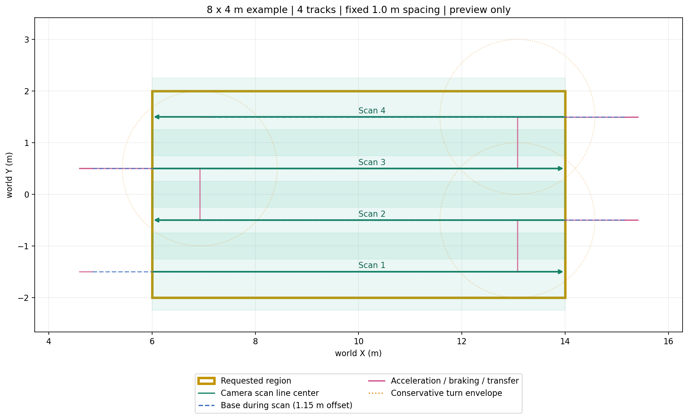

# 矩形巡检规划与预览

当前交付是规划核心和预览，不发运动指令。定位融合、从车辆当前位置接入任务、时间闭环、采集门和任务面板按[实施计划](../../docs/MISSION_IMPLEMENTATION_PLAN.md)继续接入。

## 快速运行

在工作区根目录执行；不需要OptiX/GPU或Gazebo：

```bash
source /opt/ros/jazzy/setup.bash
colcon build --packages-select agv_mission
source install/local_setup.bash
ros2 run agv_mission plan_rectangle \
  src/agv_mission/config/rectangle_demo.yaml \
  --output local_data/mission_demo/plan.json \
  --save-request local_data/mission_demo/request.yaml \
  --publish
```

另一个终端（同样source环境）：

```bash
rviz2 -d src/agv_mission/config/planning.rviz
```

不加`--publish`仅保存JSON并退出；保存的request.yaml可以重新载入。预览发布`/mission/preview/base_path`和`/mission/preview/markers`，Reliable＋Transient Local，晚启动RViz也可接收。独立规划视图Fixed Frame=world，不加载机器人；车辆现有RViz防脱节配置保持不变。自定义地图frame时同步调整RViz固定坐标系。Ctrl-C退出预览。



上图是规划JSON绘制的示意图，不是闭环运动结果。绿色为相机扫描中心与名义幅宽，蓝虚线为扫描时底盘中心，粉色为非采集运动，橙色圆为保守旋转包络。

## 参数与几何约定

- `region.start_xy_m`是道路坐标中采集区域的角点，长度沿道路+X、宽度沿+Y。`road`中的原点、yaw和目标frame由地图提供，不要求操作人员为每个矩形指定方向角。当前仅支持水平面；输出保留XYZ、四元数、法向、切向、弧长，尚未实现坡面适配。
- **`track_spacing_m`默认固定1.0 m，不自动均分缩小。** 轨迹组居中，名义幅宽F=1.5 m，零误差时轨迹数N=max(1,ceil((W−F)/s)+1)。4 m宽生成4条，中心Y为−1.5、−0.5、0.5、1.5，总覆盖4.5 m，两侧各超扫0.25 m。窄于一幅时一条居中。10 m宽需10条，总幅宽10.5 m；不代表10 m宽道路有足够车体换道空间。
- `coverage_error_m`是横向误差预算e，有效幅宽F−2e用于轨迹数和相邻覆盖校验；默认0为几何基线，尚不构成有噪声覆盖保证。不把厘米定位误差当成亚毫米配准精度。
- `drivable_bounds_xy_m`与`optical_bounds_xy_m`分别指定真实可行驶矩形和可成像背景范围，顺序[xmin,xmax,ymin,ymax]。两者均为道路坐标，显式填写，不把纹理裙边当可行驶路面。首版校验的是用户声明的静态边界，不自动读取地图障碍。
- 读取`agv_description`当前platform/linescan参数：相机前置1.15 m、1.5 m幅宽、加速0.8/减速1.0 m/s²和最高10 km/h；`--platform`/`--camera`可指定配置。现有模型保守旋转半径1.5 m，不允许缩小；车壳尺寸/畸变模型改变需重新审计包络。
- 首例0.5 m/s，加速预留0.25625 m、制动预留0.225 m，分别包含0.1 m附加余量。扫描前加速、扫描后制动；每次停车换道按横移→180°旋转→入轨补偿排列，相邻段位姿连续。旋转方向仅为预览候选，实际执行须结合实时轮组限位/状态选择。
- 扫掠使用整车保守圆与凸矩形解析检查，不依赖画图采样间距；原始畸变幅宽按当前v7的1.04倍验证成像边界。超界、非法参数、超过平台速度、可能漏扫都明确拒绝，不裁剪任务、不自动减速。

JSON包含原始请求、模型参数、各轨迹和分段点。`PREVIEW_ONLY`不等于可直接执行；`capture`为几何意图，尚未接传感器门控。`stop_at_end=false`的加速/扫描段应由后续时间规划连续通过；旋转段平移弧长不变，另有角位移。当前没有从真实初始位置到首个入轨点的路径。

## 验证

```bash
colcon test --packages-select agv_mission
colcon test-result --test-result-base build/agv_mission
ROS_DOMAIN_ID=93 python3 tools/validate_rectangle_preview.py \
  --output results/stage3_rectangle_preview.json
```

几何/消息共23项pytest通过（colcon含2项包装共25项）：固定间距、窄区/非整除宽度、正反扫描端点、相机偏置、段连续性、地图平移旋转、高度、误差预算、非对称加减速、越界和非法输入。另完成CLI保存/重载一致及真实ROS话题接收验证。未把这些测试计作闭环控制或GUI实车运动验收。
